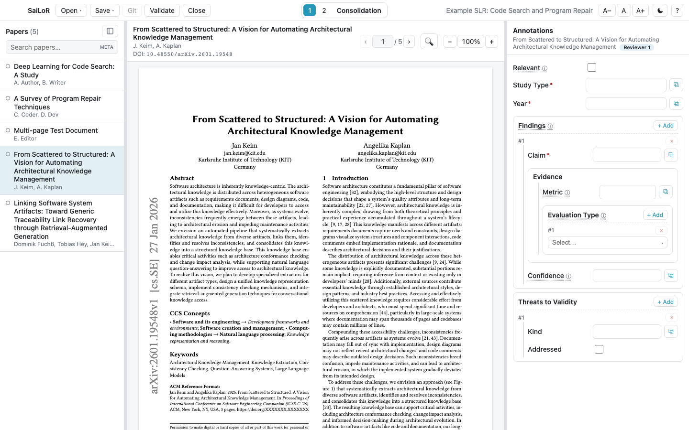

<p align="center">
  
</p>

<h1 align="center">SaiLoR</h1>

A tool to assist reviewers during **Systematic Literature Reviews (SLR)** — the letters are in the
name: **S**ai**L**o**R**. Open a single JSON "project" file that holds both an annotation schema
(a nested, cardinality-controlled taxonomy) and the papers to annotate. Read each paper's PDF, fill in typed
annotation fields — optionally grabbing values straight from selected PDF text — and save the
annotations back into the JSON.

SaiLoR is a **desktop app** (Electron) — fully local, opens local PDF files, native Open/Save
dialogs.

> **The web/browser build is discontinued.** Earlier versions also ran as a static site you could
> host or open in a browser; browser file-system limitations (the File System Access API's reach and
> reliability across browsers) made too many features — multi-file saving, git — impossible to
> support properly there. The web build, if you open it, now shows a notice pointing you at the
> desktop app instead of any project-opening UI. If you were using SaiLoR in a browser, switch to
> the desktop app below — your existing project files open in it unchanged.

<p align="center">
  
</p>

> 📖 For a feature-by-feature walkthrough with screenshots — including warnings worth reading before
> you rely on this for real review data — see the [user guide](https://github.com/Gram21/SaiLoR/wiki/User-Guide).

## Quick start

```bash
npm install
npm run dev:electron
```

## Installing a release

Grab the file for your system from the [releases page](https://github.com/Gram21/SaiLoR/releases):

| System | File |
|---|---|
| macOS, Apple Silicon (M1–M4) | `SaiLoR-<version>-macos-arm64.dmg` |
| macOS, Intel | `SaiLoR-<version>-macos-x64.dmg` |
| Windows | `SaiLoR-<version>-windows-x64.exe` |
| Linux | `SaiLoR-<version>-linux-x64.AppImage` |

> **The releases are not signed** with an Apple or Microsoft code-signing certificate —
> paying for one is not worth it for a research tool. Both systems will therefore warn you
> the first time you open the app. The steps below are how you tell them to go ahead; you
> only need to do it once.

> **Upgrading from SLR Helper?** The desktop app's settings — recent projects and window size —
> now live in a `SaiLoR` folder (on macOS, `~/Library/Application Support/SaiLoR`). On first run
> the app migrates the old "SLR Helper" folder automatically, so nothing is lost.

### macOS

1. Open the `.dmg` and drag **SaiLoR** into your **Applications** folder.
2. Open the app. macOS blocks it, saying it *"cannot be opened because Apple cannot check
   it for malicious software"*. Click **Done**.
3. Open **System Settings** → **Privacy & Security**, and scroll down to the **Security**
   section. You'll see a note that *"SaiLoR" was blocked to protect your Mac*.
4. Click **Open Anyway**, then confirm with **Open Anyway** and enter your login password.

The app opens normally from then on. (The **Open Anyway** button only appears for about an
hour after you tried to open the app — if it's gone, just try opening the app again.)

Note that on current macOS versions the old right-click → **Open** shortcut no longer works
for apps like this — the *Privacy & Security* route above is the way.

<details>
<summary>If macOS says the app is <em>"damaged and can't be opened"</em></summary>

That message means the download's quarantine flag is set on an app macOS can't verify —
**the app is not actually corrupt**. It affects builds from before v0.1.0's signing fix.
Either grab a newer release, or clear the flag once:

```bash
xattr -cr "/Applications/SaiLoR.app"
```
</details>

### Windows

1. Run `SaiLoR-<version>-windows-x64.exe`.
2. Windows SmartScreen shows *"Windows protected your PC"*. Click **More info**, then
   **Run anyway**.
3. Follow the installer.

### Linux

The AppImage is a single self-contained file — no installation needed. Make it executable
and run it:

```bash
chmod +x "SaiLoR-<version>-linux-x64.AppImage"
./"SaiLoR-<version>-linux-x64.AppImage"
```

If it fails to start, your distribution may be missing FUSE (`sudo apt install libfuse2`
on Debian/Ubuntu), or you can extract and run it with `--appimage-extract-and-run`.

## Project file format

> 📖 For a full authoring guide with many examples, see
> [docs/annotation-schema.md](docs/annotation-schema.md). The summary below is the quick reference.

A project is a `project.json` file next to an `annotations/` folder, not a single JSON file. This is
what lets two reviewers working on different papers — or different reviewer slots of the same paper —
never collide in git: each lives in its own file, so ordinary git tracking/diffing/merging handles
them independently instead of everyone fighting over one big file. (Opening a project still saved in
the old, pre-v1.3 single-file shape works unchanged — it just migrates to this layout automatically
the next time it's saved, with no explicit step.)

```
my-review/
├── project.json          # schema, protocol, screening config, and paper METADATA only — no answers
└── annotations/
    └── <paperId>/
        ├── consolidated.json   The single/consolidated annotation tree, plus aiUsage + equal
        └── reviewer-<n>.json   Each independent reviewer's own tree (multi-reviewer only)
```

Each of those files also carries that seat's `"finished": true` once its holder ticks the sign-off box
in the panel — **Annotation finished** for a reviewer, **Consolidation finished** in the Consolidation
seat, which signs off `consolidated.json` the same way. The declaration lives next to the answers it is
about, so it merges as independently as they do.

Files under `annotations/` are created **lazily** — only once a reviewer has actually written
something for that paper — and deleted again if it's cleared back to empty. A screening project names
these `screening-consolidated.json` / `screening-<n>.json` instead, so the two kinds of per-paper
decision are distinguishable at a glance.

`project.json` itself:

```jsonc
{
  "version": 1,
  "config": {
    "schema": [
      { "name": "Relevant", "type": "boolean" },        // leaf field
      { "name": "Study Type", "type": "string",
        "options": ["Case study", "Experiment", "Survey"] },  // enum dropdown

      { "name": "Publication Year", "type": "year" },   // number, bounded to a plausible pub. year
      {
        "name": "Findings", "min": 1, "max": null,       // group, repeatable (unbounded)
        "children": [
          { "name": "Claim", "type": "string" },
          { "name": "Evidence", "type": "string" },
          { "name": "Confidence", "type": "number" }
        ]
      }
    ],
    "reviewers": 2,                 // optional, 1–10 (default 1) — see below
    "finishCheckbox": false,        // optional (default true) — see "Marking papers finished"
    "screening": { "reasons": ["Wrong topic", "Duplicate"] }  // optional — see "Screening" below;
                                     // when present, "schema" above is ignored and derived from this
  },
  "papers": [
    {
      "id": "paper-a",
      "title": "…",
      "authors": ["…"],
      "doi": "10.1000/xyz",         // optional
      "year": 2024,                 // optional
      "venue": "…",                 // optional — journal/conference name
      "abstract": "…",              // optional — what screening reads when there is no PDF yet
      "pdf": "pdfs/paper-a.pdf"     // path relative to this JSON file; "" is only valid in a screening project
    }
  ]
}
```

The app assembles `project.json` and every paper's `annotations/` files into the same logical shape
you'd get from the pre-v1.3 single-file format when it loads a project — the split only changes what's
on disk, not how the app (or its own load/save/git internals) reasons about a project in memory.

**Annotation nodes** (`config.schema[]`):

| Field         | Meaning                                                                 |
| ------------- | ----------------------------------------------------------------------- |
| `name`        | Display label (required). Sibling names must be unique.                 |
| `type`        | `string` \| `number` \| `boolean` \| `year`. Omit for a group (name-only) node. `year` is a number bounded to a plausible publication year (~1000–2100). |
| `children`    | Sub-taxonomy. A node may have `type`, `children`, or both.              |
| `min`         | Minimum occurrences (default `1`).                                      |
| `max`         | Maximum occurrences: a number, or `null` for unbounded (default `1`).   |
| `options`     | Array of strings on a `string` field → a filterable enum dropdown.      |
| `description` | Optional tooltip.                                                       |

**Annotation data** mirrors the schema: at each level a map keyed by node name, where every key
holds an array of instances (bounded by `min`/`max`). Each instance carries a `value` (for fields)
and/or nested `children`. Saving prunes trailing empty optional instances and leaves `config`
untouched. Unknown top-level and per-paper fields are preserved verbatim.

> ⚠️ **`config` itself is rebuilt from scratch on every save** — any key you hand-add under it
> (`config.schema`, `config.reviewers`, …) is silently dropped the next time anyone saves. If you
> need to record something the app doesn't have a field for, use a **top-level** key instead
> (`{"version": 1, "myNotes": "…", "config": {...}, "papers": [...]}` keeps `myNotes` forever) — or,
> for a review's own protocol, the dedicated `protocol` key described next. See
> [Things to know](https://github.com/Gram21/SaiLoR/wiki/Guide-Things-To-Know) for this and a few other easy-to-miss traps.

Two optional top-level keys exist specifically to be safe from that `config` rebuild:

- **`protocol`** — the review's own protocol (research questions, search strings, databases searched,
  search date, notes), authored from the project editor's *Review protocol* section.
- **`schemaInfo`** — a free-text, schema-wide comment authored from the project editor's *Schema
  info* section, shown to reviewers via an ⓘ button on the annotation panel (opens automatically the
  first time a project with one is loaded).
- **`provenance`** — a read-only record of where a project came from, written automatically when it
  was built via *New from screening…*: the source project, when, and how many papers were carried
  over versus left behind.

## Using the app

- **Open ▾ menu** — open a project file, or reopen one of the last 5 recent projects.
- **Save ▾ menu** — Save or Save as…, with their shortcuts shown next to each item.
- **? (Help)** — opens a dialog describing the workflow and listing all keyboard shortcuts.
- **Left pane** — collapsible list of papers (toggle with the ☰ button). A completeness dot next to
  each paper fills in proportionally as fields are completed (a fraction of required fields if any
  are marked required, otherwise of all fields). The fill is progress and the color is state: amber
  while the paper is still yours to finish, **green** once you tick the **Annotation finished**
  checkbox in the annotation panel, **red** if that box is ticked while a field the schema marks
  `required` is still empty — so "done" is always something a reviewer said, not something the form
  inferred, and a mark that contradicts the data says so instead of going quiet. (A schema that
  requires nothing never goes red, and a Yes/No answer is never a hole.) Set
  `config.finishCheckbox: false` to drop the sign-off step: papers then count as finished as soon as
  the schema is fulfilled, and no paper can be *With issues*. A dropdown under the search box filters
  the list into *Open* (anything not finished), *In progress* (the started subset — anything with at
  least one annotation, still not finished), *Finished*, and *With issues*, and counts the selected
  bucket (`finished: 5/100`). Every seat gets this, the **Consolidation** seat included — there the dot
  tracks the consolidated record and the checkbox reads *Consolidation finished*, while "has every
  reviewer answered this paper yet" moves into the dot's tooltip and a second counter
  (`finished: 5/100 · 82/100 ready`). In a **screening project** the dot becomes a tri-state marker
  (included / excluded / undecided) with its own filter instead, and there is no checkbox; see
  [Screening](#screening).
- **Search** — the box above the paper list matches title, authors, DOI, abstract, the PDF's file
  name, and the paper's own id by default. Click the **META**/**TAGS** trigger on its right edge to
  switch to searching your own recorded annotation content instead.
- **Resizable panes** — drag the borders between the three panes to resize them; the widths are
  remembered.
- **Middle pane** — the paper's PDF, rendered with a selectable text layer. In a screening project
  this defaults to the title/abstract record instead, with a one-click swap to the PDF.
- **Right pane** — the annotation form, laid out by the taxonomy. Repeatable nodes show **+ Add**
  (up to `max`) and a remove (**×**) control (down to `min`). In a screening project this is the
  Include/Exclude decision instead — see [Screening](#screening).
- **Grab from PDF** — select text in the PDF, then click the **⧉** button next to a string/number
  field to insert it (numeric fields extract the first number).
- **Highlighting, sticky notes, and PDF export** — select text to highlight it, or drop a sticky
  note anywhere on the page, each with its own comment. ‹ › buttons jump between every mark on the
  paper. Marks are your own (per reviewer) and stored separately from the PDF itself, so two
  reviewers marking up the same file never conflict in git — export them into a real, standalone
  annotated PDF when you want to share one outside SaiLoR.
- **Linking a mark to a field** — the **🔗** button next to every field lets you attach one or more
  highlights/notes as evidence for that value ("why I picked this"), searchable when there are many.
  Clicking a mark jumps to it in the PDF without linking it, so you can confirm which one it is first.
- **Adding papers** — in the project editor: pick individual PDFs, a whole folder of them, or import a
  BibTeX/RIS/CSL-JSON reference export. Importing flags probable duplicates (fuzzy title match, or a
  matching normalized title with similar authors) against papers already in the project and against
  other entries in the same batch; each flagged pair needs an explicit **Duplicate**/**Different**
  decision before the import proceeds — nothing is silently merged or silently added twice.
- **Reviewer switch** — on multi-reviewer projects only, centred in the toolbar: pick whether you are
  Reviewer 1…N or Consolidation. See [Working with several reviewers](#working-with-several-reviewers).
- **Theme** — toggle light/dark for the app with the ☾/☀ button (top right). The choice is
  remembered. The PDF paper is always rendered on a normal white background, regardless of theme.
- **Font size** — the `A− A A+` buttons (or the shortcuts below) scale the app's text. This affects
  the app chrome only, not the rendered PDF. The chosen size is remembered.

### Keyboard shortcuts

| Shortcut                | Action                         |
| ----------------------- | ------------------------------ |
| `Ctrl/Cmd + O`          | Open a project file            |
| `Ctrl/Cmd + S`          | Save                           |
| `Ctrl/Cmd + Shift + S`  | Save as…                       |
| `Ctrl/Cmd + Z`          | Undo annotation change         |
| `Ctrl/Cmd + Shift + Z` / `Ctrl + Y` | Redo annotation change |
| `Ctrl/Cmd + +` / `-` / `0` | Zoom the PDF in / out / reset |
| `Ctrl/Cmd + Shift + +` / `-` / `0` | App font size larger / smaller / reset |
| `Alt + ↓` or `]`        | Next paper                     |
| `Alt + ↑` or `[`        | Previous paper                 |
| `F1`                    | Open help                      |
| `Ctrl/Cmd + C/V/X/Z`    | Native copy/paste/…            |
| `I` / `E` / `U`         | Screening only: include / exclude / un-decide |
| `1`–`9`                 | Screening only: exclude with the Nth configured reason |

## Working with several reviewers

An SLR is normally annotated by two or more people **independently**, then reconciled. Set
`config.reviewers` to a number from 2 to 10 (the *New / Edit annotation JSON* screen has a field for
it) and the project works that way.

- **Everyone annotates on their own.** Each reviewer's answers live in their own tree
  (`paper.reviews["1"]`, `"2"`, …). You see and edit only your own — nobody is anchored by what
  someone else already wrote. **Validate** and the paper list's progress dots follow whoever you are.
- **Every reviewer's tree is there from the start** — one full empty entry per field, not a missing
  key — so a reviewer's first real answer changes a value on a line that was already there, rather
  than adding one. That is what makes `git diff`/`git merge` actually usable if reviewers keep their
  own copies and merge them later. A file saved before this existed, or edited by hand, is fixed up
  the next time it's opened (and saved back, if there's somewhere to save it).
- **Pick who you are first.** Opening the project asks: it explains how multi-review works and has
  you choose a seat, because an answer nobody can be attributed to is worse than no answer. The
  choice is remembered per project (so it asks once) and you can switch from the toolbar — it sits in
  the middle, becoming a dropdown above five reviewers.
- **Consolidation can start before everyone finishes.** The seat is always available; it is the
  individual papers that wait. A paper not yet annotated by every reviewer shows as not ready in the
  list and keeps its **⇄** buttons disabled — an absent reviewer's empty column would read as "they
  found nothing" rather than "they haven't looked yet".
- **Consolidation is the reconciling pass**, not one more opinion. Take that seat and every field
  gets a **⇄** compare button showing every reviewer's answer side by side, flagging whether they
  agree, and letting you click one to adopt it. What Consolidation records is `paper.annotations` —
  the project's **final result**, and what an export or analysis would read.
- **What everyone already agreed on is filled in for you**, with a light-blue border until you click
  it. Only case and stray whitespace are forgiven — a near-miss in wording, or a field one reviewer
  left blank, stays your call. It leaves your attention for the fields that actually differ.
- **⚠ Disagreements** lists every field the reviewers answered differently, across the whole project.
  Click one to jump straight to it.
- **⚖ Agreement** reports **Cohen's κ**, **Fleiss' κ** and **Krippendorff's α** — tick any
  combination. A coefficient that cannot honestly be computed for your project is greyed out and says
  why on hover (Cohen's compares exactly two reviewers; Fleiss' needs everyone to have rated
  everything; α copes with both).
- **"These answers mean the same thing"** — reviewers write *RCT* and *randomized controlled trial*
  and mean one thing. Tick it in the compare popup and the app treats it as agreement from then on:
  in the badge, in the disagreement list, and in the statistics. Without it, agreement is understated,
  so it is worth doing before you quote a κ. Ticking it settles *that* they agreed — click one of the
  answers as well, to record *what*. Try to leave without doing so and the app asks first, then undoes
  the tick rather than let the field count as settled while holding nothing.
- **Repeatable groups are lined up for you.** Opening a paper as Consolidation adds as many entries
  as the busiest reviewer recorded, and works out *which of each reviewer's entries are the same
  entry* — two people rarely list the same three findings in the same order. Your Finding #2 is then
  everyone's Finding #2, so ⇄ compares answers that are genuinely about the same thing rather than
  reporting a disagreement that was only a difference of ordering. Matching is on what the entries
  say, so wording need not be identical. It changes the file (a single `Ctrl/Cmd + Z` undoes it), and
  a group you have already answered is left alone rather than reordered underneath you.
- **Lowering the reviewer count later doesn't erase anyone's work** — it just becomes unreachable
  (no seat, excluded from Consolidation) until you raise the count again. See §9 of the schema guide.
- **Two different people must not pick the same seat.** When [Git](#git) is available, SaiLoR records
  your git identity (name/email) the first time you claim a seat, and warns before letting a different
  identity take an already-claimed one. That protection only exists once git is in use and a seat has
  actually been claimed with it on — agree out of band who is Reviewer 1, Reviewer 2, … regardless.

It is still **one file, with no locking**: two people saving the same JSON at once will overwrite
each other. Pass it along, or take turns — or see [Git](#git) below, which is built for exactly
this: independent copies, reconciled field by field instead of overwritten.

> 📖 Full details, including the exact file shape, are in
> [§9 of the schema guide](docs/annotation-schema.md#9-multiple-reviewers--consolidation).

## Screening

Before an SLR annotates anything, it usually **screens** a large batch of candidate papers down to
the ones worth reading in full — a fast, low-effort pass typically done on title and abstract alone.
A project can be set to this mode instead of authoring a schema: tick **Screening** in *New / Edit
annotation JSON*, and the whole "build a schema" section is replaced by a short list of exclusion
reasons.

- **One decision per paper: Include or Exclude.** This is deliberately a **two-option choice, not a
  checkbox** — the app has no way to represent an unanswered boolean (an unticked box always reads as
  a real "no" everywhere else in this app), and screening needs "not screened yet" to be a state of
  its own. That third state is what the progress count, the PRISMA-style totals below, and *New from
  screening…* (see below) all depend on.
- **The exclusion reasons are fixed up front**, the way a review protocol pre-registers its exclusion
  criteria, rather than free text — that is what makes the per-reason counts in the summary add up to
  something a PRISMA flow diagram can report. Reviewers pick one from the list when they exclude a
  paper; it has no meaning otherwise.
- **A fast keyboard flow.** Press `I` to include or `E` to exclude the paper on screen, `U` to
  un-decide; a digit `1`–`9` excludes with the corresponding configured reason in one keystroke.
  Deciding a paper for the first time moves on to the next undecided one automatically, so screening
  reads as read-decide-read; going back to fix an earlier call never jumps you away from it again.
- **◧ Summary** reports progress and the include/exclude/undecided totals, plus how many papers were
  excluded for each reason.
- **The middle pane defaults to the title and abstract** rather than the PDF — that is what a
  screening decision is normally made from, and a screening paper may have no PDF attached at all
  (`"pdf": ""`). One click swaps to the actual PDF when you need it.
- **A missing abstract is extracted from the PDF automatically**, as soon as you select the paper —
  it appears in the abstract view without you opening the PDF at all, which is the point: the abstract
  is what you screen from. It uses a basic text heuristic (find the "Abstract" heading, follow that
  column to the next section), the same one that pre-fills title/authors when a PDF is added while
  building the project. It is a guess, not a fact: an extracted abstract carries a clearly labelled,
  permanent warning wherever it's shown, telling you to check the PDF directly if in doubt. It never
  runs when a real abstract is already there, and never overwrites one.
- **It reuses the multi-reviewer/Consolidation machinery wholesale**: two reviewers screen
  independently, Consolidation reconciles them, and **⚖ Agreement** reports κ over the include/exclude
  decision specifically — the statistic a screening phase actually reports. Where every reviewer
  agreed, Consolidation's **Adopt all** takes every one of those decisions at once.

**Starting the next phase from a screening project.** Once screening is done, **New from
screening…** (on the start screen) builds what comes next from the screening JSON, offering a choice
of target:

- **An annotation project** — the usual next step. Every paper **not explicitly excluded** is carried
  over — included papers always, and undecided ones by default (dropping a paper nobody actually
  excluded would silently shrink the review; you can choose to leave them out in the confirmation
  dialog instead). Title, authors, DOI, abstract, year, venue, and the PDF reference all carry over.
- **A second screening project** — for a full-text pass after the title/abstract pass, reusing the
  *same* exclusion-reason vocabulary as the first pass (editable before saving, if the second pass
  needs different reasons), so the two passes report comparable per-reason counts.

The new project's JSON is saved **next to the screening JSON** by default, so every paper's relative
PDF path keeps resolving without being rewritten, and its project editor shows a read-only
**provenance** note recording which screening project it came from, when, and how many papers were
carried over versus left behind. For a multi-reviewer screening project, "included" reads the
**consolidated** decision — the one that ships — never an individual reviewer's own opinion.

> 📖 Full details, including the derived schema's exact shape, are in
> [§10 of the schema guide](docs/annotation-schema.md#10-screening-projects).

## Saving

Writes `project.json` and the changed files under `annotations/` to the opened project's folder;
**Save as** opens a native dialog to pick a new location.

## Git

> Git support runs your own `git` binary, so it can use your real `~/.gitconfig`, your credential
> helper, and your SSH agent. If `git` is not on your `PATH`, *Import from remote git…* and the
> toolbar's **Git** button appear greyed out with git's own error explaining why.

**Import from remote git…** — on the start screen and in the toolbar's *Open* ▾ menu. Paste a repository URL,
pick a folder, and confirm; the app then clones it. A clone of a repository full of PDFs can take a
while, so you get a spinner and an elapsed-seconds line rather than a frozen-looking window. If it
fails, you get git's **exact** error message and land back on the same form with what you typed still
in it. On success you pick which project JSON to open, and the file picker already starts inside the
folder that was just cloned.

**The Git button** appears in the toolbar whenever the open project's folder sits inside a git
repository. It opens a panel with:

- **A branch switcher** in the header — a dropdown of local branches, plus **+ New branch…** to
  create one at the current commit and switch to it right away, and **- Delete branch…** to remove
  one (git itself refuses if it isn't fully merged, no force option here). Switching with nothing
  uncommitted is a plain checkout. With uncommitted changes to the project, it asks: commit first
  (cancels the switch for now), carry the changes into the new branch (merging field by field, same
  engine as Pull below), or cancel. A branch just created shares its parent's commit, so carrying
  changes into one can never itself produce a conflict.
- **Field-level review of the project's own changes** — instead of one whole-file checkbox, every
  changed field (across `project.json` and every file under `annotations/`) gets its own row ("Field:
  was *this*, now *that*") with three choices: **Use** (commit the new value), **Ignore** (leave it as
  an uncommitted local change, offered again next time), or **Discard** (revert it to the committed
  value — nothing actually happens until you press **Commit** or **Discard all**, never the moment you
  mark it). **Use all / Ignore all / Discard all** apply one disposition to everything at once.
  Any change to a file *outside* the project (a PDF you added, say) still shows as a plain whole-file
  checkbox, now with its own small **↺** to revert (tracked) or delete (untracked) that one file —
  refused for a rename or an unresolved conflict rather than guessed at.
- a commit message box and a **Commit** button (which relabels to **Discard all** and turns red if
  nothing is left marked *Use*),
- **Pull** and **Push**.

A quieter **Merge branch…** text button sits in the panel's header, next to the close button — kept
out of the primary commit/pull/push row since merging is a rare, deliberate action. It opens a small
dialog — pick a branch (local or remote-tracking, e.g. `origin/side`;
picking a remote one fetches first), see it spelled out plainly ("Merge *branch* into the current
branch *yours*"), confirm — and it merges through the same field-by-field engine as Pull:
already-up-to-date, fast-forward, a clean merge commit right away, or the same conflict dialog. It's a
separate button rather than folded into Pull/Push because merging another branch in is a deliberate,
occasional action, not something reached for every session. Unlike a branch switch, merging never
moves you off your branch, so there is no stash to unwind — a cancelled merge is a plain
`git merge --abort`.

**History…**, beside it, lists the commits that touched the open project's own file — not the whole
repository — newest first, capped at the latest 250. Expanding a commit computes the same
field-by-field "Was/Now" diff the commit review above uses, against that commit's parent, read-only
and fetched lazily (one commit at a time, never the whole list up front). A commit with no parent
says so instead of trying to diff nothing; one where the schema/protocol/etc. changed says so instead
of a diff it cannot honestly produce.

**Pull merges annotations field by field, not line by line.** A field only *you* changed keeps your
value. A field only the *remote* changed takes theirs. Only a field you **both** changed — to
different things — is a real conflict, and those are the only ones you are ever asked about: conflicts
are grouped by paper, one collapsible section per paper that collapses automatically once every
conflict inside it is decided, with your value on the left, the remote's on the right, and an editable
final value in the middle (with a button on each side to just take that side). **Use all mine / Use
all remote** resolve every remaining conflict at once toward one side. Nothing is committed until
every conflict has been answered. This is why an empty, all-`null`/`false` field is written into every paper and
every reviewer's tree from the start (see [§9 of the schema guide](docs/annotation-schema.md#9-multiple-reviewers--consolidation))
— it is what makes a plain `git diff` of one reviewer's work legible on its own, and it is also why
SaiLoR's own merge doesn't need git's line-based merge to succeed: it reads the three revisions of the
file and reconciles them as data, not as text.

**Credentials.** SaiLoR never asks for your password and never stores one — it runs your own git, so
your credential helper and SSH agent do the authenticating, exactly as they would from a terminal. If
git would need to prompt at a terminal for something (a username typed interactively, for example) —
there isn't one here — the operation fails with git's own message telling you what to fix, rather than
hanging.

**What it will not do:**

- Merge a conflict outside the project (a PDF, a `.gitignore`, …) — SaiLoR only knows how to merge
  the project's own files; anything else is left for you to resolve with git, and the merge (or, for
  a branch switch, the whole attempt) is aborted cleanly rather than half-done.
- Merge two copies of the project whose **annotation schema** was changed on both sides, differently —
  the schema decides the shape of every tree, so there is no field-level answer; the pull (or the
  merge, or the branch-switch merge) refuses and tells you why.
- Delete a paper the remote deleted if you have annotated it since — it is kept, and you are told.
- Delete a remote branch, or force-delete a local one that isn't fully merged — both are left to a
  terminal.
- Revert a rename or an unresolved merge conflict via the whole-file ↺ — same reasoning as above.

Live clone progress with a cancel button is not part of this either.

**Sharing a folder between two SaiLoR projects** (e.g. "Start full-text screening" saving the new
project next to the screening one it came from) is supported deliberately, since the two use
different annotation-file names for the same paper — but a *second* project of the same kind in
that folder is not: a branch switch or merge treats an unrecognized file under `annotations/` the
same as any other file it doesn't know how to handle (refuses cleanly), and Save As refuses outright
if the destination already holds another project sharing paper IDs and file names, rather than let
the two start silently overwriting each other.

## Building & testing

```bash
npm run build:electron    # desktop installers into release/ (via electron-builder)
npm test                  # unit tests (model: schema, normalize, round-trip) — run on every PR
npm run test:integration  # real-component end-to-end scenarios — gated in front of release builds
npm run test:e2e          # real Electron process smoke tests — gated in front of release builds
npm run typecheck
```

`npm run build` (a static SPA into `dist/`) still exists for CI/typechecking purposes, but is no
longer a supported way to run the app — see "The web/browser build is discontinued" above.

Three layers of tests, by what each one can actually catch:

- **`npm test`** — plain vitest, no rendering. ~1800 tests of pure logic: schema resolution, project
  load/normalize/serialize, the three-way merge, git output parsing, and so on. Fast, runs on every
  PR via `scripts/ci.sh`.
- **`npm run test:integration`** (`src/test/integration/`) — jsdom + React Testing Library. Each test
  walks one full use case through the *real* rendered components with real clicks/typing/DOM events —
  `getPlatform()` is the only thing mocked, and even that mock's `GitPlatform` shells out to a real
  `git` binary against a real scratch repository, so a git-shaped assertion is checked against real
  git output, not a stub. Covers: authoring a schema → annotating a PDF (highlight/note/comment/field
  value) → committing
  ([`annotationWorkflow.integration.test.tsx`](src/test/integration/annotationWorkflow.integration.test.tsx));
  two reviewers disagreeing → Consolidation reconciling them → a real merge conflict on the same field
  ([`consolidationAndMerge.integration.test.tsx`](src/test/integration/consolidationAndMerge.integration.test.tsx));
  switching branches with an uncommitted change that the target branch also touched — a real
  `stash`-carry-over into a real conflict, resolved without committing
  ([`branchSwitch.integration.test.tsx`](src/test/integration/branchSwitch.integration.test.tsx)); and
  screening decisions converted into a new annotation project, including the real id-collision
  renaming
  ([`screeningImport.integration.test.tsx`](src/test/integration/screeningImport.integration.test.tsx));
  a `git pull` against a real remote (a bare repo standing in for "origin"), diverged by a real
  push from a second clone, resolved through the same merge dialog
  ([`pull.integration.test.tsx`](src/test/integration/pull.integration.test.tsx)); and discarding an
  uncommitted field-level change back to its last-committed value through the real field review,
  which never touches git history at all (`writeWorking`, not a commit) — the one test where
  `headContent`/`workingContent` are real rather than stubbed to `null`, since that's what's needed
  to populate field review in the first place
  ([`discard.integration.test.tsx`](src/test/integration/discard.integration.test.tsx)).
  Slower than the unit suite on purpose (real scratch repos per test), so it's kept out of the PR
  path and gated in front of release builds instead (`.github/workflows/release.yml`).
- **`npm run test:e2e`** (`e2e/`, [Playwright](https://playwright.dev/)) — the one thing jsdom
  structurally can't reach: a real Electron main process, real `contextBridge`-exposed `window.slr`,
  real `ipcMain` handlers, real filesystem, real git (including a real bare repo standing in for a
  remote). [`openSaveProject.spec.ts`](e2e/openSaveProject.spec.ts) covers `openPath`/`saveProject`
  (including the `knownProjectPaths` guard that refuses a save to a path never opened), a
  `gitProbe`/`gitStatus` round-trip through the hardened `runGit` wrapper, and the split-file
  save/reopen round-trip — a real save writes `project.json` (meta-only) plus a real per-paper file
  under `annotations/`, and a real reopen reassembles them back into the single shape the app works
  with in memory. [`gitPush.spec.ts`](e2e/gitPush.spec.ts) pushes a real commit to a real bare
  "origin" and confirms it landed there, read back independently of the app. Needs
  `dist-electron/main.js` built first (`npm run test:e2e` does this itself); on Linux, Electron still
  opens a real window even for a silent smoke test, so CI wraps it in `xvfb-run`. Also gated in front
  of release builds, alongside `test:integration`.

## Deployment

`npm run build:electron` runs `electron-builder` and produces native installers in `release/`
(the `build` block in [`package.json`](package.json) targets `dmg` on macOS, `nsis` on Windows,
`AppImage` on Linux). Build on (or cross-build for) each target OS as needed. The desktop app reads
local PDF files directly, so no server is involved.

## Developing with Docker

If you'd rather not install Node locally, [`docker-compose.dev.yml`](docker-compose.dev.yml) can
build the Electron app in a container:

```bash
docker compose -f docker-compose.dev.yml run --rm electron
```

[`Dockerfile.electron`](Dockerfile.electron) is a Debian image that runs `electron-builder`. It
builds **Linux** installers (AppImage) into `./release/`; macOS/Windows installers must be built on
their native OS (Windows can be cross-built by basing the image on
`electronuserland/builder:wine`). Running the Electron GUI inside the container additionally needs
X11 forwarding — for day-to-day desktop development, run `npm run dev:electron` on the host.

## Architecture

- `src/model/` — schema types + zod validation, project load/normalize/serialize (including the
  `project.json` + `annotations/` split and legacy-format migration), annotation instance-tree
  helpers (unit-tested).
- `src/screening/` — the derived screening schema, tri-state decision/reason reading, PRISMA-style
  counts, and the two cross-field validation rules screening needs (unit-tested).
- `src/platform/` — a `PlatformAdapter` seam; `electron.ts` (IPC + `slr-file://` protocol) is the
  only real implementation now that the browser build is discontinued — `unsupported.ts` stands in
  for every other runtime, showing the "use the desktop app" notice.
- `src/git/` — field-level change detection and three-way merge of the project (`changes.ts`,
  `merge.ts`, shared by both a pull and a carry-changes-over branch switch), plus git URL parsing and
  raw command output handling; the IPC side lives in `electron/main.ts` since only the desktop app
  can spawn `git`.
- `src/llm/` — the AI-annotation layer: prompt, provider request/response shapes, field paths, and
  the parser that validates every proposal against the schema before a reviewer ever sees it.
- `src/state/store.ts` — Zustand + immer store (`src/state/aiStore.ts` for the AI flow,
  `src/state/gitStore.ts` for git).
- `src/components/` — Toolbar, PaperList, PdfViewer, AnnotationPanel/Node/Field, AiDialog.
- `electron/` — thin main process (BrowserWindow, Edit-role menu, dialog/fs IPC, PDF protocol) and
  a context-isolated preload.
