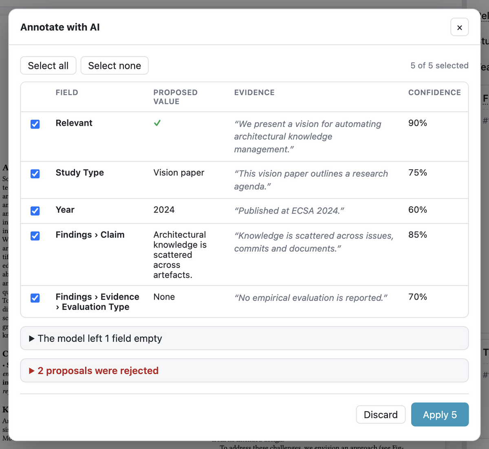
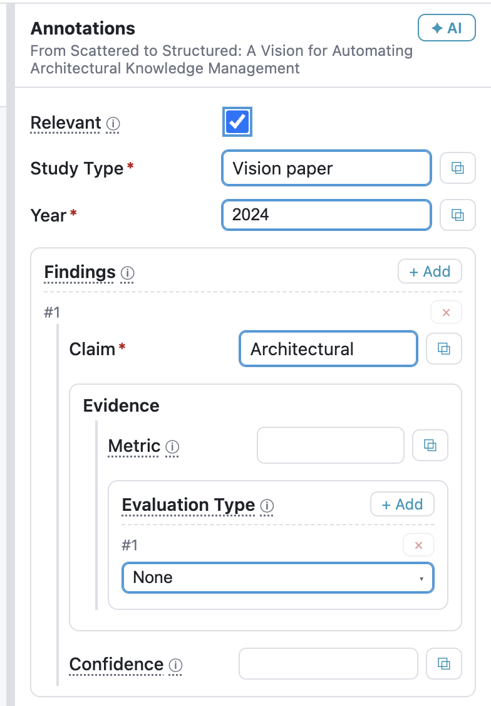
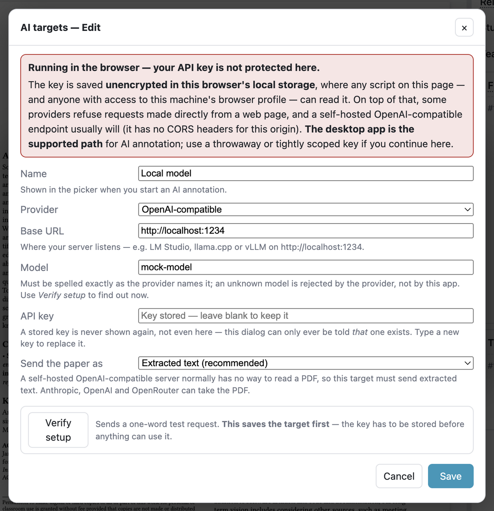

<p align="center">
  
</p>

<h1 align="center">SaiLoR</h1>

A tool to assist reviewers during **Systematic Literature Reviews (SLR)** — the letters are in the
name: **S**ai**L**o**R**. Open a single JSON "project" file that holds both an annotation schema
(a nested, cardinality-controlled taxonomy) and the papers to annotate. Read each paper's PDF, fill in typed
annotation fields — optionally grabbing values straight from selected PDF text — and save the
annotations back into the JSON.

The same codebase runs two ways:

- **Desktop app** (Electron) — fully local, opens local PDF files, native Open/Save dialogs.
- **Web app** — a static build you can host on any server (or open locally in a Chromium browser).

<p align="center">
  
</p>

## Quick start

```bash
npm install

# Web development (browser):
npm run dev
# then open http://localhost:5173

# Desktop app (Electron) in dev:
npm run dev:electron
```

Open the bundled example from the browser dev server via:
`http://localhost:5173/?project=/samples/project.example.json`

## Installing a release

Grab the file for your system from the [releases page](https://github.com/Gram21/SaiLoR/releases):

| System | File |
|---|---|
| macOS, Apple Silicon (M1–M4) | `SaiLoR-<version>-macos-arm64.dmg` |
| macOS, Intel | `SaiLoR-<version>-macos-x64.dmg` |
| Windows | `SaiLoR-<version>-windows-x64.exe` |
| Linux | `SaiLoR-<version>-linux-x64.AppImage` |

> **The releases are not signed** with an Apple or Microsoft code-signing certificate —
> paying for one is not worth it for a research tool. Both systems will therefore warn you
> the first time you open the app. The steps below are how you tell them to go ahead; you
> only need to do it once.

> **Upgrading from SLR Helper?** The desktop app's settings — recent projects and window size —
> now live in a `SaiLoR` folder (on macOS, `~/Library/Application Support/SaiLoR`). On first run
> the app migrates the old "SLR Helper" folder automatically, so nothing is lost.

### macOS

1. Open the `.dmg` and drag **SaiLoR** into your **Applications** folder.
2. Open the app. macOS blocks it, saying it *"cannot be opened because Apple cannot check
   it for malicious software"*. Click **Done**.
3. Open **System Settings** → **Privacy & Security**, and scroll down to the **Security**
   section. You'll see a note that *"SaiLoR" was blocked to protect your Mac*.
4. Click **Open Anyway**, then confirm with **Open Anyway** and enter your login password.

The app opens normally from then on. (The **Open Anyway** button only appears for about an
hour after you tried to open the app — if it's gone, just try opening the app again.)

Note that on current macOS versions the old right-click → **Open** shortcut no longer works
for apps like this — the *Privacy & Security* route above is the way.

<details>
<summary>If macOS says the app is <em>"damaged and can't be opened"</em></summary>

That message means the download's quarantine flag is set on an app macOS can't verify —
**the app is not actually corrupt**. It affects builds from before v0.1.0's signing fix.
Either grab a newer release, or clear the flag once:

```bash
xattr -cr "/Applications/SaiLoR.app"
```
</details>

### Windows

1. Run `SaiLoR-<version>-windows-x64.exe`.
2. Windows SmartScreen shows *"Windows protected your PC"*. Click **More info**, then
   **Run anyway**.
3. Follow the installer.

### Linux

The AppImage is a single self-contained file — no installation needed. Make it executable
and run it:

```bash
chmod +x "SaiLoR-<version>-linux-x64.AppImage"
./"SaiLoR-<version>-linux-x64.AppImage"
```

If it fails to start, your distribution may be missing FUSE (`sudo apt install libfuse2`
on Debian/Ubuntu), or you can extract and run it with `--appimage-extract-and-run`.

## Project file format

> 📖 For a full authoring guide with many examples, see
> [docs/annotation-schema.md](docs/annotation-schema.md). The summary below is the quick reference.

```jsonc
{
  "version": 1,
  "config": {
    "schema": [
      { "name": "Relevant", "type": "boolean" },        // leaf field
      { "name": "Study Type", "type": "string",
        "options": ["Case study", "Experiment", "Survey"] },  // enum dropdown

      { "name": "Year", "type": "number" },
      {
        "name": "Findings", "min": 1, "max": null,       // group, repeatable (unbounded)
        "children": [
          { "name": "Claim", "type": "string" },
          { "name": "Evidence", "type": "string" },
          { "name": "Confidence", "type": "number" }
        ]
      }
    ]
  },
  "papers": [
    {
      "id": "paper-a",
      "title": "…",
      "authors": ["…"],
      "doi": "10.1000/xyz",         // optional
      "pdf": "pdfs/paper-a.pdf",    // path relative to this JSON file
      "annotations": {}             // filled in as you annotate
    }
  ]
}
```

**Annotation nodes** (`config.schema[]`):

| Field         | Meaning                                                                 |
| ------------- | ----------------------------------------------------------------------- |
| `name`        | Display label (required). Sibling names must be unique.                 |
| `type`        | `string` \| `number` \| `boolean`. Omit for a group (name-only) node.   |
| `children`    | Sub-taxonomy. A node may have `type`, `children`, or both.              |
| `min`         | Minimum occurrences (default `1`).                                      |
| `max`         | Maximum occurrences: a number, or `null` for unbounded (default `1`).   |
| `options`     | Array of strings on a `string` field → a filterable enum dropdown.      |
| `description` | Optional tooltip.                                                       |

**Annotation data** mirrors the schema: at each level a map keyed by node name, where every key
holds an array of instances (bounded by `min`/`max`). Each instance carries a `value` (for fields)
and/or nested `children`. Saving prunes trailing empty optional instances and leaves `config`
untouched. Unknown top-level and per-paper fields are preserved verbatim.

## Using the app

- **Open ▾ menu** — open a project file, or reopen one of the last 5 recent projects. (Recent
  projects require the desktop app or a Chromium browser; other browsers show only "Open file…".)
- **Save ▾ menu** — Save or Save as…, with their shortcuts shown next to each item.
- **? (Help)** — opens a dialog describing the workflow and listing all keyboard shortcuts.
- **Left pane** — collapsible list of papers (toggle with the ☰ button). A green dot marks papers
  that already have annotations. Click a paper to open it.
- **Resizable panes** — drag the borders between the three panes to resize them; the widths are
  remembered.
- **Middle pane** — the paper's PDF, rendered with a selectable text layer.
- **Right pane** — the annotation form, laid out by the taxonomy. Repeatable nodes show **+ Add**
  (up to `max`) and a remove (**×**) control (down to `min`).
- **Grab from PDF** — select text in the PDF, then click the **⧉** button next to a string/number
  field to insert it (numeric fields extract the first number).
- **✦ AI** — *not available yet.* An LLM proposes values for the fields that are still empty, for
  you to review before anything is written. The groundwork is in the app but the feature is off in
  this release; it is planned for a future one. See [Annotating with AI](#annotating-with-ai).
- **Theme** — toggle light/dark for the app with the ☾/☀ button (top right). The choice is
  remembered. The PDF paper is always rendered on a normal white background, regardless of theme.
- **Font size** — the `A− A A+` buttons (or the shortcuts below) scale the app's text. This affects
  the app chrome only, not the rendered PDF. The chosen size is remembered.

### Keyboard shortcuts

| Shortcut                | Action                         |
| ----------------------- | ------------------------------ |
| `Ctrl/Cmd + O`          | Open a project file            |
| `Ctrl/Cmd + S`          | Save                           |
| `Ctrl/Cmd + Shift + S`  | Save as…                       |
| `Ctrl/Cmd + Z`          | Undo annotation change         |
| `Ctrl/Cmd + Shift + Z` / `Ctrl + Y` | Redo annotation change |
| `Ctrl/Cmd + +` / `-` / `0` | Zoom the PDF in / out / reset |
| `Ctrl/Cmd + Shift + +` / `-` / `0` | App font size larger / smaller / reset |
| `Alt + ↓` or `]`        | Next paper                     |
| `Alt + ↑` or `[`        | Previous paper                 |
| `F1`                    | Open help                      |
| `Ctrl/Cmd + C/V/X/Z`    | Native copy/paste/…            |

## Annotating with AI

> 🚧 **Not available yet — planned for a future release.**
> The groundwork described in this section is built into the app, but the feature is **switched off**
> in this release: the **✦ AI** button is not shown, and there is no way to set a provider up or
> start a run. Read this section as a preview of what is coming, and of how it will treat your data
> when it does, rather than as instructions you can follow today.

The **✦ AI** button at the top of the annotation column asks a language model to read the paper you
have open and **propose** values for its annotation fields. It is a first draft, not an answer.

**What it does**

- It only looks at the fields that are **still empty**. Anything you have already filled in is not
  sent as a question and is **never overwritten** — including if you fill a field in while the model
  is still thinking.
- You get a table: the field, the value the model proposes, the **verbatim quote from the paper**
  that supports it, the model's confidence, and a checkbox. Untick anything you don't want.
  **Nothing is written into your project until you press Apply.**
- The whole fill lands as a *single* change: one `Ctrl/Cmd + Z` undoes all of it.
- Proposals that don't fit your schema — a field that doesn't exist, a number that isn't a number, a
  value outside a dropdown's choices — are refused by the app and listed separately, never applied.
- The model is instructed to quote the paper for every value and to **leave a field empty rather
  than guess**. It is still a language model: check the quotes.

<p align="center">
  
</p>

Once applied, every field the model filled keeps a **light-blue border** until you click it (or its
name). That click is you confirming the value — the marks are yours alone: they are never saved into
the project file and are gone when you reopen it.

<p align="center">
  
</p>

**Where it sends your paper**

> ⚠️ **Once enabled, the paper's extracted text will be sent to whichever LLM provider you
> configure.** (Or the PDF file itself, if you set the target up that way.) It will leave your
> machine and go to that provider under that provider's terms. **Don't use it on material you are
> not allowed to share** — papers under a publisher's licence, embargoed manuscripts, anything
> confidential. The dialog names what will be sent and to whom before anything leaves.

There is no built-in provider and no key ships with the app: nothing is sent anywhere until you set
up a target yourself.

**Supported providers** — **Anthropic**, **OpenAI**, **Google (Gemini)**, **OpenRouter**, **Groq**,
**Mistral**, **DeepSeek**, **xAI (Grok)**, or **any OpenAI-compatible endpoint**, including one
running locally (LM Studio, llama.cpp, vLLM, …). A local endpoint is the one setup where the paper
does not leave your machine. Only Anthropic, OpenAI, Google and OpenRouter can take the PDF itself —
the rest always receive the extracted text.

Set one up via **✦ AI → ⚙** (or *Set up an LLM…*): give the target a name, pick the provider, enter
the model name and your API key, and press **Verify setup** to send a one-word test request. On the
desktop the key is stored **encrypted with your operating system's keychain** and is never handed to
the page. In the **browser build** it is stored **unencrypted** in local storage and some providers
refuse calls made directly from a web page — the desktop app is the supported path for this feature.

<p align="center">
  
</p>

<p align="center"><em>Setting up a target — shown in the browser build, which is why it leads with the
key-storage warning. The desktop app stores the key in your OS keychain instead.</em></p>

**Extraction quality is the ceiling.** The paper is sent as text pulled out of the PDF, and that
extraction is only as good as the PDF: two-column papers, tables, figures and formulas come out
imperfectly, and a **scanned** paper yields no text at all (the app stops and tells you, rather than
letting the model invent a paper from its title). The model is told the text may be garbled and to
omit a field rather than reconstruct it — but it is one more reason to read the quote before you
accept a value.

## Saving

- **Desktop**: writes to the opened file's path; **Save as** opens a native dialog.
- **Browser (Chromium)**: uses the File System Access API to save in place / to a new file.
- **Browser (other)**: downloads the updated JSON.

## Building & testing

```bash
npm run build            # static SPA into dist/ (host anywhere)
npm run build:electron   # desktop installers into release/ (via electron-builder)
npm test                 # unit tests (model: schema, normalize, round-trip)
npm run typecheck
```

## Deployment

### A. Browser variant — static hosting

`npm run build` emits a self-contained static site in `dist/`. Serve that folder from any static
host (nginx, Apache, S3/CloudFront, GitHub Pages, …). The build uses a relative base, so it also
works from a subpath.

Place each project JSON next to its `pdfs/` folder on the same host and link to it with
`?project=<url>` — the app fetches the JSON and resolves its PDFs relative to that URL:

```
https://your.host/?project=/reviews/2026/project.json
```

Users can also just click **Open…** in the app to load a local JSON from their own machine.

### B. Browser variant — Docker (recommended for self-hosting)

A multi-stage [`Dockerfile`](Dockerfile) builds the SPA and serves it with nginx; the
[`docker-compose.yml`](docker-compose.yml) wires up the port and the volume of project files.

```bash
# Build and start (serves on http://localhost:8080)
docker compose up -d --build

# Stop
docker compose down
```

By default the bundled example folder [`./samples`](samples) is mounted read-only into the
container and served under the `/projects/` URL namespace, so once the container is up you can
open:

```
http://localhost:8080/?project=/projects/project.example.json
```

To use your own reviews, point the volume in `docker-compose.yml` at your own folder of project
JSONs and their PDFs — whatever folder you mount is served at `/projects/`:

```yaml
volumes:
  - ./my-reviews:/usr/share/nginx/html/projects:ro
```

```
my-reviews/
  my-review.json          # references pdfs/paperX.pdf (paths relative to the JSON)
  pdfs/
    paperX.pdf
```

Open it with `http://localhost:8080/?project=/projects/my-review.json`.

Change the published port by editing the `ports:` mapping in `docker-compose.yml` (default
`8080:80`). To build/run the image without Compose:

```bash
docker build -t sailor .
docker run -d -p 8080:80 -v "$PWD/samples:/usr/share/nginx/html/projects:ro" sailor
```

> The browser variant is read-only on the server: saving happens client-side (File System Access
> API or a download), never written back to the container — hence the read-only mount.

### C. Desktop variant — Electron installers

`npm run build:electron` runs `electron-builder` and produces native installers in `release/`
(the `build` block in [`package.json`](package.json) targets `dmg` on macOS, `nsis` on Windows,
`AppImage` on Linux). Build on (or cross-build for) each target OS as needed. The desktop app reads
local PDF files directly, so no server is involved.

## Developing with Docker

If you'd rather not install Node locally, a separate dev stack in
[`docker-compose.dev.yml`](docker-compose.dev.yml) can run the browser dev server or build the
Electron app in a container. It is **fully separate** from the production `docker-compose.yml`
above — nothing here runs on a plain `docker compose up`, so deployment is never affected. Pick a
target with a Compose **profile**:

```bash
# Browser development — Vite dev server with hot reload on http://localhost:5173
docker compose -f docker-compose.dev.yml --profile browser up --build
# then open http://localhost:5173/?project=/samples/project.example.json

# Build the Electron desktop app — installers are written to ./release/
docker compose -f docker-compose.dev.yml --profile electron run --rm electron
```

- **Browser dev** ([`Dockerfile.dev`](Dockerfile.dev)) bind-mounts the source for hot reload. If
  file edits aren't detected (common on macOS/Windows mounts), prefix the command with
  `VITE_USE_POLLING=1`.
- **Electron build** ([`Dockerfile.electron`](Dockerfile.electron)) is a Debian image that runs
  `electron-builder`. It builds **Linux** installers (AppImage) into `./release/`; macOS/Windows
  installers must be built on their native OS (Windows can be cross-built by basing the image on
  `electronuserland/builder:wine`). Running the Electron GUI inside the container additionally needs
  X11 forwarding — for day-to-day desktop development, run `npm run dev:electron` on the host.

## Architecture

- `src/model/` — schema types + zod validation, project load/normalize/serialize, annotation
  instance-tree helpers (unit-tested).
- `src/platform/` — a `PlatformAdapter` seam so the UI is identical in Electron and the browser
  (`electron.ts` = IPC + `slr-file://` protocol; `browser.ts` = File System Access API / fetch).
- `src/llm/` — the AI-annotation layer: prompt, provider request/response shapes, field paths, and
  the parser that validates every proposal against the schema before a reviewer ever sees it.
- `src/state/store.ts` — Zustand + immer store (`src/state/aiStore.ts` for the AI flow).
- `src/components/` — Toolbar, PaperList, PdfViewer, AnnotationPanel/Node/Field, AiDialog.
- `electron/` — thin main process (BrowserWindow, Edit-role menu, dialog/fs IPC, PDF protocol) and
  a context-isolated preload.
