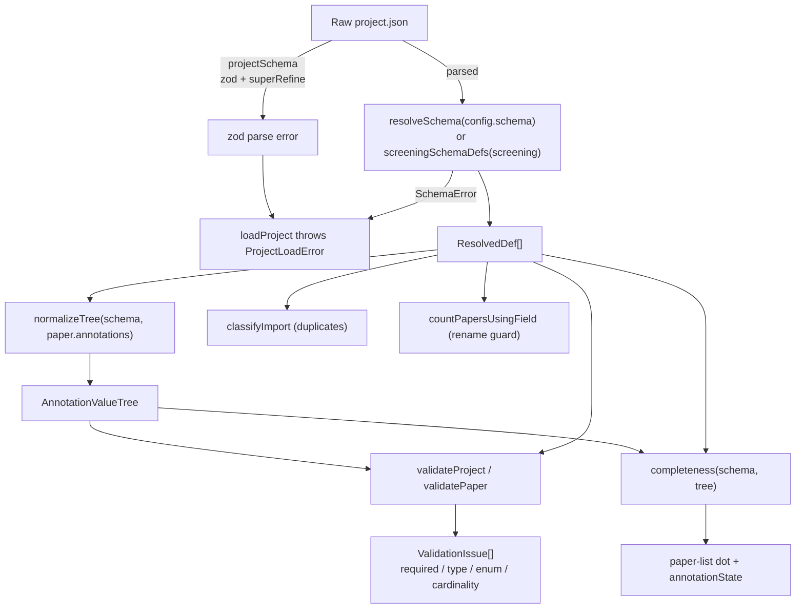

# Annotation Schema and Validation

A SaiLoR project carries its **annotation schema** under `config.schema`: a tree of
nodes describing the taxonomy of fields a reviewer fills in for each paper. The
schema is authored as plain JSON, then *resolved* into an in-memory
`ResolvedDef[]` that the form, the validator, the completeness dot, and the
duplicate detector all consume. This page covers the whole path: the authoring
types, the zod validation of the raw JSON, the resolution step that applies
defaults and enforces structural rules, the field/cardinality model, the
validation walk, the completeness computation behind the paper-list dot, the
field-usage guard that warns before a schema rename orphans answers, and the
duplicate detection run at import time.

The user-facing authoring guide, with copy-paste examples and the full format
table, lives in `docs/annotation-schema.md`; this page is the implementation
companion to it.

## The authoring type and the resolved type

`AnnotationDef` (`src/model/schema.ts`) is the author-facing shape written into
the file:

| Field        | Type                                   | Default | Meaning                                                                  |
| ------------ | -------------------------------------- | ------- | ------------------------------------------------------------------------ |
| `name`       | `string`                               | —       | Display label and the key under which answers are stored.                |
| `type`       | `FieldType`                            | —       | `string` / `number` / `boolean` / `year`. Omit to make a group.          |
| `children`   | `AnnotationDef[]`                      | —       | A nested sub-tree. A node may have `type`, `children`, or both.          |
| `min`        | `number`                               | `1`     | Minimum instances (a group repeats its whole sub-tree).                  |
| `max`        | `number \| null`                       | `1`     | Maximum instances; `null` = unbounded.                                   |
| `options`    | `string[]`                             | —       | Enum dropdown, only on a `string` field.                                 |
| `required`   | `boolean`                              | `false` | Field the reviewer must fill; ignored on a `boolean` (see below).        |
| `visibleIf`  | `string`                               | —       | Name of a sibling or ancestor field that gates this node's visibility.    |
| `description`| `string`                               | —       | Help note shown on hover.                                                |

`ResolvedDef` is the same shape with defaults filled in and an `id` assigned:

- `id` — a stable path id derived from the node's slash-joined names
  (`parentPath ? `${parentPath}/${def.name}` : def.name`), used by the canonical
  path machinery in `src/llm/paths.ts`.
- `min` / `max` — normalized from their optional raw forms to the concrete
  `1` / `1` (or `null`) defaults.
- `required` — resolved as `false` for a boolean no matter what the file said
  (a checkbox is never "empty", so `required` on one can never fire; see
  "Emptiness" below). A stray flag on a boolean in a hand-edited file is
  silently cleared here rather than rejected, so a file that currently loads
  keeps loading.
- `visibleIf` — kept only when it names a real, answerable sibling in the same
  `children` array or a field along this node's direct ancestor chain, and is
  not a self-reference. A reference to a group (a node with no `type`), to a
  cousin (an ancestor's sibling), to a non-existent name, or to the node
  itself is **dropped silently** at resolve time — the same "degrade
  defensively on hand-edited data" convention used elsewhere in this schema.
- `children` — recursively resolved.

`resolveSchema(defs)` is the public entry point: it runs `resolveDefs` over the
root array (which enforces sibling-name uniqueness and the `__proto__` /
whitespace-clash rules — see "Resolution: structural rules" below) and then
`assertInstanceBudget` over the result, refusing a schema whose empty tree would
materialize more than 100 000 instances before the reviewer types anything. It
throws a `SchemaError` on any structural failure, which `loadProject` wraps into
a friendly `ProjectLoadError("The annotation schema is invalid.")`.

## Field types

`FieldType = 'string' | 'number' | 'boolean' | 'year'`. The first three are
unconstrained value shapes; `year` is a purpose-named `number` — same on-disk
shape (a JSON number), but validated against the static range
`YEAR_MIN..YEAR_MAX` (1000–2100, in `src/model/year.ts`). `year` was chosen over
a full `date` type deliberately: an SLR needs a four-digit publication year,
nothing more, and a full date would be the wrong size for the data. A `year`
field fails to load in an older SaiLoR that predates the type, the same as any
new `type` value would — the whole point of validating `type` against a fixed
enum.

A node is a **field** when it has a `type` (`isField(def) === def.type !== undefined`)
and a **group** when it has `children` but no `type`. A node may carry both — a
field that additionally owns a sub-tree. A node with neither is invalid (it
would be a label pointing at nothing).

`options` turns a `string` field into an **enum**: the form renders it as a
searchable combobox, the value is stored as a plain string, and an unselected
value stores `null`. `options` on any non-`string` node is a schema error.

## Cardinality: `min`, `max`, and repeatable groups

Every node occurs `min` (default `1`) to `max` (default `1`; `null` = unbounded)
times. A node is **repeatable** when `isRepeatable(def)` — `def.max === null ||
def.max > 1`. `max < min` is a schema error.

Cardinality applies to **groups** too, not just fields: a repeatable group
produces several parallel copies of its whole sub-tree — the "list of findings"
shape. The annotation value tree mirrors this: at each level it is an object
keyed by node `name`, where each key holds an **array of instances** (bounded by
`min`/`max`), and each instance is an object with an optional `value` (for
fields) and/or `children` (a nested tree). See
[`data-model.md`](data-model.md) for the
on-disk shape.

The tree machinery in `src/model/annotations.ts` enforces cardinality on
read/normalize/save:

- `initTree(defs)` materializes `Math.max(def.min, 1)` instances per node
  recursively — the editor always shows at least one instance of every node, so
  the effective minimum is 1 even when `min` is 0.
- `normalizeTree(defs, existing)` reconciles a loaded (possibly partial,
  possibly hand-edited) tree: drops keys not in the schema, pads each list up to
  `min` (and at least 1), and clamps down to `max` if exceeded. It also adopts a
  bare primitive or single object written where a list was expected
  (`"Study Type": "RCT"` or `{...}` instead of `["RCT"]`) as that one entry
  rather than discarding a real answer — this walk is the one that rewrites the
  file, so discarding would open the project cleanly and let the next save
  overwrite a real answer with `null`, silent data loss.
- `pruneTree(defs, tree)` (serialization) drops only **trailing** empty
  instances, keeping required instances (up to `min`, at least one). An empty
  instance with a filled one after it is a deliberate gap and is kept, because
  position carries meaning for consolidation's reviewer alignment (see
  `data-model.md`).
- `canAdd`/`canRemove` gate the form's `+ Add` / `×` controls against `max` and
  `min` respectively.

## Resolution: structural rules

`resolveDefs` (in `src/model/schema.ts`) walks the raw `AnnotationDef[]` and
enforces, at every level:

- **Sibling names must be unique.** Two nodes at the same level cannot share a
  `name`, because the name is the key under which answers are stored. A
  duplicate throws `SchemaError("Duplicate sibling annotation name …")`. Names
  in different branches may repeat.
- **Whitespace-clash rejection.** Siblings that differ only by surrounding
  whitespace are rejected too, because the canonical path format cannot tell
  them apart: `parsePath` trims a segment, so `"Claim "` and `"Claim"` would
  both canonicalize to the same def and a committed answer could land in the
  wrong field. A *lone* padded name is fine and resolves through a trimmed
  fallback; the refusal only fires once both exist.
- **`__proto__` rejection.** A field named `__proto__` is refused outright:
  annotation trees are plain objects, so such a name hits
  `Object.prototype`'s setter, the field reads back through the prototype but
  `Object.keys`/`JSON.stringify` skip it, and the reviewer's answers vanish on
  save with no error. This can only come from a hand-edited file; quietly
  renaming someone's schema is worse than refusing it.

`assertInstanceBudget` caps the product down each branch: `min` is a lower bound
on instance count and `initTree`/`normalizeTree` *materialize*
`Math.max(min, 1)` instances per node recursively at load. Seven levels each
with `min: 7` is about 400 bytes of file and ~820 000 instances; ten levels of
ten is ~500 bytes and 10^10 instances — an out-of-memory kill of the whole
process during load, with no error dialog. A per-node `min` cap cannot stop the
nested case, so the product is bounded directly (100 000), and `countInstances`
stops counting once it exceeds the cap so a 10^10 schema is rejected in the time
it takes to exceed the budget.

## Zod validation of the raw JSON

`annotationDefSchema` (a recursive `z.lazy`) is the schema-level validator. Its
`.strict()` object rejects unknown keys, and `superRefine` enforces the
cross-field rules that the per-field zod constraints cannot express:

- `max >= min` (with `null` treated as unbounded),
- a node must have a `type` or non-empty `children`,
- `options` only on a `string` field,
- `required` only on a field (one with a `type`).

`projectSchema` wraps `config.schema` (optional-and-unbounded at the zod layer,
because a screening project's schema is derived, not authored) and enforces, in
its own `superRefine`:

- a **non-empty `schema`** unless `config.screening` is present (screening's
  schema is derived from `config.screening.reasons` — see
  `src/screening/schema.ts`), and
- a **non-empty `pdf`** on every paper, again unless `config.screening` is
  present (screening is normally done from title + abstract, before any PDF is
  attached).

`ScreeningConfig` is the one authorable screening setting: `reasons: string[]`
(non-empty, trimmed and deduped by `project.ts`; order is the order the summary
reports counts in). Its presence under `config` is what makes a project a
screening project; `config.schema` is then ignored on load and rewritten on
save as the projection `screeningSchemaDefs(config)` returns — a fixed two-field
schema (`Decision` as a two-option `Include`/`Exclude` enum, `Reason` as an enum
of the reasons). The two-option enum (not a boolean) is a hard constraint of
this codebase: a checkbox cannot tell "I decided to include" from "I have not
looked at this yet", and that distinction *is* the screening output.

`paperSchema` is deliberately loose on `year`, `annotations`, `reviews`,
`aiUsage`, and `equal` (`z.unknown()` / `z.record(z.unknown())`): these are
repaired-or-dropped structurally in `project.ts` rather than enforced at the
zod layer, so a hand-edited file with a plausible shape (e.g. `"year": "2021"`)
that currently loads keeps loading.

## Validation: the schema walk

`src/model/validate.ts` walks a resolved schema against a paper's annotation
tree and reports what a reviewer still has to fix. It is deliberately
defensive: the project JSON is hand-editable, so anything can be anywhere, and
a broken tree must surface as an issue, never a thrown exception.

A `ValidationIssue` carries both a human-readable `path`
(`"Findings #2 › Evidence › Metric"`) and a canonical machine `canonicalPath`
(`"Findings[1]/Evidence/Metric"`, the `formatPath` form from
`src/llm/paths.ts`) so the UI can jump straight to the field, not just the
paper. `canonicalPath` is empty for a paper-level issue that names no field
(a caught structural error, or a screening cross-field rule).

The walk produces four issue kinds:

- **`required`** — a `required` field whose value is empty. Booleans can never
  be `required`-empty: an unticked box is a real `false`, not "not answered".
- **`type`** — a value of the wrong type for its field (`typeMismatch`).
  `null`/`undefined` is "not answered" and is the `required` check's job, not
  the type check's. A `year` out of `[1000, 2100]` is reported as `type`, not a
  new kind, with the expected clause spelling out the bound. A type mismatch
  short-circuits: a mistyped value tells us nothing about requiredness or enum
  membership, so the field is not also checked for those.
- **`enum`** — a non-empty string value not in its field's `options` list.
- **`cardinality`** — a node whose instance count is below `min` or above `max`.

A fifth kind, **`screening`**, is never emitted by this module's own walk; it
is emitted by `src/screening/validate.ts` for the two cross-field rules the
schema language cannot express (excluded with no reason; reason recorded but
not excluded). It lives in the shared `IssueKind` union because `ValidationIssue`
and everything that renders one (notably `ValidationDialog.tsx`) is shared.

The diagram traces the load path from raw JSON through zod, resolution,
tree normalization, and on to the three consumers that read a resolved
schema and a value tree: validation, completeness, and the duplicate /
field-usage checks.

### Skipping unannotated papers

`validateProject` skips papers with no annotations at all
(`hasAnnotations(schema, tree)` is false). A paper nobody has touched fails
every required field for the single reason it hasn't been started, which says
nothing a reviewer doesn't already know from the paper list's own "not annotated
yet" dot; validating it would produce a wall of "missing" issues. Skipped
papers are returned separately as `unannotated: UnannotatedPaper[]`, so "not
started" is never silently indistinguishable from "actually valid". If the
walker itself throws on a surprise in a hand-edited file, the paper gets a single
`type` issue (`"Could not validate this paper's annotations: …"`) rather than
taking the app down — a validation run must never crash over a hand-edited file.

`ValidationDialog.tsx` surfaces the result: issues grouped by paper (in the
order `validateProject` walked), each clickable to jump to the paper and — when
the issue names a field — scroll the annotation panel to that field and flash it
via `canonicalPath`. Unannotated papers are listed below as a plain "not started
yet" checklist. A paper with no issues shows "No problems", and the dialog notes
that yes/no fields always count as answered.

### Emptiness

`isEmptyValue(type, value)` defines "not answered" and is shared by validation
and completeness:

- `boolean` is **never** empty — an unchecked box is a legitimate `false`, and a
  missing/`null` boolean is read as `false`. A required boolean can therefore
  never be reported missing. This is intentional product behaviour, not an
  oversight.
- `number`: `0` is a real answer; only `null`/`undefined` is empty.
- `string`: whitespace-only counts as empty (it is invisible in the UI).

## Completeness and the paper-list dot

`src/model/completeness.ts` computes how much of a paper's *answerable surface*
is filled in — the numbers behind the paper list's completeness dot. It is
store-free and DOM-free: it only ever reads a resolved schema and a value tree.

`completeness(defs, tree)` returns `{ filled, total }` over the paper's tree,
with three rules that keep it aligned with validation and with what the form
shows:

- **Denominator.** Required fields only when the schema marks anything required
  (`hasRequiredFields`), otherwise every field. `validate.ts` defines "not
  finished" as "a required field left empty"; wherever that rule has teeth, the
  dot must count the same fields, or the dot and the Validate dialog would
  disagree about the same paper. Where nothing is required, required-only would
  mean 0/0 for every paper; counting every field is the only fallback under
  which the dot can ever read 100%.
- **Booleans are excluded** from both `filled` and `total`. `isEmptyValue` says
  a boolean is never empty (so counting it would make an untouched paper read as
  partially filled), and `hasAnnotations`' private `isEmptyInstance` says the
  opposite (a boolean counts only when `true`, so a correctly-recorded `false`
  would be unreachable). Neither rule is safe to reuse, so — matching
  `annotationText`'s reason for the same exclusion — booleans carry no
  completeness signal.
- **Repeatable nodes have no fixed size**, so the denominator comes from the
  data: every instance actually present in `tree` is counted once, not one per
  schema def and not `pruneTree`d first. Adding an empty entry lowers the ratio
  (the form now really does show one more unanswered field); removing it, or
  saving (which drops trailing empties), recovers it.
- **`visibleIf`-hidden fields are skipped** entirely, exactly as `validate.ts`
  skips them — and for a stronger reason here: a hidden field is one the form
  does not show, so a reviewer cannot fill it. Counting it puts a denominator
  out of reach behind a dot that can never complete, and since the "finished but
  a required field is empty" mark reads this same fraction (see
  `annotationState.ts`), it would paint such a paper permanently red over a
  field nobody could answer — while the Validate dialog, correctly, reports no
  problem. The two must agree, so they apply the same gate. The gate ancestor
  values are threaded through the walk identically to `validateTree`'s
  `gateAncestors`.

`completenessPercent(c)` turns the fraction into the dot's fill: `null` when
`total === 0` (a boolean-only schema, an absent tree, or a schema no data has
reached yet — callers fall back to a binary dot); exact `0`/`100` at the
endpoints; and the interior clamped to `[5, 99]` so 199/200 does not *look*
complete and 1/200 does not *look* untouched — the dot's pre-existing meaning
was "touched vs not", and that must not regress now that it also shows degree.

`annotationState` (`src/model/annotationState.ts`) is the single vocabulary that
combines `Completeness` (a fact about the data) with `Paper.finished` (a
reviewer's declaration) into the dot's color — `untouched` / `partial` /
`complete` / `finished` / `flagged`. `flagged` (red) is "declared finished
while a **required** field is empty", reachable only in a schema that marks
something required, and re-evaluated from the current data on every read so it
flips to and from `finished` on its own as fields are emptied and refilled.
`completenessApplies` excludes only screening projects (which have their own
tri-state marker and no finished checkbox). `PaperList.tsx` calls
`completeness` for the dot's *fill* (progress) and `annotationState` for its
*color* (whose move it is) — the two are deliberately independent inputs so a
full-but-unsigned-off paper reads as `complete`, never `finished`, until a human
ticks the box.

## Field usage: guarding schema renames and removes

`src/model/fieldUsage.ts` answers the one question the schema editor needs to
warn *before* a rename or remove: how many papers still record an answer under
a given field.

Answers are stored keyed by the schema field's *name*, so renaming a field (or
removing one) orphans every answer recorded under the old name. Nothing
migrates them: `normalizeTree` builds its output by iterating the schema's defs
and drops any key the schema no longer has, so the next load quietly prunes them
and the next save makes that permanent. `countPapersUsingField(papers, path)`
counts, across each paper's consolidated tree *and* every reviewer's own tree
(kept verbatim under `extra.reviews`), how many hold a real recorded answer at
exactly `path` — the field's names from the schema root down to it.

Matching is by the field's **path** from the root, not by its bare name anywhere
in the tree. Matching on the bare name over-warned in the most common editor
action — add a field, type a name another field already uses, change your mind,
delete it — and a guard that cries wolf on a node holding nothing is a guard
users learn to click through. `isAnswer` mirrors the app's shared emptiness
rule: an unticked checkbox is not evidence (every boolean reads `false` whether
or not anyone looked), and a blank/whitespace-only string is not an answer, so
neither makes a rename look destructive when it is not.

`countLinksUsingField(papers, path)` is the counterpart for a PDF-mark link — a
"why I picked this value" link pointing at `path`. Unlike an ordinary answer
(which the next load prunes silently), an orphaned link leaves the *mark* still
showing a label for a field that no longer resolves, with no way for a reviewer
to discover or clean it up short of opening every mark's popover — worth
warning about for that reason. The linked-field canonical path is parsed via
`parsePath` rather than string-prefix-matched, since a name containing `/` or
`[` is escaped in the canonical form.

`SchemaTreeEditor.tsx` is the consumer: it calls `countPapersUsingField` /
`countLinksUsingField` and warns before a rename/remove/move that would orphan
answers or links. The screening-reasons editor has its exactly-analogous guard
in `src/screening/reasonUsage.ts`; the two hazards are the same shape.

## Duplicate detection at import

`src/model/duplicates.ts` flags probable duplicate papers at import time,
reusing `consolidate/similarity`'s lexical matcher rather than a second one. It
is pure and store-free: it knows nothing of `EditorPaper`, the DOM, or React;
the caller (`editorStore.ts`) adapts its own paper/reference shapes into
`DupRecord` and turns a `DupVerdict` into an actual store mutation.

`classifyImport(existing, incoming)` returns one `DupVerdict` per incoming
record (index-aligned): `new`, or `certain`/`probable` against a `target`
(either an existing paper or an earlier entry in the same batch — a single
`.bib` can list the same paper twice). Each incoming entry is compared against
every existing record *and* every earlier incoming entry, and the best
candidate wins by `rank`: a DOI-`certain` match beats a title-`certain` match
beats any `probable` match, and `probable` matches rank by score. A
DOI-`certain` match short-circuits the search (nothing beats it).

`classifyPair` evaluates a candidate pair in a fixed priority order, each rule
strictly stronger than the next, first fire wins:

1. **DOI** — identical normalized DOI is `certain`. An identical DOI is the same
   record whatever year two databases claim for it, so the year veto never
   applies to a DOI match. Two *different* known DOIs demote everything below.
2. **Exact normalized title** — `normalizeTitleForMatch` strips casing,
   whitespace, and *all* punctuation (so an em-dash vs a hyphen, or a colon vs
   none, already collapse). `certain` when nothing contradicts it; demoted to
   `probable` by a large year gap or a DOI conflict; demoted to `probable` when
   both sides have authors but share *none* (titles like "Introduction" /
   "Editorial" are shared by unrelated proceedings papers, and `certain` merges
   silently — `fillFromRef` would then write one paper's DOI/year/venue onto
   the other, a wrong record rather than a missing one).
3. **Fuzzy title** — `fuzzyScoreAtLeast` against the `TITLE_SIM_THRESHOLD`
   (0.90) whole-title threshold. `probable`.
4. **Base title + authors** — the title up to its first colon, fuzzy-scored,
   corroborated by author surname-set Dice ≥ `AUTHOR_SIM_THRESHOLD` (0.50).
   `probable`.

A **year gap** of `>= YEAR_GAP_VETO` (2) on an otherwise title-matching pair
means "different artifact" (a workshop paper and its journal extension share a
title and are both worth citing separately) rather than "database
disagreement", and downgrades what would otherwise be a match all the way to
`new`. It is `>=`, not `!==`: databases disagree by one year constantly
(online-first vs. issue date), and treating that routine noise as a different
paper would be a far more common false negative than the workshop/journal case
is a false positive.

### Cost guards

Detection is O(existing × incoming): a 2000-paper project against a 1000-entry
`.bib` is 2 000 000 title pairs, run synchronously inside the store's `set`.
Calling `stringSimilarity` (a full Levenshtein matrix) on every pair measures
at over 40 seconds of hard UI freeze — a shipped non-feature. `fuzzyScoreAtLeast`
brings the provably-identical result down to well under a second by proving
most pairs cannot reach the threshold before ever computing an edit distance.
It uses two independent, sound **lower bounds** on the edit distance (hence
upper bounds on the ratio): a length bound (`lev >= |len(a) - len(b)|`) and a
histogram bound (`lev >= (Σ|countA(c) - countB(c)|) / 2`), cheapest first,
only calling the real `stringSimilarity` when neither rules the pair out. A
token-Dice check runs before any skip (short, heavily-reordered titles can pass
where the length bound would skip), and when Dice alone clears the bar the
reported score is Dice itself — only the `>= threshold` verdict decides
`certain`/`probable`/`new`, not the exact number.

## Where this fits

The resolved schema is the shared backbone of the annotation side of SaiLoR.
Beyond the consumers above, it feeds AI-assisted annotation (the LLM prompt
hands a model the schema it has never seen via `SCHEMA_FORMAT_DOC` in
`src/llm/prompt.ts`, kept in step by hand with `docs/annotation-schema.md`),
consolidation alignment (`src/consolidate/`), and the git merge/reviewers
machinery. See:

- [`../architecture.md`](../architecture.md) for the overall
  runtime and the split on-disk storage layout.
- [`data-model.md`](data-model.md) for the
  on-disk annotation value tree and the per-reviewer / consolidation split.
- [`../workflows/screening.md`](../workflows/screening.md) for the
  screening project workflow and the derived screening schema.
- `docs/annotation-schema.md` for the user-facing authoring guide with
  copy-paste examples.