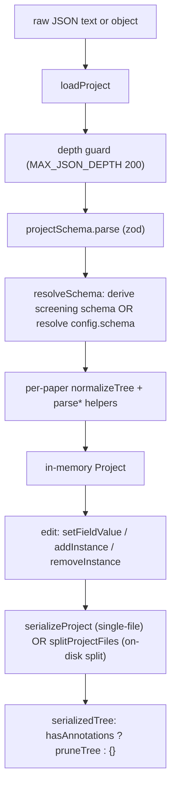

# Project Data Model

A SaiLoR project is, logically, one JSON document: a `config.schema` (the
annotation taxonomy), a list of `papers`, and each paper's annotation trees.
The interesting part of the data model is the **split** between what that one
document is on disk and what the app works with in memory. On disk it is a
meta-only `project.json` plus a family of small per-paper annotation files
designed so two reviewers never touch the same file. In memory it is a single
normalized `Project` object whose value trees mirror the resolved schema, edited
through one set of store actions and serialized back through `pruneTree` +
`splitProjectFiles`.

This page covers the on-disk layout, the in-memory types, the load → normalize
→ edit → prune → serialize lifecycle, the silent migration from the legacy
single-file shape, lazy file creation/deletion, and the five-state annotation
vocabulary that the paper list, its filter, and its finished counter all share.

The companion page [[concepts/annotation-schema]] covers the schema types
(`AnnotationDef`/`ResolvedDef`), zod validation, and the completeness/validate
walks in detail; this page covers them only where they cross the project
lifecycle.

## On-disk layout

The serialized project is split into two layers:

- **`project.json`** — meta only. `version`, `title`, `provenance`,
  `protocol`, `schemaInfo`, `config` (the resolved `schema`, `ai`,
  `finishCheckbox`, `reviewers`, `screening`), and a `papers` array carrying
  *paper metadata* (`id`, `title`, `authors`, `year`, `venue`, `doi`,
  `abstract`, `abstractFromPdf`, `pdf`) plus any preserved `extra` keys. No
  `annotations`, `reviews`, `aiUsage`, `equal`, `alignment`, `marks`, or
  `finished` ever appear here.
- **`annotations/<paperId>/…`** — one folder per paper, holding the
  per-paper-per-reviewer annotation files:

| File                                                         | Holds                                                                                                       | When it exists                       |
| ------------------------------------------------------------ | ----------------------------------------------------------------------------------------------------------- | ------------------------------------ |
| `consolidated.json`                                          | the consolidated/`annotations` tree, plus `aiUsage`, `equal`, `alignment`, `finished`                      | when any of those is non-empty       |
| `reviewer-<n>.json`                                          | reviewer `n`'s own `annotations` tree and `finished` flag                                                  | when that tree has answers or the flag is set |
| `marks-consolidated.json`                                    | the consolidated/Consolidation seat's `marks`                                                               | when `marks` is non-empty            |
| `marks-<n>.json`                                             | reviewer `n`'s own `reviewMarks`                                                                            | when that list is non-empty          |

A screening project swaps the `reviewer-`/`consolidated` prefixes for
`screening-<n>.json` / `screening-consolidated.json` — same layout, a different
prefix so screening decisions and full annotations are distinguishable at a
glance in the folder. `marks-*` files keep the same name in both modes, since
PDF highlights are reading notes rather than screening/annotation data.

The split exists to keep two reviewers — or two reviewers of the same paper's
different slots — from ever editing the same file, which is what makes a git
merge of a multi-reviewer project survive without per-field conflicts.
`aiUsage` and `equal` are not split per reviewer even in a multi-reviewer
project: `aiUsage` is one array for the whole paper, `equal` is inherently a
consolidation-time concept, and both are small, low-conflict records that ride
in the consolidated file.

`splitProjectFiles` is the pure function that produces this split: given a
`Project`, it returns `{ meta, files }` where `files` is a list of
`ProjectFileEntry { relPath, text }`. A `text` of `null` means "this file
should not exist" — the caller (the Electron main process on save, or the git
layer on merge finish) deletes it if present on disk. The function is
side-effect-free so it stays unit-testable without a filesystem; `electron.ts`
and `gitStore.ts` do the actual writes/deletes.

## In-memory types

### `Project`

```ts
interface Project {
  version: number
  title?: string
  provenance: ProjectProvenance | null
  protocol: ProjectProtocol | null
  schemaInfo: string | null
  schema: ResolvedDef[]
  aiEnabled: boolean
  finishCheckbox: boolean
  reviewers: number
  papers: Paper[]
  screening: ScreeningConfig | null
  extra: Record<string, unknown>
}
```

A few invariants worth knowing:

- `provenance`, `protocol`, and `schemaInfo` are **required-not-optional**
  (`T | null`, not `T?`). Constructing a `Project` without deciding what to do
  with each is a type error, not a silent drop — this matters at `mergeProjects`,
  where an accidental `undefined` would lose the field.
- `protocol` and `schemaInfo` live at the **root**, not under `config`.
  `config` is a strict zod object rebuilt from scratch on every save, so
  anything hand-added under it (`config.protocol`, `config.researchQuestions`)
  is silently dropped the first time the file is saved. Root-level fields
  round-trip.
- `aiEnabled` and `finishCheckbox` default to `true`; only an explicit
  `config.ai: false` / `config.finishCheckbox: false` opts out.
- `reviewers` defaults to `1` (single-reviewer). More than `1` means each
  reviewer `1..N` annotates independently into `Paper.reviews[N]`, plus a
  built-in Consolidation seat that reconciles them into `Paper.annotations`.
- `screening`, when set, is the single source of truth for the schema: the
  `schema` field is *derived* from `config.screening.reasons`
  (`screeningSchemaDefs`) on every load, and whatever `config.schema` the file
  held is ignored. The derived schema is written back on save so the file stays
  self-describing, but the two can never drift.
- `extra` holds any unknown top-level keys, preserved verbatim on save.

### `Paper`

```ts
interface Paper {
  id: string; title: string; authors: string[]; doi?: string
  year?: number; venue?: string; abstract?: string; abstractFromPdf?: boolean
  pdf: string
  annotations: AnnotationValueTree      // the single/consolidated tree
  reviews: Record<string, AnnotationValueTree>   // keyed "1".."N"
  aiUsage: AiUsageRecord[]
  equal: string[]                        // canonical field paths marked "same answer"
  alignment: StoredAlignment             // Consolidation's entry-matching record
  marks: PdfMark[]                       // consolidated seat's PDF highlights
  reviewMarks: Record<string, PdfMark[]> // per-reviewer highlights
  finished: boolean                      // consolidated seat's sign-off
  reviewsFinished: Record<string, boolean>  // per-reviewer sign-off
  extra: Record<string, unknown>
}
```

The single-tree-vs-per-reviewer split repeats four times — `annotations`/
`reviews`, `marks`/`reviewMarks`, `finished`/`reviewsFinished` — for the same
reason each time: each reviewer owns their own reading independently, and the
consolidated/Consolidation seat owns the reconciled record that ships. In a
single-reviewer project the per-reviewer maps stay empty and `annotations`/
`marks`/`finished` alone carry the data, exactly as before multi-reviewer
support existed.

`finished` is deliberately **not derived** from the data: a full tree means
every field has something in it, which is a fact about the form, not a
judgement that the extraction is right. Only a human can make the second claim,
so it is stored rather than computed. It is not re-derived on load either, so a
later edit that empties a field leaves the flag standing while the dot stops
being green (the paper list requires both) — nothing silently un-declares what
a reviewer declared.

### Annotation value tree

```ts
type FieldValue = string | number | boolean | null
interface InstanceNode { value?: FieldValue; children?: AnnotationValueTree }
interface AnnotationValueTree { [nodeName: string]: InstanceNode[] }
```

The tree mirrors the resolved schema: at each level it is a map keyed by node
name, every key holds an array of instances (bounded by the node's `min`/`max`),
and each instance may carry a `value` (if the node is a field) and/or
`children` (a nested tree). `emptyValue` gives the default per type (`false`
for boolean, `null` otherwise); `makeInstance`/`initTree` build fresh instances
recursively initializing children to their `min` (at least 1).

### `StoredAlignment`

```ts
interface StoredSlot { members: Record<string, number>; children?: StoredAlignment }
type StoredAlignment = Record<string, StoredSlot[]>
```

`alignment` records which of each reviewer's repeated entries are *the same
entry*, as an explicit mapping rather than by physically reordering the
reviewers' arrays (the pre-v1.7 approach, which wrote Consolidation's
bookkeeping into other people's data). Anything that reads across reviewers
projects them through `alignedReviews` first, which produces the same lined-up
view as a throwaway copy without touching the stored trees. It is persisted
(rather than recomputed on demand) because matching is offered *before* the
consolidator starts work, and once they have committed an answer under a slot,
that slot must keep meaning the same thing — a mapping recomputed after a
reviewer's later edit could quietly move a different entry into the slot.

### `AiUsageRecord`, `ProjectProvenance`, `ProjectProtocol`

`AiUsageRecord` (`{ provider, model, appliedAt }`) is a permanent AI-usage
disclosure — one entry per `applyAiSuggestions` pass that actually wrote
something, append-only, oldest first. Unlike the session-only "unconfirmed"
`aiMarks` in the store, it survives into the saved file.

`ProjectProvenance` records where a project's papers came from when built by
importing from another project (today only `kind: 'screening-import'`): the
source's title and file name (never path — these files are git-committed, and
an absolute path leaks the author's filesystem), the import timestamp, and a
`counts` snapshot (`included`/`undecided`/`excluded`/`carried`) that a PRISMA
flow diagram needs and that nothing can re-derive later. `null` for a project
started from scratch.

`ProjectProtocol` is the review's authored protocol — research questions, search
strings, databases, search date, notes — recorded inside the project file so a
pre-registered SLR's defining decisions travel with the data they produced.
Every field is optional and authored by hand; `null` when the file records none.

## The load → normalize → edit → prune → serialize lifecycle



*The lifecycle from raw JSON through normalized in-memory `Project` to the
pruned, split on-disk files.*

### Load: `loadProject`

`loadProject(input: string | unknown): Project` is the single entry point. It:

1. **Depth-guards first** (`exceedsDepth`, `MAX_JSON_DEPTH = 200`), before any
   recursive walker runs. Almost every traversal (zod, `resolveDefs`,
   `normalizeTree`, `deepEqualJson`, `serializeProject`) is recursive and blows
   the stack somewhere between a few hundred and a few thousand levels; a
   deeply-nested hand-edited file would otherwise escape this function's
   "throws `ProjectLoadError` with friendly details" contract as a raw
   `RangeError`.
2. **Parses with zod** (`projectSchema`). A `ZodError` becomes a
   `ProjectLoadError` with one detail per issue; a `RangeError` (belt-and-braces
   against the depth guard) becomes a "nested too deeply" error.
3. **Resolves the schema.** For a screening project the schema is *derived* from
   `config.screening.reasons` (`screeningSchemaDefs`); for any other project the
   authored `config.schema` is resolved. `SchemaError` becomes a friendly
   `ProjectLoadError`.
4. **Checks for duplicate paper ids** (which would break selection/navigation).
5. **Builds each `Paper`**, defensively parsing every hand-editable field:
   `normalizeTree` for `annotations`, `normalizeReviews` for `reviews`,
   `parseAiUsage`, `parseEqual`, `parseAlignment`, `parseMarks`/
   `parseReviewMarks`, `parseReviewsFinished`, and `parseYear`/`parseProvenance`/
   `parseProtocol`/`parseSchemaInfo`. Unknown keys go to `extra`.

The defensive-parse convention is uniform: the file is hand-editable, so a
malformed entry is **dropped, never thrown over** — except `parseScreening`,
whose reasons *are* the schema's enum and so cannot be degraded past (an empty
result is a load error, not an empty list).

### Normalize: `normalizeTree`

`normalizeTree(defs, existing)` reconciles a (possibly partial, possibly
hand-edited) value tree against the resolved schema: drops keys not in the
schema, coerces each present instance's structure to the def, pads up to `min`
(and at least 1) instances, and clamps down to `max`. It also adopts shorthand
shapes a hand-editor might write — a bare primitive (`"Study Type": ["RCT"]`
instead of `[{value:"RCT"}]`) or a single entry where the format wants a list
(`"Study Type": "RCT"`) — *as the value* rather than dropping it, because this
walk is the one that rewrites the file and discarding it would let the next
save overwrite a real answer with `null`.

`normalizeReviews` additionally backfills a skeleton tree for every reviewer
`1..reviewerCount` who has no tree of their own. A reviewer who has not started
otherwise has no key in `reviews` — fine for the app, but bad for a JSON diff,
where their first annotation would look like a whole new field appearing out of
nowhere. A key already there with `null`s turns that into an ordinary
value-on-an-existing-line change. It never removes a key for a reviewer number
*above* `reviewerCount`: lowering the count hides that reviewer's tree but must
not be what deletes it.

### Edit: `setFieldValue` / `addInstance` / `removeInstance`

Edits go through the store, which routes every write to the correct seat's tree
via `currentTree`:

- single-reviewer, or Consolidation seat → `paper.annotations`
- a numbered reviewer → `paper.reviews[currentReviewer]` (lazily created on
  first write)

`setFieldValue(path, name, index, value)` walks `containerAt(tree, path)` to
the addressed instance and sets `inst.value`. It **coalesces consecutive edits
of the same field** into one undo step (keyed by `path|name|index`). In the
Consolidation seat it also maintains the `equal`/deferral invariants: emptying
a field clears its `equal` mark (a resolved field must not read as resolved
while holding no answer); picking a value clears a pending deferral but does
not by itself set `equal` (only the explicit "these answers mean the same
thing" checkbox may).

`addInstance`/`removeInstance` push/splice instances, respecting `max`/`min`
via `canAdd`/`canRemove`. `removeInstance` does extra bookkeeping: because
every structure addresses a field instance by canonical path with an embedded
index, removing anything but the last entry shifts the survivors' indices, so
linked-field mark paths, AI marks, `paper.equal` entries, and deferred
consolidations are all rewritten via `shiftCanonicalPath` (or dropped when they
named the removed instance itself).

All three set `dirty` and push an undo snapshot (unless coalescing).

### Prune: `pruneTree`

`pruneTree(defs, tree)` drops **trailing** empty instances from each list, so
saved files stay tidy; required instances (up to `min`, at least 1) are always
kept. Only trailing empties go — an empty instance with a filled one after it
is a gap on purpose and is kept, because position carries meaning
(Consolidation lines reviewers' lists up by index, and closing a gap would
silently re-point the alignment at the wrong entries on the next load).

### Serialize: `serializeProject` and `splitProjectFiles`

`serializeProject(project)` produces the **logical whole-project JSON** (the
single-file shape) — `config` written from the resolved schema, annotation
trees pruned of trailing empties, optional fields omitted when empty, `extra`
re-emitted. This is the contract every platform shares and what git-diff/tests
deal in; papers are sorted by plain case-sensitive string comparison on `id`
(deterministic, locale-independent).

`serializedTree(schema, tree)` is the per-tree serialization rule used by both
serializers: `hasAnnotations(schema, tree) ? pruneTree(schema, tree) : {}`. An
empty normalized tree (which exists in memory to bind the form to the schema)
does not belong in a file until a reviewer has recorded an answer.

`splitProjectFiles(project)` produces the **on-disk split** (`{ meta, files }`)
described above. The platform layer (`electron.ts`) re-parses
`serializeProject`'s output with `loadProject` and runs `splitProjectFiles` on
the result for the actual disk writes; the git layer (`gitStore.ts`) does the
same via `toSplitProject` for merge finishes.

### Change detection: `deepEqualJson`

`deepEqualJson(a, b)` is structural equality for plain JSON values:
order-independent for object keys, order-sensitive for arrays, exactly JSON's
notion of equality otherwise. It is deliberately not a text/string comparison
— `needsShapeMigration` uses it so that whitespace, indentation, and stray key
order (which `serializeProject` freely rewrites on every save) never look like a
reason to migrate a file that is already semantically fine. It is also shared
with `git/merge.ts`'s three-way field-change decision, so a second
implementation would be a bug waiting.

## Legacy single-file migration

A project file may predate the split layout and carry `annotations`/`reviews`
inline under each paper (the "legacy single-file shape"). Two functions handle
the transition:

- **`isLegacyProjectShape(raw)`** — true when any paper in the parsed
  `project.json` has an `annotations` or `reviews` key. Used to decide whether
  a project needs migrating to the split layout on open.
- **`assembleLegacyProjectJson(meta, paperFiles)`** — reassembles a meta-only
  `project.json` body plus its per-paper annotation files back into the legacy
  whole-project shape `loadProject` already knows how to parse, so the read
  path reuses `loadProject` unchanged rather than duplicating its
  validation/defaulting logic. `paperFiles` holds each per-paper file already
  `JSON.parse`d; a paper with no files on disk gets an empty entry.

Migration is **silent and automatic on next save**: `needsShapeMigration`
checks (structurally, via `deepEqualJson`) whether the file's
`annotations`/`reviews` already match the canonical serialized shape, scoped to
exactly those fields. If not, and the project has a stable write handle, the
store re-serializes and saves in place — never a download, never a prompt. A
project with nowhere stable to write (a `?project=` URL, or a browser pick
with no in-place handle) keeps the better shape in memory and converges again
next open. The migration write is deferred one tick so the UI paints first;
its only consequence is deciding whether to kick off the fire-and-forget
resave.

## Lazy file creation and deletion

Per-paper-per-reviewer files are written **only when the tree holds answers**
(`hasAnnotations`), and deleted when empty:

- `reviewer-<n>.json` — written when reviewer `n`'s tree has answers (`has`)
  *or* their `finished` flag is set (a reviewer who ticked the box and then
  cleared a field still said something; dropping the file would silently
  un-say it). Otherwise `text: null` → delete if present.
- `consolidated.json` — written when any of the consolidated `annotations`,
  `aiUsage`, `equal`, `alignment`, or `finished` is non-empty; otherwise
  `null`.
- `marks-<n>.json` / `marks-consolidated.json` — written when the mark list is
  non-empty; otherwise `null`.

A `null` `text` is the delete signal: `splitProjectFiles` is pure and produces
the full intended file set, so the caller deletes any on-disk file whose entry
is `null`. This is what keeps a paper nobody has annotated yet from accumulating
empty files, and what makes a cleared annotation tree's files vanish on the
next save.

`splitProjectFiles` also honors the "lowering the reviewer count must not
delete a reviewer's tree" contract: the set of reviewer slots it emits is the
union of `1..reviewers` and every reviewer number `parseReviews`/
`parseReviewsFinished` kept (including ones above the current count), so a
reviewer who left the project still has their tree written — and it reappears
if the count is raised back.

## The five-state annotation vocabulary

`annotationState.ts` defines the single vocabulary behind the paper list's dot,
its state filter, and its "finished: 5/100" counter, so those three can never
tell different stories about the same paper. The two inputs are deliberately
independent: how full the form is (`Completeness`) is a fact about the data;
whether it is finished is a reviewer's declaration (`Paper.finished`). Neither
is derived from the other; `annotationState` is the one place they combine.

The five states:

- **`untouched`** — nothing filled in, nothing declared.
- **`partial`** — some fields filled, still incomplete.
- **`complete`** — every field the dot counts is filled, but nobody has ticked
  "Annotation finished" yet. Not a finished paper: a full form has not been
  vouched for.
- **`finished`** — complete *and* declared finished. The only green state.
- **`flagged`** — declared finished while a **required** field is empty.
  Reachable by ticking the box early or by emptying such a field on a finished
  paper; re-evaluated from current data on every read, so it flips to and from
  `finished` on its own as fields empty and refill. Reads as an error, not
  progress. Only reachable in a schema that marks something required.

### `completenessApplies` gate

`completenessApplies(project)` is the one gate behind the dot's color, the
finished checkbox, and the filter dropdown. Only a **screening project** is
excluded: it has its own tri-state included/excluded/undecided marker, and the
derived screening schema marks nothing required, so a fill would count both
Decision and Reason — meaning an "Include" decision (which needs no Reason)
would read as half-done for a paper that is actually settled.

**Consolidation is included**, which is why this needs no seat argument: the
consolidated tree is the record that ships, making it the one tree most in need
of a sign-off, and the storage is already there (`currentFinished` routes the
Consolidation seat's tick to `Paper.finished`, the same field a lone reviewer
ticks). Readiness ("has every reviewer answered this paper") moves into the
dot's tooltip rather than its color.

### `finishCheckboxLabel` (seat-aware)

`finishCheckboxLabel(isConsolidation)` returns `'Consolidation finished'` for
the Consolidation seat and `'Annotation finished'` otherwise — one definition,
because the paper list's `complete` tooltip sends the reader to that control
*by name*, and a tooltip naming a box the seat does not have would send them
hunting.

### `config.finishCheckbox: false`

When the project opts out of the finish checkbox (`Project.finishCheckbox =
false`), nobody signs anything off, so a fulfilled schema *is* finished. The
stored tick is not read at all (it may hold a declaration from before the
option was turned off); `complete` and `flagged` are both unreachable — the
first because a fulfilled schema goes straight to green, the second because
there is no declaration left for the data to contradict. Any ticks recorded
while it was on are kept in the file untouched, so turning it back on restores
them.

### Filter buckets

`AnnotationFilter` is `'all' | 'open' | 'in-progress' | 'finished' | 'issues'`
— four buckets over the five states, plus "all". The states exist to color a
single dot precisely; a filter answers a coarser question:

- `open` — every paper whose box is not ticked (untouched, partial, complete).
- `in-progress` — the started subset of `open` (at least one annotation entry
  recorded). Decided from `touched`, not from the state, because a paper
  touched only through a Yes/No answer counts as started even though its dot
  stays `untouched` (completeness ignores booleans).
- `finished` — signed off and still holding.
- `issues` — `flagged`.

`annotationFiltersFor(requireTick)` drops `issues` from the dropdown when no
paper can ever be in that state (`finishCheckbox: false`) — an option that
always selects nothing reads as "no problems found" rather than "not
applicable". `matchesFilter(state, filter, touched)` is the single mapping from
the five states (plus `touched`) to the buckets; a `null` state (a screening
project) matches only "all", so a filter carried over from an annotation
project cannot silently empty a screening list.

## Relationships to other pages

- [[concepts/annotation-schema]] — the `AnnotationDef`/`ResolvedDef` types, zod
  validation, field types, cardinality, the validate walk, and the
  completeness computation in full detail.
- [[workflows/consolidation]] — how the Consolidation seat uses `alignment`,
  `equal`, and the consolidated tree.
- [[workflows/screening]] — the screening workflow and the derived two-field
  schema.
- [[operations/electron-shell]] — the platform layer that performs the actual
  `splitProjectFiles` writes/deletes.
