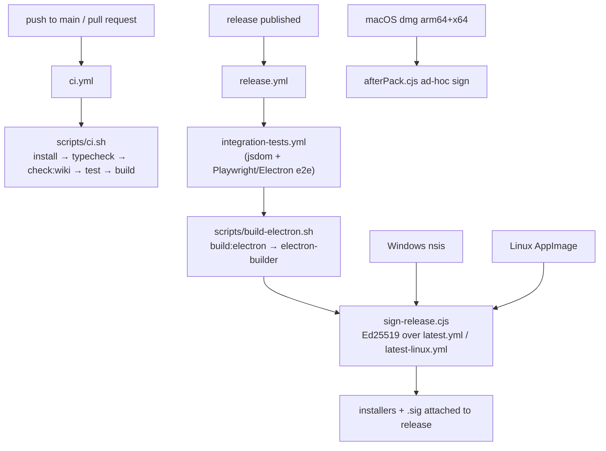
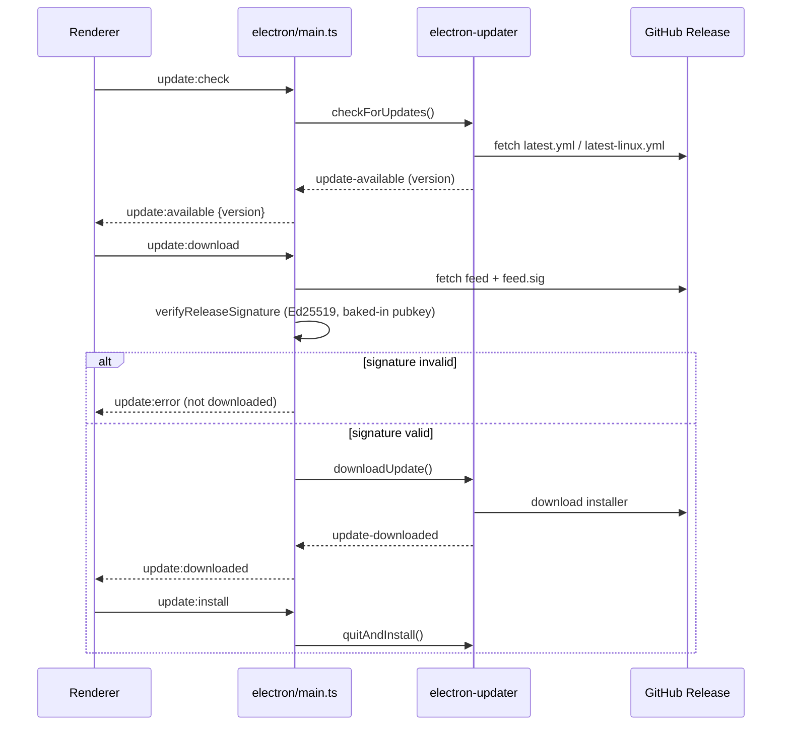

# Build, CI, and Release

SaiLoR ships as a packaged Electron desktop app, with a static web SPA build
that still exists as the per-PR type-check/build gate even though the browser
deployment itself is discontinued (the web build now shows a "use the desktop
app" notice instead of any project-opening UI). The build, test, packaging, and
release machinery is deliberately split so that the real work lives in
repo-local scripts that run identically on any CI provider, while the GitHub
Actions workflows only supply runners and provider-specific glue (artifact
upload, scheduled triggers, wiki mirroring).



*Build, CI, and release flow. CI runs on every push/PR; release runs only on a
published GitHub Release and is gated by the integration/e2e suite.*

## Build pipeline

### Static SPA build (`npm run build`)

`npm run build` is `tsc -b && vite build` — it type-checks via the TypeScript
project references (`tsconfig.app.json` for `src`, `tsconfig.node.json` for
`vite.config.ts`, the Electron sources, `e2e/`, and the integration/vitest
configs) and then produces a plain static SPA in `dist/`. The Vite config
(`vite.config.ts`) uses `base: './'` so the output works both from a server
subpath and from `file://`, and injects `__APP_VERSION__` from `package.json`
so the app's version stays single-sourced.

The `vite-plugin-electron` integration is **gated on `ELECTRON=1`**. Without
it, `vite` produces the static SPA only — no Electron main/preload is built and
no desktop shell is launched. This is the build the CI script runs; it exists
to type-check and exercise the SPA, not to produce a desktop installer.

### Electron build (`npm run build:electron`)

`build:electron` is `cross-env ELECTRON=1 npm run build && electron-builder
--publish never`. Setting `ELECTRON=1` activates `vite-plugin-electron`:

- The **main** process entry is `electron/main.ts`, emitted to `dist-electron/`.
- The **preload** (`electron/preload.ts`) is emitted as **CommonJS with a `.cjs`
  extension**. This is required because the package is `type: module`, so a
  `.js`/`.mjs` preload would be treated as ESM, while Electron loads preload
  scripts as CommonJS. The `rollupOptions.output` is forced to `format: 'cjs'`
  with `entryFileNames: '[name].cjs'`.
- The renderer is left as a normal web build with no Node integration (the
  `renderer` transform option is deliberately omitted).

`electron-builder` then packages the app according to the `build` section of
`package.json` (see [electron-builder configuration](#electron-builder-configuration)).
The `--publish never` flag matters even though `build.publish` names a GitHub
provider: that block exists so `electron-updater` can find the feed at runtime,
not so `electron-builder` publishes during a build.

## CI: `scripts/ci.sh` and `.github/workflows/ci.yml`

`scripts/ci.sh` is the single source of truth for "does the app build and pass
its checks." CI providers should do nothing more than check out the code, supply
a Node.js toolchain, and run it — so the same checks run locally with
`./scripts/ci.sh`. It runs from the repo root under `set -euo pipefail` and
executes, in order:

1. **Install** — `npm ci` when `package-lock.json` is present, else `npm install`.
   Skipped entirely when `SKIP_INSTALL=1` (deps already present).
2. **Type checking** — `npm run typecheck` (`tsc -b --noEmit`).
3. **Wiki link check** — `npm run check:wiki` (`scripts/check-wiki-links.js`,
   over `openwiki/` and `user-guide/` — detailed in
   [The wiki link checker](#the-wiki-link-checker) below).
4. **Tests** — `npm test` (`vitest run`). The default vitest config excludes the
   slow integration suite (`*.integration.test.*`), so this is the fast
   per-PR unit-test gate.
5. **Build** — `npm run build` (the static SPA build, which also drives the
   `tsc -b` project-reference type-check).

`.github/workflows/ci.yml` runs this script on `ubuntu-latest` (Node 24) on
**push to `main`** and on **every pull request** (whatever it targets — a PR
onto a release branch needs the same checks as one onto main). It deliberately
does *not* combine a push-on-every-branch trigger, since a branch with an open
PR would then build twice per push. A `concurrency` group keyed on
`${{ github.workflow }}-${{ github.ref }}` with `cancel-in-progress: true`
keeps only the newest commit per ref. `workflow_dispatch` allows a manual run.

### Integration and e2e tests (separately gated)

The heavier test suites are pulled out of the per-PR CI into a **reusable**
workflow, `.github/workflows/integration-tests.yml`, triggerable via
`workflow_call` and `workflow_dispatch`. It has two jobs:

- **`integration-test`** — `npm run test:integration`
  (`vitest run --config vitest.integration.config.ts`), the jsdom-based
  integration suite in `src/test/integration/` that spins up a real scratch git
  repo per test. It mocks the platform seam entirely.
- **`e2e-test`** — a real Electron smoke test (`npm run test:e2e`, which is
  `cross-env ELECTRON=1 npm run build && playwright test`) that launches the
  actual packaged main process and drives its real `contextBridge`/IPC. It needs
  a real display (Electron opens a native window on Linux regardless), hence
  `xvfb-run -a`.

`release.yml` gates its build job on this reusable workflow via `uses:`, so a
broken end-to-end workflow can't reach a packaged release, while the workflow
stays independently runnable from the Actions tab for a fast check without a
full release run.

## Release: `.github/workflows/release.yml`

Triggered on a **published GitHub Release** (`release: [published]`) and by
`workflow_dispatch` (a manual dry run that builds artifacts but uploads nothing
to a release). It requires `permissions: contents: write` to attach assets.

1. **`integration-tests`** job — calls `integration-tests.yml` (see above) as a
   gate.
2. **`build`** matrix job (`needs: integration-tests`, `fail-fast: false`) —
   one runner per OS, each running `./scripts/build-electron.sh`:

   | OS | Target | Artifacts uploaded | Feed signed |
   |---|---|---|---|
   | `macos-latest` | `dmg` (arm64 + x64) | `release/*.dmg` | — (no feed on mac) |
   | `windows-latest` | `nsis` | `*.exe`, `*.exe.blockmap`, `latest.yml`, `latest.yml.sig` | `release/latest.yml` |
   | `ubuntu-latest` | `AppImage` | `*.AppImage`, `latest-linux.yml`, `latest-linux.yml.sig` | `release/latest-linux.yml` |

   Artifacts are always uploaded to the workflow run (`sailor-<os>`, with
   `if-no-files-found: error`) so a `workflow_dispatch` build is still
   downloadable; they are attached to the release (`softprops/action-gh-release@v2`)
   only when `github.event_name == 'release'`.

`scripts/build-electron.sh` mirrors `ci.sh`'s shape: run from repo root,
optionally install deps (`SKIP_INSTALL=1` to skip), then `npm run build:electron`,
then `ls -lh release/`. electron-builder auto-detects the host OS and emits the
matching target into `./release/`.

### Release signing (Ed25519 feed signature)

Because there is no purchased Authenticode/Apple code-signing certificate
(see [Installer signing and user-side bypass](#installer-signing-and-user-side-bypass)),
`electron-updater`'s own publisher-signature check has nothing to verify
against, and its built-in sha512 installer check only guards against transport
corruption — the hash comes from the same release channel as the installer, so
whoever can publish one can publish a matching hash for the other. SaiLoR
closes that gap independently with an **Ed25519 signature over the feed file**:

- `scripts/sign-release.cjs` reads the `RELEASE_SIGNING_PRIVATE_KEY` secret (a
  PEM-encoded Ed25519 private key, present only in the release workflow's
  environment — never committed), signs the raw bytes of the feed file
  (`latest.yml` on Windows, `latest-linux.yml` on Linux), and writes
  `<path>.sig` (base64) next to it. It runs once per feed; macOS has no feed at
  all (see below) and is skipped (`matrix.feed` is empty).
- The matching **public key is baked into the app** at build time
  (`RELEASE_PUBLIC_KEY_B64` in `src/model/updateSignature.ts`), never fetched
  from the release channel being verified.
- At runtime, `electron/main.ts`'s `verifyUpdateFeed(version)` fetches the same
  feed file and its `.sig` directly from the release download URL, calls
  `verifyReleaseSignature(feedBytes, signatureB64, RELEASE_PUBLIC_KEY_B64)`, and
  **only proceeds to `autoUpdater.downloadUpdate()` if verification passes**.
  This chains trust: our signature covers the feed file, and electron-updater's
  existing sha512 check then covers the installer against that now-trusted feed.

The self-update path is **Windows/Linux only**. `autoUpdater.autoDownload` and
`autoInstallOnAppQuit` are both `false`, so a download only starts when the
renderer calls `update:download` (the reviewer clicked "Download update") after
`verifyUpdateFeed` succeeds, and install only happens on `update:install`
("Restart to update"). macOS is excluded entirely: electron-updater's
Squirrel.Mac path needs the update to pass Gatekeeper, which requires a real
Apple Developer ID signature and notarization that this project does not have;
mac keeps a check-only banner instead.



*Self-update control flow (Windows/Linux). The app verifies the feed signature
before allowing electron-updater to download the installer.*

### Installer signing and user-side bypass

The installers themselves are **unsigned by Apple and Microsoft** — no
Developer ID / Authenticode certificate is configured. Two mitigations are in
place:

- **macOS ad-hoc signature (`scripts/afterPack.cjs`)** — the `afterPack` hook
  runs `codesign --force --deep --sign -` on the `.app` bundle when no
  `CSC_LINK`/`CSC_NAME` certificate is configured. Without it, electron-builder
  leaves only a linker-signed stub (`codesign --verify` fails, identifier is
  "Electron"), and a downloaded, quarantined app reports the dead-end
  *"SaiLoR" is damaged and can't be opened.* A free ad-hoc signature
  downgrades that to the ordinary "unidentified developer" prompt, which the
  user can bypass. If a real certificate *is* configured, the hook returns
  early so it does not clobber a proper signature. Notarizing with a real
  Developer ID is still the only way to get no prompt at all.
- **Windows** — the NSIS installer is unsigned, so Windows SmartScreen shows an
  "unrecognized publisher" warning. A real Authenticode certificate would remove
  that warning and build reputation over time, but update *authenticity* is
  already covered independently by the Ed25519 feed signature above.

User-side bypass steps:

- **macOS**: after downloading the `.dmg`, open it and drag SaiLoR to
  Applications. The ad-hoc signature means the first launch shows an
  "unidentified developer" prompt rather than "damaged" — right-click the app →
  *Open* → *Open* in the dialog to bypass, or remove the quarantine attribute
  with `xattr -dr com.apple.quarantine "/Applications/SaiLoR.app"`.
- **Windows**: run the `.exe` installer; if SmartScreen blocks it, click
  *More info* → *Run anyway*.

## electron-builder configuration

The `build` section of `package.json` configures packaging:

- `appId: io.github.gram21.sailor`, `productName: SaiLoR`.
- `asar: true`, `compression: maximum`, `electronLanguages: ["en-US"]`.
- `files`: `dist/**/*`, `dist-electron/**/*`, `build/icon.png`, excluding
  `**/*.map` and `node_modules/**/*`.
- `directories.output: release`, `directories.buildResources: build`.
- `afterPack: scripts/afterPack.cjs` (the macOS ad-hoc signing hook).
- `publish`: GitHub provider, owner `Gram21`, repo `SaiLoR` — the same
  `owner`/`repo` `electron/main.ts` uses to build its own feed URLs.
- Platform targets:
  - **macOS** — `dmg` for `arm64` and `x64`, icon `build/icon.icns`, with a
    custom `dmg` window layout.
  - **Windows** — `nsis`, icon `build/icon.png`.
  - **Linux** — `AppImage`, icon `build/icon.png`.
- Each target sets an `artifactName` of
  `${productName}-${version}-<os>-${arch}.${ext}`.

### npm install-script approval

`package.json` declares `allowScripts: { "esbuild@0.25.12": true }`, permitting
only esbuild's install script to run under the locked dependency set; all other
post-install scripts are blocked. This is the explicit allowlist for
native/build-tool install hooks.

## Docker-based Electron builds

`Dockerfile.electron` is a **build image for the Linux Electron installer**.
electron-builder needs glibc and system libraries, so it uses a Debian base
(`node:22-bookworm`, not Alpine), installs `ca-certificates` and `fakeroot`
(which electron-builder uses while packaging Linux targets), runs `npm ci` from
the lockfile (cached until it changes), and defaults to
`npm run build:electron`. It builds **Linux installers (AppImage) into
`/app/release`**; Windows/macOS installers must be built on their native OS
(Windows can also be cross-built by swapping the base for
`electronuserland/builder:wine`).

`docker-compose.dev.yml` bind-mounts the source at `.:/app` (with a named
`/app/node_modules` to keep host/container modules separate) so the image only
carries the toolchain + dependencies. The standard invocation is:

```
docker compose -f docker-compose.dev.yml run --rm electron
```

The compose service's `CMD` can be overridden for other tasks, e.g.
`... run --rm electron npm run build` (renderer-only) or
`... run --rm electron npm test` (unit tests). `Dockerfile.electron` is the
only Dockerfile in the repo — the old web-serving Docker files were removed
and the app no longer ships a containerized web server. Running the Electron
GUI inside the container additionally needs X11 forwarding, so day-to-day
desktop development runs `npm run dev:electron` on the host.

## Wiki sync mechanics

Three workflows keep `openwiki/` (developer docs), `user-guide/` (the user
guide), and the GitHub wiki in sync. One *generates* the developer docs; the
other two *mirror* them to and from the wiki:

- **`.github/workflows/openwiki.yml`** — scheduled OpenWiki regeneration
  (opens a PR; the wiki itself is not involved).
- **`.github/workflows/wiki-publish.yml`** — mirrors `openwiki/` +
  `user-guide/` into the GitHub wiki.
- **`.github/workflows/wiki-import.yml`** — mirrors wiki edits back into
  `openwiki/`, `user-guide/`, and `.github/wiki-assets/`.

That is the complete set — exactly three wiki-related workflows exist in
`.github/workflows/`. The `openwiki` CLI normally *scaffolds its own*
recurrence setup on every run (it rewrites `.github/workflows/openwiki-update.yml`
with its own default schedule and refreshes `OPENWIKI:START/END`-delimited
snippets in `AGENTS.md`/`CLAUDE.md`); `openwiki.yml` discards all of that
before opening its PR, so the repo deliberately carries only the customized
`openwiki.yml` and the CLI-scaffolded variant never accumulates as a second,
conflicting schedule.

### OpenWiki generation (`openwiki.yml`)

`openwiki.yml` runs on a Monday 06:00 UTC cron and `workflow_dispatch`. Its
first real step counts the commits `main` received in the last 7 days,
excluding `openwiki/**` (`git rev-list --since="7 days ago"`); with none it
stops early, so an OpenWiki-only commit never re-triggers the generator.
Otherwise it installs `openwiki` plus its `mermaid`/`jsdom` optional peers as
globals (for real mermaid-fence validation instead of the crude regex fallback,
which false-positives on valid diagrams such as any `<br/>` inside a bracketed
label), runs `openwiki --update --print`, discards the CLI's self-scaffolded
workflow and agent-file snippets (above), and opens a PR scoped to `openwiki`
via `peter-evans/create-pull-request` (`add-paths: openwiki`).

### Publish: repo → wiki (`wiki-publish.yml`)

Triggers: `push` to `main` under `openwiki/**`, `user-guide/**`,
`.github/wiki-assets/**`, or the workflow file itself, plus
`workflow_dispatch`. It clones `SaiLoR.wiki.git` and **replaces** the wiki —
a page that no longer exists in either folder is deleted from the wiki, so the
folders are the single source of truth. The staged layout:

- **`Home.md`** — always `.github/wiki-assets/Home.md`, verbatim: a short
  landing page linking to the user guide first, then Development. Its first
  line is the `<!-- wiki-sync:auto-home -->` marker (see the import section).
- **`Development.md`** — `openwiki/Home.md`, renamed so the wiki's own Home
  slot is free for the landing page above. When `openwiki/` provides no
  `Home.md`, a fallback `Development.md` is synthesized carrying the same
  marker, so import can recognize it as ours rather than as a human's page.
- **`<page>.md`** — the rest of `openwiki/*.md`, unchanged and flat at the
  wiki root. `index.md` (OKF's own directory listing) and `INSTRUCTIONS.md`
  (the brief handed *to* the generator) are skipped as generator bookkeeping;
  every other page — including OKF's `log.md` changelog when present — is
  published.
- **`Concepts-*` / `Operations-*` / `Workflows-*`** —
  `openwiki/{concepts,operations,workflows}/*.md`, flattened to the wiki root
  under explicit `Section-Page` names from the `SUBWIKI_PAGES` table (each
  subsection's own auto-generated `index.md` is skipped too). The names are
  hand-written rather than derived from the path, so an acronym in a filename
  (`llm`, `pdf`) keeps its real casing instead of becoming `Llm`/`Pdf`.
- **`User-Guide.md`, `Guide-*.md`** — `user-guide/*.md`, flattened to the wiki
  root and renamed per the `GUIDE_PAGES` table (`README` → `User-Guide`,
  `things-to-know` → `Guide-Things-To-Know`, …). GitHub's hosted wiki does not
  serve pages that live in a subdirectory — the file exists in the wiki's git
  history but has no page URL, a 404 the instant anything links to it — so,
  unlike `user-guide/`'s own copy in the main repo, the published copy cannot
  be a folder.
- **`screenshots/**`** — `user-guide/screenshots/*.png`, flattened to the wiki
  root alongside the now-flat pages that reference them
  (``), so those references stay correct without
  being rewritten too.
- **`_Sidebar.md` / `_Footer.md`** — assembled from `.github/wiki-assets/`
  (see [Publish-side chrome](#publish-side-chrome) below).

Then, on the staged copies only: OKF YAML frontmatter is stripped (gollum has
no concept of frontmatter and would render it as literal text at the top of
the page), and cross-links are rewritten from their repo forms to the wiki's
extensionless flat URLs — openwiki's bare `name.md` links become the flat
names, each `SUBWIKI_PAGES` page's own links are fixed up relative to its real
openwiki location (a same-subsection sibling stays a bare `name.md`; anything
reached by walking up to `openwiki/` becomes `../name.md`), and
`user-guide/README.md`'s two links into the main repo (`../README.md`,
`../LICENSE`, with or without a `#heading` anchor) become absolute GitHub URLs.
`rsync -a --delete` then mirrors `stage/` into the wiki clone — `--delete`
makes this a replace, not a merge — and the commit happens only when something
actually changed, as `github-actions[bot]` with a `[wiki-sync]` marker.

### Publish-side chrome

The chrome lives in `.github/wiki-assets/`, not in `openwiki/`.
`Sidebar.md` and `Footer.md` are the **developer-docs navigation**, and are
deliberately kept *out* of `openwiki/`: GitHub renders `_Sidebar`/`_Footer` as
wiki-wide chrome rather than pages of their own, so openwiki/ itself would
never link to them as pages — but the link checker still wants to verify them.
Living in `.github/wiki-assets/` lets `scripts/check-wiki-links.js` fold them
in as `extraPages` and validate them against the real openwiki page set. That
is also why publish rewrites `Sidebar.md`'s own top
<!-- openwiki: broken internal link [Home] file "Home" does not exist. Fix the href or restore the target, then delete this comment. -->
`[SaiLoR — Developer Documentation](Home)` link from `Home` to `Development`
**on the staged copy only** (`openwiki/Home.md` is staged as `Development.md`):
the asset file itself must keep saying `Home` — the real openwiki page name —
so it keeps validating. The rewrite matches the exact link text, so the
<!-- openwiki: broken internal link [Home] file "Home" does not exist. Fix the href or restore the target, then delete this comment. -->
user-guide fragment's own `[🏠 Wiki home](Home)` link keeps pointing at the
real Home page.

Each also carries a **"User Guide" fragment** — `Sidebar-user-guide.md` and
`Footer-user-guide.md`, plain markdown wrapped in
`<!-- wiki-sync:user-guide-sidebar|footer:start/end -->` marker pairs. GitHub
hides HTML comments when rendering, so the markers are invisible on the wiki
but let `wiki-import.yml` find the fragment and lift it back out on
round-trip. The sidebar leads with the user guide (fragment first, then
`Sidebar.md`), matching `Home.md`'s ordering; the footer keeps the developer
links first and appends the fragment last, since a footer reads along one line
rather than top-to-bottom.

### Import: wiki → repo (`wiki-import.yml`)

The reverse direction, triggering on `gollum` (a wiki page create/update) and
`workflow_dispatch`. Note the GitHub constraint the workflow header records:
`gollum` only runs a workflow when the workflow file is on the default branch,
so the file has no effect until merged to `main`. On a run it checks out
`main`, clones the wiki, and undoes exactly the publish mapping:

- `Home.md` still carrying the `wiki-sync:auto-home` marker is exactly what
  publish wrote, so it is dropped as a no-op; a Home without the marker is a
  human's replacement and becomes the new asset template
  (`.github/wiki-assets/Home.md`) — never `openwiki/Home.md`, which is
  `Development.md` now.
- `Development.md` → `openwiki/Home.md`.
- The marked fragments are lifted out of `_Sidebar.md`/`_Footer.md` into
  `.github/wiki-assets/Sidebar-user-guide.md`/`Footer-user-guide.md`
  (whatever currently sits between the markers — publish's text if nobody
  touched it, a human's edit otherwise); the remainders become the plain
  developer-docs `Sidebar.md`/`Footer.md` again, with the dev-docs link
  rewritten back from `Development` to `Home` so the asset file keeps
  validating.
- The `SUBWIKI_PAGES`/`GUIDE_PAGES` renames are reversed with **dir-aware,
  per-page link fixups run before the generic rewrite**: each subsection
  page's own copy first gets its flat sibling references turned back into real
  relative paths (`data-model.md` for a same-subsection sibling,
  `../architecture.md` for a root-level page, `../workflows/screening.md` for
  another subsection), and only then does the generic pass rewrite every
  *other* page's references to the flat aliases. The two passes never both
  touch the same file — whichever ran last would otherwise win with the wrong
  answer.
- `wiki/screenshots/` is restored into `user-guide/screenshots/` only when the
  wiki actually has it, so a temporarily missing folder (a first run against
  an older wiki, say) is never mistaken for "the screenshots were all deleted"
  and never wipes the repo's real copies.
- Whatever remains is pages only: `rsync -a --delete --include '*.md'
  --exclude '*'` mirrors it into `openwiki/`, so `openwiki/.last-update.json`
  (generator state) always survives.

If anything changed, it commits `openwiki/`, `user-guide/`, and
`.github/wiki-assets/` to `main` as `github-actions[bot]` with a `[wiki-sync]`
marker.

### The wiki link checker

The GitHub wiki has no build step of its own — a link to a page, heading, or
image that no longer exists is simply a dead end once published.
`scripts/check-wiki-links.js` (`npm run check:wiki`, step 3 of
`scripts/ci.sh`) is that build step, run before anything reaches the wiki. It
checks `openwiki/` and `user-guide/` — the two folders publish mirrors —
against four rules:

1. Every internal link points at a page that exists. Page names are matched
   both bare (`operations`, the wiki form) and with the extension
   (`operations.md`, which also renders in the repo — the form every
   user-guide cross-link is written in).
2. Every `#section` link points at a heading that exists, under GitHub's own
   anchor-slug rules — including the `-1`/`-2` suffixes GitHub adds to
   duplicate headings in document order. The rules are reproduced rather than
   approximated because the near-misses are exactly what the script exists to
   catch: in "Load → Normalize" the arrow vanishes but its spaces do not,
   leaving a double hyphen.
3. Every link to something outside a bare page name — an image, or a path
   leaving the directory (`../LICENSE`) — resolves to a real file on disk.
   Screenshots get a separate `` scan because they are embedded
   as HTML (for the explicit `width=` attribute gollum's markdown-image syntax
   has no equivalent for), not ``, so the markdown-link scan never
   sees them.
4. Every page is reachable from the directory's hand-maintained table of
   contents — `.github/wiki-assets/Sidebar.md` for `openwiki/` (folded in as
   an extra page), the "Guide contents" table in `user-guide/README.md` for
   the user guide — otherwise a new page is trivially easy to leave orphaned.

`index.md` (OKF's own directory listing) and `INSTRUCTIONS.md` (the brief
handed to the generator) are deliberately exempt from rule 4 — generator
bookkeeping that is never published, with nothing in the wiki ever linking to
them. Each `SUBWIKI_PAGES` page is registered twice: under its flat alias
(what `Sidebar.md` actually links to) and under its real basename (so
same-page `#anchor` links and bare sibling cross-references resolve), with the
basename exempted since only the flat alias is ever a reachable wiki page.

The `SUBWIKI_PAGES` table is hand-duplicated in three places —
`wiki-publish.yml`, `wiki-import.yml`, and `check-wiki-links.js` — and
`.github/wiki-assets/Sidebar.md` links the flat names. Adding, moving, or
renaming an openwiki subsection page therefore means updating all four in the
same change. The duplication is the price of the flattening, which itself
exists because GitHub's hosted wiki cannot serve pages that live in
subdirectories.

### Why the two cannot trigger each other in a loop

Publish and import would otherwise form a loop: publish pushes to the wiki
(`gollum` → import → commit to main → `openwiki/**` push → publish → …). Three
independent layers prevent it:

1. **Concurrency** — both workflows share a `concurrency: group: wiki-sync`
   with `cancel-in-progress: false`, so the two directions can never run at the
   same time (a half-finished mirror is worse than a slow one).
2. **Commit-message guard** — `wiki-publish.yml` skips when the triggering
   commit message contains `[wiki-sync]` (the marker import's commits carry),
   so it never re-publishes a commit the import workflow itself created.
3. **Sender guard** — `wiki-import.yml` skips when
   `github.event.sender.login == 'github-actions[bot]'` (the identity publish
   commits as), so it ignores wiki writes made by the publish workflow itself
   and only reacts to a human editing the wiki.

Together these mean each direction only reacts to *human*-originated changes on
the other side, not to the bot's own mirrored commits.
