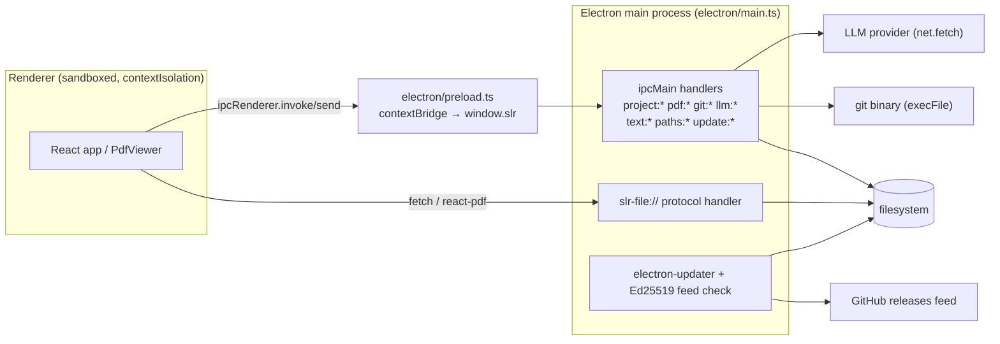

# Electron Main Process and IPC

The desktop build is a single Electron main process (`electron/main.ts`) plus a preload bridge (`electron/preload.ts`). The main process is the **only** component in the whole application that touches the filesystem, spawns a process, or talks to an LLM provider's network endpoint. The renderer — a Vite-built React app loaded from the dev server in development or `file://` in the packaged build — reaches all of that exclusively through the IPC surface exposed by the preload bridge as `window.slr`. There is no `nodeIntegration`; `contextIsolation` is on and `sandbox: true`.

This page documents the shell itself. The *content* of the Git and LLM features is covered on the dedicated pages — here they appear only as IPC handler groups and the security invariants the shell enforces around them.



## Trust boundary and the allowlist discipline

The renderer is treated as compromised-capable: every handler that takes a path, URL, ref, or argv-shaped value from it re-validates that value in the main process before acting. The shell backs this with **session-only allowlists** — `Set`s populated only by the outcome of a native dialog or a successful first contact, and checked before any read or write:

| Allowlist | Populated by | Guarded operation |
|---|---|---|
| `knownProjectPaths` | `project:open` / `project:openPath` (successful read) and `project:pickSavePath` / `paths:sibling` | `project:save` — refuses any path not opened or chosen this session |
| `readablePdfPaths` | `pdf:pick` / `pdf:pickFolder` (native dialogs) | `pdf:read` — refuses any absolute PDF path the reviewer did not select |
| `writableExportPaths` | `pdf:pickExportPath` / `text:pickExportPath` | `pdf:embedMarks` (new-path target) and `text:write` |
| `knownGitRoots` | `git:info` (resolved toplevel) and `git:clone` (the dest this app cloned) | every `git:*` handler that takes a `root` via `assertRoot` |
| `allowedEscapes` | `pdf:allowPath` (native confirmation dialog) | `slr-file://` and `pdf:checkPath` traversal check |

The git handlers additionally validate every renderer-supplied relative path through `assertRelPath` (rule in `src/git/relpath.ts`) and every ref through `assertRef` (rule in `src/git/ref.ts`). These rules live in `src/` rather than `electron/` purely so the vitest suite can reach them — `electron/` is outside vitest's include. The same testability motive applies to `validateGitUrl` / `validateClonePath` (`src/git/url.ts`) and the update-signature verifier.

## Window, menu, and window-state persistence

`createWindow` builds the `BrowserWindow` with:

```text
webPreferences: { preload: …/preload.cjs, contextIsolation: true,
                  nodeIntegration: false, sandbox: true }
```

Window size and position are persisted to `userData/window-state.json`. `loadWindowState` reads it; `positionIsOnScreen` only reuses a saved position if it still overlaps a connected display, so a disconnected monitor cannot strand the window off-screen. `saveWindowState` writes the *pre-maximize* normal bounds (`getNormalBounds`) so a restore returns to the size the user actually chose. Resize/move/maximize are debounced (400 ms) and the `close` handler writes the final state synchronously. On macOS the dock icon is set explicitly via `app.dock.setIcon` so it appears in development, not just in the packaged `.app`.

Two window flags — `allowClose` and `isQuitting` — describe the *previous* window's close, not the current one, and are deliberately reset to `false` at the top of `createWindow`. On macOS the app outlives its last window (`window-all-closed` only quits off `darwin`), so a window closed via the unsaved-changes prompt would otherwise leave `allowClose = true` behind, and a window reopened from the dock would sail past the close guard and discard a whole session's unsaved work.

The application menu (`buildMenu`) is minimal but carries three deliberate deviations from Electron's default roles:

- **Edit menu** — Undo/Redo are custom items whose `click` sends `app:undo` / `app:redo` to the renderer, routing the shortcut to the app's annotation history rather than native text undo. Cut/copy/paste/selectAll stay native. Accelerators are `CmdOrCtrl+Z` and `CmdOrCtrl+Shift+Z`.
- **View menu** — the zoom roles are deliberately omitted so `Ctrl +/-/0` reach the renderer, which uses them for app font scaling (native page zoom would also scale the PDF "paper", which is unwanted). Reload and Force Reload are custom items routed through `guardedReload`, not `{ role: 'reload' }`: the role would reload immediately, and a reload emits neither `close` nor `will-navigate`, so the unsaved-changes guard would never see it (and the desktop build installs no `beforeunload` handler), meaning a reflexive `Ctrl+R` threw away every unsaved annotation with no prompt.
- **File menu** — `close` on macOS, `quit` elsewhere.

External links are intercepted twice: `setWindowOpenHandler` denies any new window and hands `target="_blank"` URLs to the user's default browser via `openExternalUrl`, and `will-navigate` prevents the app window from navigating away from the app document. `openExternalUrl` restricts itself to `http:`, `https:`, and `mailto:` — handing arbitrary schemes (e.g. `file:`) to the OS could launch programs. On `app.whenReady`, every permission request (camera, mic, geolocation, notifications, …) is denied via both `setPermissionRequestHandler` and `setPermissionCheckHandler`, since a window rendering untrusted PDFs has no legitimate use for any of them.

A legacy-user-data migration (`migrateLegacyUserData`) runs before `app.whenReady` (and before Chromium opens the profile): the app used to be called "SLR Helper", and the rename alone would strand `window-state.json` and `localStorage` in a directory nothing reads. Both old spellings are tried and copied into a never-used profile; an existing profile always wins.

## The `slr-file://` protocol

PDFs are served to the renderer (and to `pdf.js`) through a custom `slr-file` scheme registered as **privileged before the app is ready**:

```text
protocol.registerSchemesAsPrivileged([{
  scheme: 'slr-file',
  privileges: { standard: true, secure: true, supportFetchAPI: true,
               stream: true, corsEnabled: true },
}])
```

`corsEnabled` is load-bearing: the renderer's origin (the dev server, or `file://` packaged) is not `slr-file://`, so fetching a PDF is cross-origin. Without this privilege Chromium rejects the request *before* `protocol.handle` runs — the handler never sees it and pdf.js reports "Unexpected server response (0)".

The handler (`registerPdfProtocol`) serves `slr-file://project/pdf?path=<encoded relative path>`. The path is carried in the **query**, not the URL path: a `..` sitting in a URL path is a dot-segment by the URL Standard's own definition and is collapsed during normal URL parsing (Chromium's, when constructing the request, the same as `new URL()` here), which would silently eat every `..` a `pdf` value climbed with before the handler ever ran. A query value is never subject to that normalization. `getPdfSource` in `src/platform/electron.ts` is the only builder of this URL.

Path containment is enforced by `resolveProjectPath`, the single place this logic lives and shared with the `pdf:checkPath` IPC call. It does two checks:

1. **String containment** — `path.resolve(projectDir, rel)` must equal or sit under `projectDir`. `path.resolve` is pure string arithmetic: it collapses `..` but follows no links.
2. **Real-path containment** — `realpath` resolves the chain, so a symlink *inside* the project directory (a `pdfs/paper.pdf` linked to `/etc/passwd`) is caught: the real destination must sit under the real base. This second check runs only when the first passed, because `allowedEscapes` (below) bypasses the boundary check outright.

`allowedEscapes` is the reviewer's explicit override for one PDF that points outside the project's own folder. It is:

- **Session-only** — an in-memory `Set`, never written to disk.
- **Keyed by the exact stored relative path**, not by where it resolves — the decision is "I trust *this specific reference* in *this specific project*", not "I trust this file forever".
- **Cleared whenever `projectDir` actually changes to a different directory** (`project:setDir`), so an approval for one project's external reference cannot silently carry over to a different project that happens to store the same relative path.
- **Granted only by a native dialog in the main process** (`pdf:allowPath`). The dialog used to be a `window.confirm` in the renderer, which a compromised renderer could skip by calling the bridge method directly; moving it to the main process makes the check a real check.

`pdf:checkPath` lets the renderer ask the same containment question *before* constructing a URL, so a blocked or missing PDF gets an honest reason (`escapes` / `no-project` / `not-found`) instead of pdf.js's own opaque failure for an HTTP 403/404 it never explains. `getPdfSource` re-asserts the project directory from the current project handle on every PDF load (`setProjectDir`) before calling `checkPdfPath`, because the project editor can repoint the directory.

## Project file model and the `project:*` handlers

Since v1.3 a project's own annotations live outside `project.json` — one `annotations/<paperId>/reviewer-<n>.json` (or `screening-<n>.json` for a screening project), plus `consolidated.json` / `marks-<n>.json` — so two reviewers editing different papers (or different slots of the same paper) never touch the same file and never collide in git. `project.json` itself holds only paper metadata.

The renderer's `loadProject` only knows the old, single-blob shape (deliberately — it is already exhaustively validated, and duplicating that logic for a split shape would be the "two implementations of one fact" the codebase avoids). So the main process does the reassembly:

- `readProjectText` reads `project.json`; if it is the legacy single-file shape (`isLegacyProjectShape` from `src/model/project.ts`) it is passed through untouched, otherwise `loadPaperFiles` walks the `annotations/` folder and `assembleLegacyProjectJson` splices each paper's files back into one JSON text in the shape `loadProject` accepts.
- `safeReadAnnotationFile` reads each annotation file with the same "received material, might contain a symlink escape" defense as `resolveProjectPath`: `realpath` resolves the chain and the real destination must sit under the real `annotationsDir`. Returns `null` for "not there" and "escapes" alike — both mean "no file", not an error. Corrupt JSON is skipped, never thrown over.
- `loadPaperFiles` reads only the file names this project's own kind (`screening`) owns, never the other kind's, so a sibling project sharing the same `annotations/` folder can never shadow this one's reviewer/consolidated data on read.

Writing goes through `writeProjectFiles` (shared by `project:save` and every git handler that needs to put a specific project state onto disk — `git:commitPartial`'s write→add→commit→restore swap and `git:pullFinish`'s merge result both go through it, so "how a split project is written" has exactly one implementation). It writes `project.json` and reconciles the whole `annotations/` folder against the `files` list: a non-null entry is written, a `null` entry is deleted. Every annotation target is containment-checked twice (string and real-path), and `assertNotSymlink` refuses to write through a symlink — a project folder can arrive by zip/USB/shared drive with a symlink already in it, and `writeFile` follows one, so a `<name>-fulltext.json` shipped as a symlink to `~/.zshrc` turned one click into an overwrite of a startup file.

The `project:*` handlers:

- `project:open` / `project:openPath` — native open dialog / open by absolute path; both add the resolved path to `knownProjectPaths`.
- `project:save` — refuses any path not in `knownProjectPaths`, then `writeProjectFiles`.
- `project:setDir` — sets `projectDir` and clears `allowedEscapes` only when the directory actually changes.
- `project:pickSavePath` — picks a location only (no empty file is created if the editor is abandoned); registers the result.
- `project:checkSiblingCollision` — would writing to `destPath` start sharing an `annotations/` folder with a same-family sibling project sharing at least one paper id? Flags same-family overlap only (different families use `screening-N.json` vs `reviewer-N.json` and cannot collide on a filename). Not git-specific, so it lives in the `project:*` namespace.
- `project:peek` — re-reads each recent project's existence and current title (the stored recents title goes stale the moment the file is renamed elsewhere), each handled independently so one broken JSON cannot take the others down.

## `pdf:*`, `reference:pick`, `text:*`, and `paths:*` handlers

- `pdf:pick` / `pdf:pickFolder` — native dialogs; every selected path is added to `readablePdfPaths`. `pdf:pickFolder` recursively collects every `.pdf` under the chosen directory, skipping unreadable directories.
- `pdf:read` — returns raw PDF bytes (as a `Uint8Array`; a `Buffer` does not survive the IPC boundary intact) for title/author extraction. Unlike the `slr-file://` protocol this is not confined to the project directory — the reviewer may pick PDFs from anywhere — and `readablePdfPaths` is what enforces "only a file the reviewer actually selected."
- `pdf:checkPath` / `pdf:allowPath` — see the protocol section above.
- `pdf:embedMarks` — a one-way, user-triggered export that burns `PdfMark`s into real PDF annotation objects (Highlights with `/QuadPoints` per line, and `Text` sticky-note annotations), built by hand via pdf-lib's low-level `PDFContext` API because pdf-lib has no high-level "add a Highlight" API. Marks beyond the PDF's actual page count are skipped (the marks and the PDF bytes are two files a reviewer might have edited independently), and annotations already in the PDF are appended to, not replaced. A new-file destination must be in `writableExportPaths`; writing over the paper's own PDF (`'original'` target) is unaffected. `assertNotSymlink` guards the destination.
- `pdf:pickExportPath` — native save dialog; registers the result in `writableExportPaths`.
- `reference:pick` — native open dialog for `.bib`/`.ris`/`.json`; returns the text and basename.
- `text:pickExportPath` / `text:write` — text export; same `writableExportPaths` allowlist and `assertNotSymlink` guard.
- `paths:relative` / `paths:rebase` / `paths:absolute` / `paths:sibling` — pure path arithmetic to keep PDF references portable across project-file moves. Forward slashes keep the JSON identical across platforms. `paths:sibling` requires `sourceFile` to already be a known project and `fileName` to be a plain basename (no separators), so it can only ever name a fresh file in an already-known directory; it registers the result as a legitimate `project:save` target.

## LLM handlers (`llm:*`)

The two jobs here live in the main process for the same reason: **the API key must never enter the renderer.**

1. **Storage** — targets live in `userData/llm-config.json` (mode `0o600`) with the key encrypted via `safeStorage` (the OS keychain). `llm:configs` returns each target with the key stripped and replaced by a `hasKey` boolean. `llm:saveConfig` keeps a stored key when an edit leaves the key field blank (the user cannot read it back to retype it). `encryptKey` refuses to write the key in the clear if `safeStorage.isEncryptionAvailable()` is false (a real possibility on Linux with no keyring).
2. **Transport** — `llm:call` substitutes the real key for the `{{apiKey}}` sentinel the renderer placed in headers and sends with `net.fetch` (this also sidesteps CORS: a renderer `fetch` to an LLM API is a preflighted cross-origin POST from a `file://` origin and would be blocked). Before sending, the URL is checked against the configured `baseUrl` origin (with an explicit scheme check — opaque `file:` origins compare equal, so without it a `file:` base would authorise any `file:` target and turn this into a file reader). `redirect: 'error'` refuses redirects because provider-specific key headers (`x-api-key`, `x-goog-api-key`) are *not* stripped by the fetch stack the way `Authorization` is, so following a redirect would leak the key to whatever origin the endpoint names. A 10-minute `AbortController` timeout prevents a misconfigured self-hosted endpoint that accepts the connection and never answers from hanging forever. `llm:abort` aborts an in-flight call by `requestId`.

See `/openwiki/workflows/llm-annotation.md` for the annotation flow built on top of this.

## Git handlers (`git:*`)

The whole git feature lives in the main process rather than a library because the user asked for "the local git installation": their git, their `~/.gitconfig`, their credential helper, their SSH agent. Every call goes through `runGit`, which:

- uses `execFile` with an **argument array**, never a shell string, and `--` before any user-supplied path or URL (a repository URL is user input reaching a spawned process; without both, a URL of `--upload-pack=…` would be read as an option).
- never lets the renderer name an argv — it picks one of the operations and supplies data; the main process decides what git is asked to do. A general `git <args>` channel would be arbitrary code execution (git has `--exec-path`, aliases, and the `ext::` transport).
- injects `GIT_SAFE_CONFIG` (a hard `-c` override that beats every config file) disabling `core.fsmonitor`, `core.hooksPath` (pointed at a non-existent tmp dir), `core.pager`, `core.editor`, `core.alternateRefsCommand`, `uploadpack.packObjectsHook`, and `protocol.ext.allow=never`. The threat model is a received project folder that brings its own `.git/` by zip/USB/shared drive: a hostile `core.fsmonitor` runs on `git status` (one click from opening the project), and `git:info` fires automatically on project open. `diff.external` is deliberately not in the list (setting it empty makes git run the empty string); `--no-ext-diff` and `--no-textconv` are passed where a diff is run instead. Keys a user may legitimately set globally (`core.sshCommand`, `credential.helper`, `gpg.program`) are left alone — they run only on an explicit network action, not on merely opening a folder.
- strips inherited `GIT_DIR` / `GIT_WORK_TREE` / etc. (SaiLoR may have been launched from inside another repository) and sets `GIT_TERMINAL_PROMPT=0` / `GIT_EDITOR=true` / `GIT_SEQUENCE_EDITOR=true` — this process has no tty, so a git that asks for input would block forever; credential helpers, askpass, and SSH agents are untouched because none is a terminal prompt.
- treats a non-zero exit as **data, not an exception** (a merge that conflicts exits 1, and that is the normal path here); only a failure to launch git at all is signalled with `code: null`. Timeouts: 30 s for plumbing, 900 s for network (clone/fetch/push); `maxBuffer` raised to 32 MB for large project-JSON diffs.

`assertRoot` guards every root-taking handler against `knownGitRoots`; `assertRelPath` / `assertRef` re-check renderer-supplied paths and refs. See `/openwiki/workflows/git-integration.md` for the merge/pull/branch-switch state machines built on these handlers.

## Self-update (`update:*`)

Native self-update is **Windows/Linux only**. macOS is excluded because electron-updater's Squirrel.Mac path needs the downloaded update to pass Gatekeeper, which needs a real Apple Developer ID signature *and* notarization — this project only ad-hoc-signs on mac (`scripts/afterPack.cjs` runs `codesign --force --deep --sign -` when no `CSC_LINK`/`CSC_NAME` is configured, downgrading the "damaged and can't be opened" dead end to an ordinary "unidentified developer" prompt). A real auto-installed mac update would show up as "damaged." Mac keeps the check-only banner (see below) untouched.

Nothing here runs on its own: `autoUpdater.autoDownload` and `autoUpdater.autoInstallOnAppQuit` are both `false`. A download only starts when the renderer calls `update:download` (the reviewer clicked "Download update"), and installing only happens on `update:install` ("Restart to update"). `update:check` is a no-op returning `{ supported: false }` on darwin.

Because there is no purchased code-signing certificate for Windows/Linux, `electron-updater`'s own sha512 check on the downloaded installer only catches transport corruption — the hash comes from the same release as the installer, so whoever can publish one can publish a matching hash for the other. The shell closes this gap with an independent **Ed25519 feed-signature verification** before any download:

- `verifyUpdateFeed(latestUpdateVersion)` fetches the same feed file (`latest.yml` on Windows, `latest-linux.yml` on Linux) electron-updater is about to use, *plus* the `<feed>.sig` file alongside it, and verifies the signature with `verifyReleaseSignature` (`src/model/updateSignature.ts`) against `RELEASE_PUBLIC_KEY_B64` baked into the app at build time. The public key is never fetched from the release channel being verified, so a compromised release cannot republish a matching fake key. Only on a passing signature does `update:download` call `autoUpdater.downloadUpdate()`. This chains trust: the signature check covers the feed file, and electron-updater's own existing sha512 check covers the installer against that now-trusted feed file.
- `scripts/sign-release.cjs` signs each feed file with the project's Ed25519 private key (the `RELEASE_SIGNING_PRIVATE_KEY` GitHub Actions secret, never committed) and writes `<feed>.sig`, which the release workflow attaches to the GitHub release alongside the feed file.

`electron-updater` events are forwarded to the renderer as `update:available` / `update:progress` / `update:downloaded` / `update:error`. `latestUpdateVersion` records what `update-available` last reported so the feed check verifies the file for *that* release.

The **check-only banner** used on all platforms (including mac) is separate: `src/model/version.ts` calls the GitHub releases API (`api.github.com/repos/Gram21/SaiLoR/releases/latest`) and compares versions with a semver-aware `isNewerVersion`. It is written to fail silently on 404/403/network error (the repo may be private, in which case unauthenticated requests 404; embedding a token would be a credential leak), runs on every startup, and caches for 15 minutes — long enough to absorb a crash-restart loop, short enough that a normal day of launches still hits the network. `pickInstaller` selects the asset matching the machine (`macos-arm64.dmg`, `windows-*.exe`, `linux-*.AppImage`).

## Preload bridge (`electron/preload.ts`)

`contextBridge.exposeInMainWorld('slr', …)` exposes the `SlrBridge` interface mirrored in `src/platform/electron.ts` (where the `ElectronAdapter` implements `PlatformAdapter` over it). The bridge is the renderer's only channel to native capability. Notable members:

- `os: { platform, arch }` — from `process.platform` / `process.arch`, so the update notice can offer the installer that actually matches this machine (e.g. the arm64 dmg rather than the Intel one).
- Project open/save, PDF pick/read/embed, reference pick, text export, path arithmetic — each a thin `ipcRenderer.invoke` wrapper over the handlers above.
- LLM — `llmConfigs` / `saveLlmConfig` / `deleteLlmConfig` / `callLlm` / `abortLlm`. Deliberately **no way to read an API key back**; the renderer can store one and use one, but never see one.
- Git — the full surface (`gitProbe` through `gitBranchSwitchAbort`), all `ipcRenderer.invoke`.
- Self-update — `checkForNativeUpdate` / `downloadNativeUpdate` / `installNativeUpdate`, plus `onNativeUpdateAvailable` / `onNativeUpdateProgress` / `onNativeUpdateDownloaded` / `onNativeUpdateError` listeners (each removes prior listeners before registering, to avoid stacking across re-mounts).
- Dirty/save coordination and Edit-menu wiring — `setDirty` (`ipcRenderer.send`), `onRequestSave` / `saveComplete`, `onUndo` / `onRedo`. These are `send`/listener pairs, not `invoke`, because they are one-way notifications.

## Quit / unsaved-changes coordination

A clean quit is coordinated across the process boundary so the user is prompted once and the save round-trip completes before the app exits. The state lives in the main process: `isDirty`, `allowClose`, `isQuitting`.

- The renderer keeps the main process informed of unsaved state via `app:setDirty` (`setDirty` on the bridge). `useElectronCloseGuard.ts` pushes dirty state on every change: it treats *either* an unsaved annotation project (`useStore.dirty`) *or* an open project-editor draft (`useEditorStore.dirty`) as dirty, and routes the Edit-menu Undo/Redo and the save-before-quit request to whichever of the two stores is currently on screen (the editor has its own draft + history while open).
- `before-quit` sets `isQuitting = true`. The window `close` handler intercepts the close when there are unsaved changes (`if (allowClose || !isDirty) return; e.preventDefault()`) and calls `promptUnsavedChanges`, a native three-button dialog: **Save** sends `app:requestSave` to the renderer and waits; **Don't Save** sets `allowClose = true` and finishes the close; **Cancel** resets `isQuitting = false` and stays open (so a later plain window close does not inadvertently quit the whole app).
- On **Save**, the renderer's `onRequestSave` callback runs the appropriate store's `save()` and replies with `app:saveComplete(ok)`. On `ok` the main process sets `allowClose = true` and calls `finishClose`, which resumes the quit (`app.quit()`) if `isQuitting` else destroys the window. On failure/cancel it aborts the quit (`isQuitting = false`) and keeps the window open.
- `window-all-closed` quits on non-darwin; on macOS the app outlives its last window and `activate` re-creates one.
- `guardedReload` (the View-menu Reload items) is a lighter two-choice confirmation (Cancel / Reload anyway) rather than the three-way Save/Don't Save/Cancel of a close — a reload is a debugging affordance, and routing it through the renderer's save round-trip (which can itself open a native Save dialog) to reload underneath that is more machinery than the action warrants. Refusing by default is what matters.

`ClosePrompt.tsx` is the in-app analogue for closing a *project* (not the app) with unsaved changes: the same three choices and wording as the native Electron quit dialog, resolved through `useStore.resolveClosePrompt`, so closing a project and quitting behave alike.

## Shared pure logic imported from `src/`

`electron/main.ts` is the only file under `electron/` that imports from `src/`, and it imports only shared pure logic that must not exist twice: the git URL/path/ref/output/ownAnnotationPath/concurrentRead/deriveGitInfo modules, the `model/project` legacy-shape helpers, `model/pdfMarks` / `model/pdfExport`, and `model/updateSignature`. All of these import nothing DOM-specific themselves, so they typecheck identically under the main process's tsconfig (node types) and the renderer's (DOM types) — the same arrangement that lets the vitest suite reach the security rules in `src/git/*`.