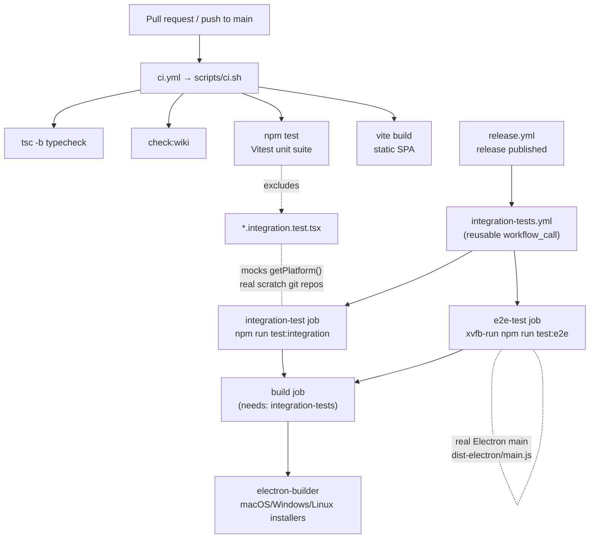

# Testing Strategy

SaiLoR uses three deliberately separated test tiers, each owning the class of
bug the tier below it structurally cannot see. The boundaries are chosen so a
faster, cheaper test covers everything it can, and slower, more expensive tests
only exist for the seams that genuinely need them.



The CI gating flow: unit tests gate every PR; integration and e2e gate the release build.

## The three test tiers

### Tier 1 — Vitest unit tests

The default, fastest tier. Runs on every PR.

```jsonc
// package.json
"test": "vitest run",
"test:watch": "vitest",
```

Configured in the `test` block of `vite.config.ts`:

```ts
// vite.config.ts
test: {
  environment: 'jsdom',
  globals: true,
  include: ['src/**/*.test.{ts,tsx}'],
  exclude: [
    '**/node_modules/**',
    '**/dist/**',
    '**/.{idea,git,cache,output,temp}/**',
    '**/*.integration.test.{ts,tsx}',
  ],
},
```

- **Environment:** `jsdom`, **globals:** `true` (so `describe`/`it`/`expect`/`vi`
  are available without imports — though most files import them explicitly for
  editor/IDE support).
- **Include:** `src/**/*.test.{ts,tsx}`.
- **Exclude:** the integration suite is explicitly kept out. Because Vite's
  `test.exclude` *replaces* its default list rather than appending to it, the
  usual defaults (`node_modules`, `dist`, etc.) are repeated alongside the
  `*.integration.test.{ts,tsx}` pattern.

This tier is ~90 files of pure-logic and store tests that never touch a real
filesystem or git binary. See [Test conventions](#test-conventions) below for
what each area covers.

### Tier 2 — Integration suite

The jsdom-based integration tests. Slower by design, kept off the default run,
gated in front of release builds.

```jsonc
// package.json
"test:integration": "vitest run --config vitest.integration.config.ts",
```

A **standalone config** rather than `mergeConfig` over `vite.config.ts` —
Vite's `mergeConfig` concatenates array fields like `test.include` rather than
replacing them, which would silently pull the ~90 unit test files into this run
too.

```ts
// vitest.integration.config.ts
export default defineConfig({
  plugins: [react()],
  test: {
    environment: 'jsdom',
    globals: true,
    include: ['src/test/integration/**/*.integration.test.tsx'],
  },
})
```

The suite lives in `src/test/integration/*.integration.test.tsx`. Each test:

1. **Mocks `getPlatform()`** to inject a fake `PlatformAdapter` — the React app
   talks only to that interface (the same one that makes the app run inside
   Electron *and* in a plain browser), so mocking it at that single seam makes
   the whole app run under jsdom without a real Electron environment.
2. **Spins up a real scratch git repository** per test (`mkdtempSync` → `git
   init` → initial commit), and wires a fake `GitPlatform` whose `status` /
   `commit` / `beginPull` / etc. shell out to the real `git` binary against
   that directory — so merge, pull, push, branch-switch, and discard flows run
   against genuine git, not a stub.
3. **Renders the real React components** with React Testing Library (`render`,
   `screen`, `userEvent`), driving them with real clicks, typing, and DOM
   events — not direct store calls.
4. **Verifies independently of the app** by reading the scratch repo directly
   (e.g. `git log -1 --format=%s`, `git show HEAD:project.json`) so a green
   test proves a real commit landed, not just that the store claims it did.

Because jsdom performs no real layout, the integration tests stub the geometry
primitives the components actually read (`getBoundingClientRect`,
`Range.getClientRects`, `ResizeObserver`) and mock `react-pdf` (which needs a
real canvas/PDF.js parsing jsdom cannot provide) — but everything *above* that
(selection capture, mark creation, the comment popover, the annotation form,
the Git panel) is the genuine component code.

The integration tests in `src/test/integration/`:

| File | Flow it owns |
|------|-------------|
| `annotationWorkflow.integration.test.tsx` | Author a schema (every field type) → annotate a real PDF (highlight, sticky note, comment, field value) → save → commit with real git |
| `consolidationAndMerge.integration.test.tsx` | Multi-reviewer consolidation and an explicit merge with a real conflict |
| `branchSwitch.integration.test.tsx` | Switching branches with uncommitted changes the target also touched — a real stash-carry-over → field-level conflict via `GitMergeDialog` |
| `pull.integration.test.tsx` | A real `git pull` against a bare "origin" diverged by a second clone, through `GitDialog`'s real "Pull" button |
| `discard.integration.test.tsx` | Discarding an uncommitted field-level change back to its last-committed value (`writeWorking`, not `commit`) |
| `pdfReadingPosition.integration.test.tsx` | "Continue where you left off" — reopening lands on the same paper/page |
| `screeningImport.integration.test.tsx` | Screening include/exclude decisions → "New from screening…" import flow |

### Tier 3 — Playwright / Electron e2e

Electron smoke tests only — real main process, real `contextBridge`/IPC, real
`fs`. This tier exists for the class of bug jsdom structurally cannot see: the
preload bridge and the main process's IPC handlers actually wired up
correctly.

```jsonc
// package.json
"test:e2e": "cross-env ELECTRON=1 npm run build && playwright test",
```

Requires `ELECTRON=1` and a **built app** — the script builds it first
(`cross-env ELECTRON=1 npm run build` produces `dist-electron/main.js`).

```ts
// playwright.config.ts
export default defineConfig({
  testDir: './e2e',
  timeout: 30_000,
  workers: 1,            // each test launches its own real Electron process
  reporter: 'list',
})
```

One worker: there is no shared state to race, so parallelism would only cost
CPU/RAM for no speed-up.

The e2e tests drive the `window.slr` bridge methods directly (`openPath`,
`saveProject`, `gitProbe`, `gitStatus`, `gitPush`) rather than through the
rendered UI — the native "Open"/"Save" dialogs a real user click would hit are
exactly the one thing Playwright can't drive here, so the tests call the bridge
methods a menu click would eventually reach instead.

`e2e/openSaveProject.spec.ts` covers three distinct concerns:

- **Open/save round-trip** — opens a project by path through real IPC, then
  saves it back. Exercises a real guard: `electron/main.ts`'s `project:save`
  handler refuses to write to any path that wasn't first opened via
  `project:open`/`project:openPath` (`knownProjectPaths`) — the test proves the
  guard is real by asserting a save to an *unopened* path is rejected with
  `/was not opened or chosen/`.
- **Real git IPC** — `gitProbe` (returns `available: true`, version matches
  `/git version/`) and `gitStatus` through the hardened `runGit`/`gitEnv`/
  `GIT_SAFE_CONFIG` wrapper (which strips `GIT_DIR`, disables hooks/pager/
  ext-diff). The only test that reaches the real wrapper through the real
  contextBridge/IPC path; the jsdom integration tests fake `GitPlatform`
  entirely.
- **Split-file save/reopen round-trip** — the only test that exercises the
  real split layout (`project.json` carries metadata only;
  `annotations/<id>/*.json` holds the per-paper answer) and the reassembly
  (`readProjectText` → `assembleLegacyProjectJson`) a real reopen does to turn
  that back into the single in-memory shape.

`e2e/gitPush.spec.ts` covers the one flow no jsdom test can: a real `git:push`
IPC handler against a real bare "origin". It creates a bare origin and a local
clone, establishes upstream tracking with real git, leaves one commit
unpushed, then drives `window.slr.gitPush(localDir)` and confirms the commit
landed by reading the bare repo *directly* (`git log -1 --format=%s` in
`originDir`), independent of the app and of the local clone's own idea of what
happened.

## CI gating

### `scripts/ci.sh` — the provider-agnostic CI pipeline

The single source of truth for "does the app build and pass its checks". CI
providers (GitHub Actions, GitLab CI, …) do nothing more than check out the
code, provide a Node.js toolchain, and run this script — so the exact same
checks run locally with `./scripts/ci.sh`.

```bash
# scripts/ci.sh — ordered steps (set -euo pipefail)
step "Type checking (tsc -b)"           # npm run typecheck
step "Checking wiki links (openwiki/, user-guide/)"  # npm run check:wiki
step "Running tests (vitest)"            # npm test  (unit tier only)
step "Building static SPA (vite build)"  # npm run build
```

Run from the repo root regardless of where it's invoked; `SKIP_INSTALL=1`
skips `npm ci`/`npm install` when deps are already present.

### `ci.yml` — unit tests gate every PR

```yaml
# .github/workflows/ci.yml
on:
  push: { branches: [main] }
  pull_request:       # every PR, whatever it targets
  workflow_dispatch:
```

The CI workflow runs `./scripts/ci.sh` on `ubuntu-latest` (Node 24). It runs
the **unit tier only** (`npm test` excludes integration tests) on every push to
`main` and every pull request.

### `integration-tests.yml` — reusable integration + e2e workflow

A reusable workflow (`workflow_call` + `workflow_dispatch`) with two jobs:

- **`integration-test`** — `npm run test:integration` (the jsdom integration
  suite with real scratch git repos).
- **`e2e-test`** — `xvfb-run -a npm run test:e2e`. Needs a real display even
  though nothing is screenshotted: Electron opens a real native window on
  Linux regardless, hence `xvfb-run`.

Stays independently triggerable (Actions tab → "Run workflow", or
`gh workflow run integration-tests.yml`) for a fast check without a full
release run.

### `release.yml` — integration + e2e gate the release build

```yaml
# .github/workflows/release.yml
on: { release: { types: [published] } }
jobs:
  integration-tests:
    uses: ./.github/workflows/integration-tests.yml
  build:
    needs: integration-tests   # a broken e2e/integration flow must not reach a packaged release
```

The `build` job (`needs: integration-tests`) builds the packaged Electron app
for macOS, Windows, and Linux via `electron-builder`. A broken end-to-end
workflow (schema authoring, PDF annotation, git commit, merge/pull/branch-
switch/discard, screening import, real IPC) is blocked from reaching a
packaged release by this gate.

## Test conventions

### Pure model tests — `src/model/*.test.ts`

Pure-logic tests of the data model. Fixtures are built through the real load
path (`loadProject` / `serializeProject`), not hand-assembled `Project` objects,
so every input is exactly as schema-normalized as a real file would be. Cover:
schema resolution (defaults, path ids, duplicate sibling names, enum options,
`max < min` rejection, `required` defaults), `normalizeTree` / `pruneTree` /
`canAdd` / `canRemove`, round-trip (`loadProject` → `serializeProject`),
validation (`ProjectLoadError`), and PDF-mark/metadata/text helpers.

```ts
// src/model/model.test.ts — representative schema-resolution + round-trip test
it('resolves and round-trips enum options', () => {
  const resolved = resolveSchema([{ name: 'Kind', type: 'string', options: ['A', 'B', 'C'] }])
  expect(resolved[0].options).toEqual(['A', 'B', 'C'])
  const project = loadProject(/* … */)
  const reDumped = JSON.parse(serializeProject(project))
  expect(reDumped.config.schema[0].options).toEqual(['A', 'B', 'C'])
})
```

### Store tests — `src/state/store.*.test.ts`

Tests of the Zustand stores (`useStore`, `useEditorStore`, `useGitStore`,
`useAiStore`). The platform seam is mocked at `getPlatform()`:

```ts
// src/state/store.marks.test.ts — the standard store-test platform mock
const mockPlatform = { kind: 'browser' as const, getOsInfo: () => null, /* … */ }
vi.mock('../platform', () => ({ getPlatform: () => mockPlatform }))
const { useStore } = await import('./store')
```

A `beforeEach` loads a project into the store (`st().loadFromText(PROJECT, …)`)
so each test starts from a known state. Cover: undo/redo (including coalescing
consecutive edits of the same field into one undo step, and a new edit clearing
the redo stack), annotation lifecycle (`setFieldValue`, `addInstance` /
`removeInstance`), marks (`addHighlight` / `setMarkComment` / `setMarkColor` /
`removeMark`), reading position (`noteReadingPosition` / `loadReadingPosition`),
reviewer seats, save / save-as, screening, alignment, batch-unanimous adoption,
and the hidden `unlockAi` session flag. The `gitStore.test.ts` suite stubs the
full `GitPlatform` shape and drives `runPull`'s orchestration (dirty guard,
pull classification, parse boundary, merge, resolution dialog) through each
branch via `beginPullResult` / `finishPullResult`.

### Consolidation tests — `src/consolidate/*.test.ts`

Pure-logic tests of the multi-reviewer consolidation: `alignNode` (matching
entries reviewers recorded in different orders, matching through wording
differences rather than demanding identical text, ranking by number of
agreeing fields), agreement metrics, unanimous adoption, disagreements
export, and readiness.

### Git tests — `src/git/*.test.ts`

Pure-logic tests of the git layer. `merge.test.ts` builds fixtures through
`loadProject` (the real load path) and covers `merge3` / `mergeProjects` /
`applyResolutions` / `conflictId` over repeatable findings and paper-meta
fields. `ref.test.ts` covers `refProblem` — the ref/path safety guard that
refuses empty refs, option-like refs (`--upload-pack=…`), control characters,
revision syntax (`main^`, `main@{1}`), and everything `git check-ref-format`
forbids. Also: `changes.test.ts` (field-change detection), `output.test.ts`
(`parsePorcelain` / `capDiff`), `relpath.test.ts`, `url.test.ts`,
`deriveGitInfo.test.ts`, `concurrentRead.test.ts`, `ownAnnotationPath.test.ts`.

### Component tests — `src/components/*.test.ts`

Unit tests of **pure helper functions extracted from components**, tested
directly without rendering. The rendered-component coverage (real RTL rendering,
real clicks/typing) lives in the integration suite instead; these `.test.ts`
files cover the nontrivial decision logic the components export:

- `PaperList.test.ts` — `paperIsMarkedDone` (the consolidation case: the status
  dot must mean "every numbered reviewer has answered", read from
  `paper.reviews`, not "does `paper.annotations` have anything" — because
  `adoptUnanimousValues` fills `paper.annotations` just from opening the
  paper).
- `GitDialog.test.ts` — `mixedDiscardConfirmMessage` (warn before a commit
  silently reverts or deletes a Discard row; a `PaperChange` marked Discard
  deletes the paper and all its annotation files, so it is named as "1 paper",
  not "1 field") and `isProjectOwnPath`.
- `PdfViewer.test.ts` — `destinationPoint` (XYZ/FitH/FitV/FitR destination
  parsing), `markVerticallyVisible`, `dedupeOverlappingRects`.
- `PapersEditor.test.ts` — `duplicatePaperIds` (trimmed, case-sensitive, empty
  ids not flagged).
- Plus `ConsolidationDialog`, `ConsolidationVerdicts`, `GitMergeDialog`,
  `AgreementDialog`, `NodeName`, `Toolbar`, and `PaperList` performance /
  completeness / finished variants.

## Which tests to run for a given change

| Area you changed | Run |
|------------------|-----|
| Data model (`src/model/*`) | `npm test` — the relevant `src/model/*.test.ts` |
| Store (`src/state/*`) | `npm test` — the relevant `src/state/store.*.test.ts` / `editorStore.*.test.ts` / `gitStore.test.ts` |
| Git logic (`src/git/*`) | `npm test` (`src/git/*.test.ts`) **and** `npm run test:integration` (real-git merge/pull/push/branch-switch/discard) |
| Component (`src/components/*`) | `npm test` (`src/components/*.test.ts`) **and** `npm run test:integration` (the rendered-component flow) |
| Platform seam / Electron main (`electron/*`, `src/platform/*`) | `npm run test:e2e` (real IPC, real `contextBridge`, real `fs`) |
| Anything touching save/open/git IPC | `npm run test:e2e` (the only tier that reaches the real main-process handlers) |

For a full local pre-release check, run all three tiers:
`npm test && npm run test:integration && npm run test:e2e`.