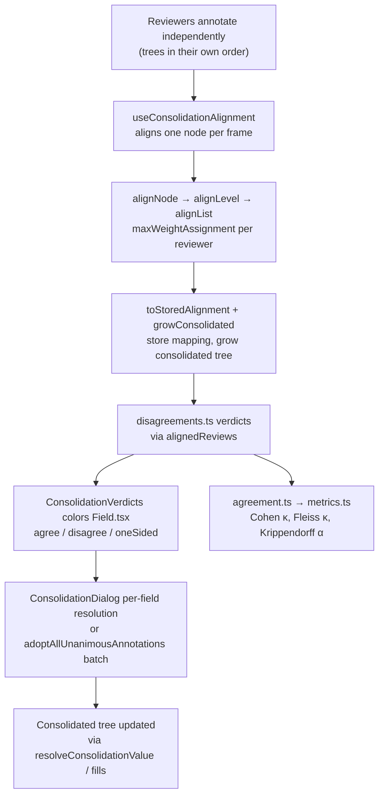
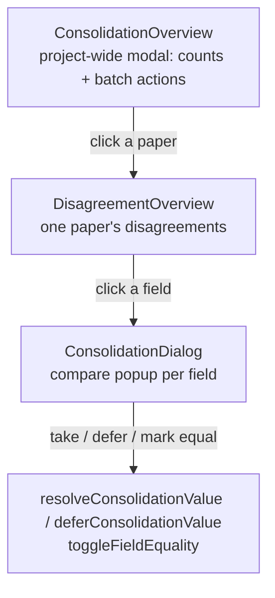

# Multi-Reviewer Consolidation

Consolidation is what happens once more than one reviewer has annotated the same
paper: their independent trees must be turned into one agreed-upon tree. The
hard part is not the reconciliation itself (a human does that, one field at a
time) but the prerequisite — deciding *which* of each reviewer's repeated
entries are the same entry. Two reviewers both record three Findings, but
nothing makes them record them in the same order, so Reviewer 1's Finding #1 may
be Reviewer 2's Finding #3. Comparing them slot by slot without recovering that
correspondence first would report disagreement everywhere and be worse than
useless.

This page follows the pipeline in three stages: **align** the reviewers' entries
into a shared slot space, **compare** them field by field to surface
agreement/disagreement, and **resolve** the disagreements into the consolidated
tree — with batch adoption and inter-rater statistics built on the same aligned
view.

The diagram shows the alignment → comparison → resolution → apply flow, with
the agreement-statistics path branching from the same aligned view.

## The core problem: entry matching

`src/consolidate/align.ts` is the entry point for the alignment stage. Two
properties of the matching are deliberate and fall out of the algorithm's shape
rather than being enforced afterwards:

- **Matching is optimal, not greedy.** Each node's entries are paired by
  `maxWeightAssignment` (`src/consolidate/assign.ts`), a Hungarian-algorithm
  implementation that maximises total agreement over the whole set. Greedy
  matching — repeatedly taking the best remaining pair — is wrong here: one
  early pairing that looks good locally can force two later entries into a much
  worse pairing, and greedy has no way to trade the first against the second.
  The sets involved are single digits in practice, so the O(n³) optimality is
  affordable.
- **Matching is hierarchical, so it cannot cross.** A group's sub-entries are
  only ever matched *inside* an already-matched pair of parents. The recursion
  never offers a candidate outside the matched parent, so there is no point at
  which Finding A could pair with Finding B while A's Evidence pairs with C's.
  The consistency the feature requires is structural, not a rule applied after
  the fact.

### The alignment pipeline

The unit the scheduler works in is a single schema node, matched independently
of its siblings. `alignNode(schema, reviews, nodeName)` resolves the node and
runs `alignLevel` over it. `alignLevel` walks each definition at one level;
for a repeatable node (`max === null || max > 1`) it calls `alignList`, and for
a non-repeatable group with children it produces a single fixed slot and
recurses into the children. `alignableNodes(schema)` lists the nodes worth
aligning at all — those that are repeatable or contain a repeatable node
beneath them.

`alignList` is where the multi-reviewer matching happens. Multi-dimensional
assignment is NP-hard and absurd at these sizes, so the reviewer with the most
entries *anchors* the slots (seeding one slot per anchor entry), and everyone
else is matched onto those slots in turn. Later reviewers are matched against
*all* members already in a slot (not just the anchor), so a slot's identity
firms up as reviewers agree on it. The order reviewers are folded in is fixed —
most entries first, then by numeric id — so the same input always produces the
same alignment; an alignment that shifted between runs would reorder saved data
for no reason.

Two constants govern the matching, both small enough to be overruled by any
real agreement:

- `MIN_MATCH_SCORE = 0.5` — entries must be *strictly more alike than different*
  to be called the same entry. Below that floor the pair scores 0 (not its real
  mass), which lets a new-slot column win instead. Without a floor the solver
  would silently marry a reviewer's unmatched finding to whichever leftover
  entry happened to be available, reporting it as a disagreement about one
  finding rather than as two separate findings — invisible and wrong. The
  trade-off is one-directional: splitting a pair that really was one entry is
  visible and fixable, while merging two entries that were never the same thing
  is invisible.
- `NEW_SLOT_WEIGHT` and `ORDER_TIE_BREAK` — an entry that matches none of the
  existing slots opens a new slot of its own rather than being forced into a
  leftover one. A reviewer recording a finding nobody else wrote down ends up
  as its own slot, ready for the consolidator to verify or discard.

After slots are formed, `scoreSlot` computes each slot's `agreement` (0..1,
averaged over every distinct pair of members) and `evidence` (how much that
verdict rests on), and the slot's children are aligned recursively — the
hierarchical, non-crossing property.

### Similarity

The matching is driven by similarity in `src/consolidate/similarity.ts`. A
`Sim` is a `{ score, weight }` pair: `score` is 0..1 how alike two answers
are, and `weight` is how much evidence the verdict rests on. The matcher
maximises `agreementMass = score × weight` per pairing, which is what gives a
group matching five fields priority over one matching a single field —
averaging scores alone cannot express that.

`valueSimilarity` is type-aware:

- **boolean** only counts when at least one side ticked it — every unticked box
  reads `false`, so scoring `false`/`false` as agreement would make every pair
  of entries look alike.
- **enum (`options`)** is compared by label equality, never text — "High" and
  "Low" share characters and mean the opposite.
- **year** is an identity (matches or not), not a magnitude — 1999 and 2999
  are not "close".
- **number** is scored by relative closeness, so 40 and 41 participants are
  near-agreement while 40 and 4000 are not.
- **free text** uses `stringSimilarity`, which takes the more forgiving of
  Levenshtein ratio (handles typos and inflections) and token Dice coefficient
  (survives reordering and padding). Both are blind to meaning — "RCT" and
  "randomised trial" score 0 here.

`combine` reduces per-field verdicts into a weighted mean whose total weight
carries forward, so a parent group's verdict still knows how much it rests on.
The `TextSimCache` memoises text comparisons on the value pair — nearly all the
matcher's time goes here, since reviewers annotating one paper write many of the
same short answers, and caching the value pair (with a length-prefixed
unambiguous key) brings a deliberately punishing paper from ~2.3s to ~270ms.

### Stored alignment and persistence

The computed `TreeAlignment` is reduced to its persistable half by
`toStoredAlignment` (`src/consolidate/apply.ts`): who is in each slot, and
nothing else. `agreement`/`evidence` are re-derived whenever wanted, and
`counts` is just each reviewer's array length — storing either would store a
claim that can go stale against the data it describes.

The mapping is persisted (in the consolidated annotations file) rather than
recomputed on demand, for the same reason it used to be stored as the ordering:
matching is offered *before* the consolidator starts work, and once they have
committed an answer under a node, slot N means a particular thing to them. A
mapping recomputed after a reviewer's later edit could quietly move a different
entry into slot N, and their recorded answer would then describe something it
was never about. Until v1.7 the correspondence was stored *as* the ordering —
every reviewer's entries were physically permuted so index N meant the same
entry for everyone, which dragged their completeness dots down and reported
phantom missing fields. Now the mapping is its own record (`StoredAlignment` in
`src/model/alignment.ts`) and the reviewers' own arrays are never touched.

`parseAlignment` reads the hand-editable file defensively: anything malformed
is dropped rather than thrown over, and a dropped mapping is not data loss
because the reviewers' own answers are untouched by definition. `alignedReviews`
projects each reviewer's tree *through* the mapping into a throwaway lined-up
view in which index N is the same entry for every reviewer, so any cross-
reviewer reader can compare at a fixed index. A slot no reviewer filled becomes
an empty instance; an entry the mapping has no slot for (a reviewer added an
entry after consolidation started) is appended rather than dropped, so nothing a
reviewer wrote can go missing from a view built on a mapping that has fallen
behind. The projection is read-only in spirit — callers must not write through
it; the reviewers' stored trees are the authority.

### Growing the consolidated tree

`growConsolidated` gives the consolidated tree one entry per slot so the
consolidator finds the entries already laid out instead of counting the
reviewers' work by hand and pressing "add" that many times. It only ever
*grows* — the consolidator may have added entries of their own, and a count
derived from the reviewers is no reason to delete them — and it reports whether
anything actually moved, because opening a window must not mark a project dirty
when the data already fitted. It recurses inside each slot so a repeatable node
nested under this one is matched within its own parent pair, with a per-entry
slot count.

### Freezing and widening

`alignConsolidationNode` (the store action) refuses to recompute a node once
the consolidator has committed an answer under it (`consolidatorHasAnswered` in
`src/consolidate/readiness.ts`): slot N means a particular thing to them by
then. But the freeze must not lock out a reviewer added to the project after
it, or one who had not started the paper yet — their answers sat in their own
tree forever, never placed into a slot, dropping out of unanimity checks and
agreement stats. So a frozen node runs `widenAlignment` instead of a fresh
`alignNode`: it only ever *adds* a reviewer absent from every slot's `members`,
never moves one already there, and recurses into the children only of slots a
newcomer actually landed in.

### Scheduling

Matching is not cheap (hundreds of milliseconds on a large paper), so
`useConsolidationAlignment` runs it whenever Consolidation is the active seat,
one schema node at a time, yielding to the browser between nodes via
`setTimeout`. Whatever the reviewer opens the compare popup on jumps the queue
to the front. Once the queue is drained, "reviewer 2's entry N" means the same
entry as reviewer 1's, which is the point at which reading across at a fixed
index is meaningful — so `adoptUnanimousValues` runs at the end of the queue.

## Comparison: agreement and disagreement

`src/consolidate/disagreements.ts` turns the reviewers' own trees (projected
through `alignedReviews`) into per-field `FieldVerdict`s: who answered, what
category each answer falls in, and whether that amounts to agreement. It is
pure and read-only — the reconciling itself still happens by hand in
Consolidation mode; this only describes where it's needed.

For each field the walk records `answeredBy`, `values`, `categories`, `agree`,
and `oneSided`:

- **`agree`** is true when every answering reviewer gave the same category. A
  consolidator's equivalence mark (`paper.equal`) overrides to a shared
  synthetic `MARKED_EQUAL_CATEGORY`, which can never coincide with an actual
  agreement (it starts with whitespace, which `comparable` always trims).
- **`oneSided`** is true when the field sits in a repeated entry that some
  reviewers recorded and others did not — one reviewer listed a finding the
  other simply does not have. This is a disagreement worth showing, but *not*
  one `agree` can express: `agree` feeds inter-rater statistics, and a unit
  only one rater touched carries no agreement information. So `oneSided`
  travels beside `agree` for the UI to colour and the disagreement lists to
  count, and is only ever true when at least two reviewers have worked the
  paper.
- **`participantCount`** is how many reviewers have annotated *anything* on
  this paper — not the configured `project.reviewers`, since a reviewer who
  has not started the paper is not withholding an answer.

A field fewer than two reviewers answered carries no agreement information at
all; callers computing a statistic must gate on `answeredBy.length >= 2`
rather than trust `agree`, which reads `true` vacuously for zero or one
answers.

### Known limitation: lazy alignment

`paper.alignment` is recorded lazily — one paper at a time, while it is open in
Consolidation. So the project-wide Agreement and Disagreements views, which
compute over the *whole* project, still compare mismatched entries on a paper
nobody has consolidated yet: two reviewers who listed the same findings in a
different order read as total disagreement, and Cohen's κ can come out as low
as −1. `needsAlignment` (readiness.ts) is what warns about this, and the banner
in `AgreementDialog` renders off it. Computing a fresh alignment in the
verdicts was tried and reverted: the verdicts would carry slot-space indices
from an alignment the consolidated tree was never grown against, mis-attributing
marked-equal fields in the very statistic meant to make them honest.

## Status verdicts and the field border

`consolidationFieldStatus` (`src/components/ConsolidationVerdicts.ts`) is the
single rule that decides what colour a field gets in Consolidation:

- **`agree`** (green) — every configured reviewer answered and they all agree.
- **`disagree`** (red) — any disagreement present among the answers, even while
  another reviewer is still pending; or a one-sided entry (an entry only some
  reviewers recorded, with at least one answer); or some participants answered
  and others left it blank (silence against a recorded value is a difference
  the consolidator must still settle).
- **`undefined`** — nobody has reached it.

`oneSided` is checked *before* agreement: nothing inside an entry only some
reviewers recorded can be agreement, whatever the values look like — a Yes/No
left unticked in a finding the other reviewer never wrote down would otherwise
read as a shared `false`. It stays out of `agree` because `agree` feeds the κ
statistics, where a unit only one rater touched must not count either way.

`AnnotationPanel` computes one verdict map for the whole current paper and
provides it through `ConsolidationVerdictsContext`; `Field.tsx` reads its
verdict via `useConsolidationFieldStatus(canonical)` and applies a
`consolidation-agree`/`consolidation-disagree` class. Every other view
(`DisagreementOverview`, `ConsolidationOverview`, the export filter) calls the
same function rather than restating its rule, so the field border and the
disagreement list are two views of one verdict.

## Resolution UI flow

The UI is a three-layer funnel:

- **`ConsolidationOverview`** — the project-wide entry point. It groups every
  disagreement verdict by paper (via the same `consolidationFieldStatus`
  rule), reports a total and per-paper counts, offers "Adopt all unanimous" and
  "Agreement", and an Export dropdown that renders `projectDisagreementsText`.
- **`DisagreementOverview`** — one paper's unresolved fields. Clicking a field
  calls `openConsolidation(path, name, index, true)`, which opens the compare
  popup and drops the list.
- **`ConsolidationDialog`** — the per-field compare popup, only reachable from
  Consolidation mode's compare button on a field. It shows every reviewer's
  answer for that one field side by side (read from the lined-up view, since
  reading each reviewer's own array at a slot index would only line up if
  their entries had been permuted — which consolidation no longer does).

The dialog's actions:

- **Take a reviewer's answer** writes through `resolveConsolidationValue` —
  Consolidation *is* the active reviewer, so the write lands in the
  consolidated tree via `currentTree`'s routing; nothing dialog-specific is
  needed on the store side.
- **Enter a different value** / **Defer** calls `deferConsolidationValue`,
  which records the field as deliberately left open without stranding it.
- **Mark equivalent** (`toggleFieldEquality`) settles *that* the reviewers
  agreed without recording *what* they agreed on. `closingWouldStrand` catches
  the worst combination — marked equal but no value recorded — and the dialog
  refuses to close (Escape first arms a warning rather than discarding the
  mark) until the consolidator either picks a value or un-marks. A screening
  decision can never be marked equivalent ("Include and Exclude mean the same
  thing" is not a claim anyone can make); the checkbox stays available on the
  Reason field.

`agreementVerdict` decides the popup's agree/disagree badge in `comparable()`
form (case/whitespace-normalised), matching `disagreements.ts` and
`unanimous.ts` — those three consumers must reach the same verdict, and a
consolidator's equivalence mark overrides.

## Batch operations

### Unanimous adoption

`src/consolidate/unanimous.ts` finds fields every reviewer answered the same
way and adopts them automatically, so the consolidator's attention stays on the
fields that actually differ. `comparable()` normalises case and whitespace (but
not punctuation — the bar for writing a value unasked is "they said the same
thing", not "close enough"; this is deliberately not `similarity.ts`'s
`normalizeText`, which exists to rank fuzzy matches). `agreedValue` requires
*every* reviewer to have actually answered — silence is not assent — and is
kept honest for booleans by `isUnanswered` treating a boolean as answered only
once ticked, so untouched checkboxes do not count as unanimous `false`.

`unanimousFills` reads across at a fixed index, which is only meaningful once
the entries have been lined up — so the scheduler runs it after the alignment
queue drains, and `adoptUnanimousValues` passes the reviews through
`alignedReviews` first. Adopted values carry the same `consolidation` AI-mark
the AI's fills get, so they are visibly the app's doing until the consolidator
looks at them.

`adoptAllUnanimousAnnotations` runs the whole project as one batch, paper by
paper, yielding to the browser between papers. It is one undo entry for the
whole batch: `coalesce` turns true only once something has actually changed,
so the entry that gets pushed holds the project as it was before the first
write. A paper whose alignable node the consolidator has already answered is
*skipped whole* — alignment declines to re-match an answered node, and reading
across its unaligned entries at a fixed index would invent agreement rather
than find it. The run reports progress (`unanimousRun`) and is stopped if the
project is closed or replaced.

### Readiness checks

`src/consolidate/readiness.ts` defines the gates:

- `readyToConsolidate` — every numbered reviewer has recorded something on the
  paper (`hasAnnotations`). Opening compare on a paper one reviewer has not
  reached shows their column empty, which reads as "they found nothing" when
  the truth is "they have not looked yet" — so those papers are held back. The
  compare button on each field is disabled until this is true.
- `consolidatorHasAnswered` — whether the consolidator has committed an answer
  under a node. This is the freeze signal `alignConsolidationNode` and the
  batch adopt action both consult; two copies drifting apart would mean the
  batch adopting papers alignment judged unsafe to touch.
- `needsAlignment` — a paper has a repeatable node two or more reviewers
  recorded entries in but Consolidation has not reviewed yet, making the
  project-wide statistics unreliable. Reported as a count for the warning
  banner in `AgreementDialog`.

## Inter-rater agreement statistics

`src/consolidate/agreement.ts` reduces a project to the opaque
`raters`/`units` shape `metrics.ts` consumes — the one place that bridges
project structure and the coefficients, so the arithmetic never has to change
when the annotation tree's shape does. A verdict becomes a unit only when
`answeredBy.length >= 2`, the standard convention behind Cohen's, Fleiss', and
Krippendorff's alike; the gate belongs here, once, rather than re-derived by
every caller. The same units are also broken out per schema field
(`FieldAgreement`), in schema order, because a single pooled coefficient
mixes categories that were never comparable (a `Year` and a free-text `Claim`
do not share a category space). A screening project reports agreement on the
  include/exclude decision only — the exclusion reason is a different question
  and is filtered out rather than counted as "skipped".

`src/consolidate/metrics.ts` implements three nominal-scale coefficients,
deliberately knowing nothing about papers, schemas, fields, or reviewers:

- **Cohen's κ** — exactly two raters; `pe` from each rater's marginal
  restricted to the co-rated units. Needs at least two co-rated units.
- **Fleiss' κ** — any number of raters, but every unit must be rated by every
  reviewer (it cannot tell a skip from "never asked"); a single gap makes it
  inapplicable.
- **Krippendorff's α** — the one built to tolerate the gaps a real review
  always has: any number of raters, no requirement they rated the same units.
  Units with fewer than two ratings contribute nothing.

All three detect the `pe = 1` / `De = 0` trap structurally — when every rating
was the same single category, observed agreement and chance agreement are both
total, a true `0/0`; reporting `0` or `1` would both be dishonest, so the
result is `null` with a user-facing note. `AgreementDialog` shows whichever
coefficients the project's data can support (defaulting to the usable ones),
the per-field table, and a copy-as-TSV action. `perFieldTsv` is a pure
function pulled out so the cell wording is testable without mounting the dialog.

## Disagreement export

`src/consolidate/exportDisagreements.ts` renders disagreements as plain text
for the Export dropdowns. `paperDisagreementsText` writes one paper's block —
metadata, then each disagreement's path and each answering reviewer's value
(via the shared type-aware `formatValue`). `projectDisagreementsText` joins the
blocks with a divider, skipping papers with no disagreements, matching what
`ConsolidationOverview`'s list shows. The export only formats — it receives
verdicts already filtered to `consolidationFieldStatus(...) === 'disagree'`, so
it never decides what counts as a disagreement.

## Extension points and invariants

- **The mapping is the authority for "same entry".** Every cross-reviewer read
  — verdicts, statistics, the compare popup, unanimous adoption — projects
  through `alignedReviews` first. New cross-reviewer consumers must do the
  same, or they compare mismatched entries.
- **Reviewers' own trees are never mutated by consolidation.** `toStoredAlignment`
  stores membership only; `alignedReviews` is a throwaway projection; callers
  must not write through it.
- **A frozen node only widens, never re-matches.** Once the consolidator has
  answered under a node, `widenAlignment` adds absent reviewers without moving
  existing members or their nested matching.
- **The three agreement consumers must agree.** `comparable()` is shared by
  `unanimous.ts`, `disagreements.ts`, and `ConsolidationDialog`'s
  `agreementVerdict`; a second copy drifting would mean the popup saying
  "reviewers agree" while the statistic counted a disagreement.
- **Statistics are unreliable until a paper is aligned.** `needsAlignment`
  warns; the fix is to record the matching for every paper rather than only
  the opened one (now a scheduling change, since the mapping is a stored
  thing), not to recompute alignment inside the verdicts.