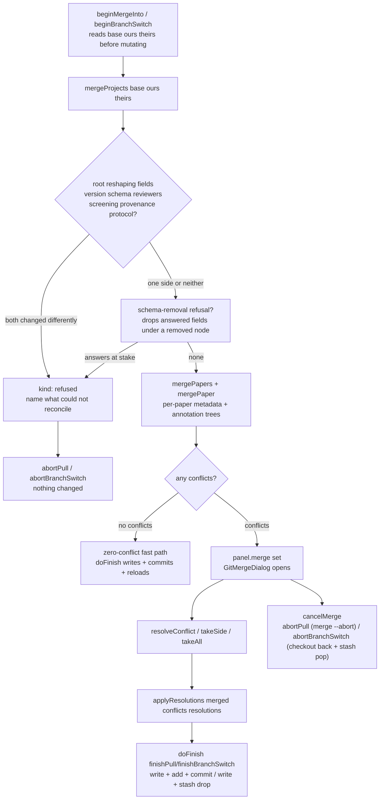
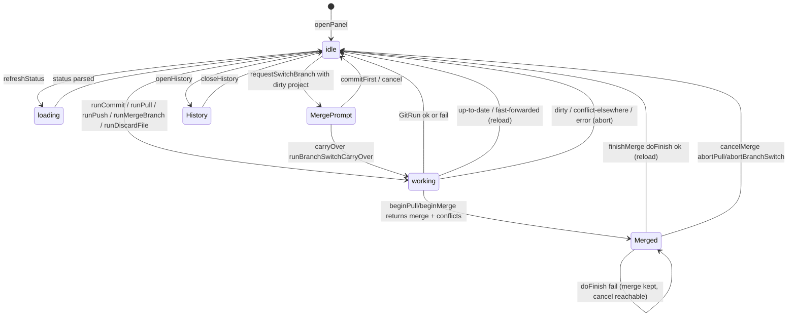
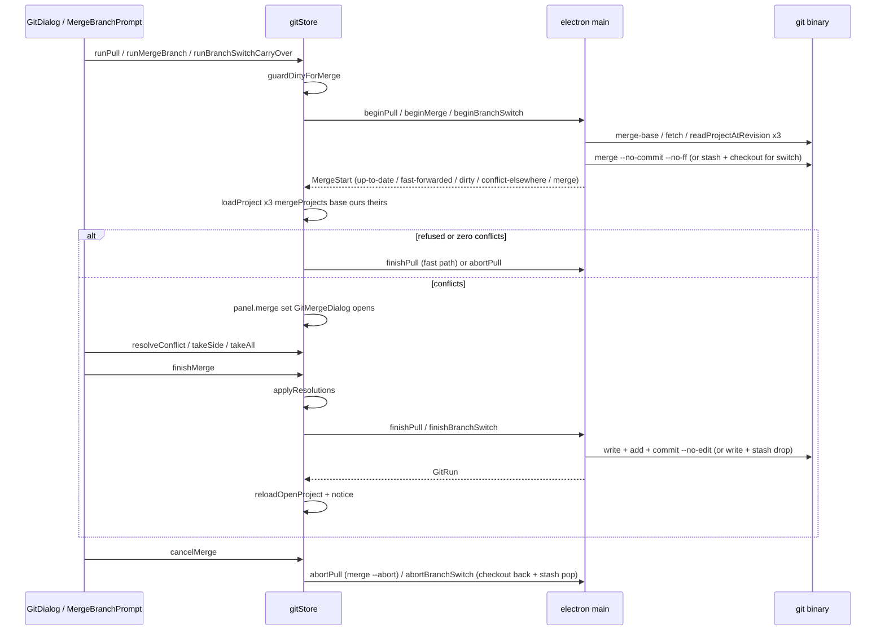

# Git Integration

Git support lets a review team share one SaiLoR project across machines without
SaiLoR ever teaching its users git. Two ideas make that possible despite a
file format that was *designed* so independent reviewers don't trample each
other (each reviewer's answers live in their own file under `annotations/`):

- a **field-level three-way merge** (`src/git/merge.ts`) that reconciles two
  divergent copies of the project by the single rule *"a side that did not
  change a value away from the base does not get a vote on it"*, and
- a strict **fetch-vs-parse split**: the Electron main process is the only thing
  that talks to git; it returns raw text across IPC and the renderer parses and
  diffs it. Every diff — a commit panel's HEAD-vs-working review, a merge's
  base/ours/theirs, a history row's parent-vs-commit — is computed in the
  renderer from text the main process fetched.

This page follows the flow in four layers: the **security gates** that vet
every input before it reaches a spawned `git`, the **IPC plumbing** in
`electron/main.ts` that owns the only path to git, the **pure logic** in
`src/git/` (merge, changes, output, concurrent reads), and the **gitStore**
state machine plus its UI components that drive the whole thing from the
renderer.

<!-- openwiki: mermaid parse failed and this diagram was converted to a text fence so it does not break rendering. Fix the diagram source and restore the mermaid fence. Parser error: Parse error on line 3: ... GS ->|getPlatform().getGit()| GP["Git Expecting 'SQE', 'DOUBLECIRCLEEND', 'PE', '-)', 'STADIUMEND', 'SUBROUTINEEND', 'PIPE', 'CYLINDEREND', 'DIAMOND_STOP', 'TAGEND', 'TRAPEND', 'INVTRAPEND', 'UNICODE_TEXT', 'TEXT', 'TAGSTART', got 'PS' -->
```text
flowchart TD
  UI["UI components<br/>GitCloneDialog / GitDialog / GitMergeDialog<br/>GitHistoryDialog / MergeBranchPrompt / DeleteBranchPrompt"] --> GS["useGitStore state machine<br/>src/state/gitStore.ts"]
  GS -->|getPlatform().getGit()| GP["GitPlatform seam<br/>src/platform/electron.ts"]
  GP -->|window.slr bridge| IPC["Electron main IPC handlers<br/>git:* in electron/main.ts"]
  IPC --> SEC["Security gates first<br/>assertRelPath / assertRef / assertRoot<br/>validateGitUrl / validateClonePath"]
  SEC --> RG["runGit<br/>execFile + GIT_SAFE_CONFIG + gitEnv"]
  RG --> GIT["user's git binary"]
  IPC -->|raw text| GP
  GP -->|raw text| GS
  GS -->|loadProject / mergeProjects / detectFieldChanges| LOGIC["pure logic<br/>src/git/merge.ts changes.ts output.ts"]
```

The diagram above shows who owns what; the layers below explain each one.

## Security gates: input never chooses argv

Every string the renderer names — a clone URL, a destination path, a repo-relative
path, a branch ref — is user input that reaches a spawned process or a file
write, so it is checked **once, before any git command**, in modules under
`src/git/` that `electron/main.ts` imports rather than keeping a second copy
inside `electron/`. Those modules are deliberately outside `electron/` because
`electron/` sits outside vitest's test scope, and "a security gate with no tests
is a security gate nobody can change safely" — the same reason every gate below
has a sibling `*.test.ts`.

`runGit` (`electron/main.ts`) itself hardens the environment so a hostile
`.git/config` from a folder received by zip/USB cannot run code on a mere
"open project":

- `gitEnv()` strips inherited `GIT_DIR`/`GIT_WORK_TREE`/`GIT_*` variables (a
  shell sitting inside another repo would otherwise point every command at it)
  and sets `GIT_TERMINAL_PROMPT=0` and `GIT_EDITOR=true` so git fails fast with
  its own message instead of blocking on a tty that does not exist — while
  credential helpers, askpass programs and SSH agents are deliberately untouched.
- `GIT_SAFE_CONFIG` is a hard `-c` override prepended to every invocation:
  `core.fsmonitor=false`, a non-existent `core.hooksPath` under the OS temp dir
  (defanging `.git/hooks`), `core.pager=cat`, `core.editor=false`,
  `core.alternateRefsCommand=`, `uploadpack.packObjectsHook=`, and
  `protocol.ext.allow=never`. The threat is concrete: the docs describe
  receiving a project folder, and a copied `.git/` brings its `config` — a
  `core.fsmonitor` of `printf PWNED > /tmp/proof; false` runs on `git status`,
  which the Git button reaches in one click and `git:info` fires automatically
  on project open. Keys a user may legitimately set globally (`core.sshCommand`,
  `credential.helper`, `gpg.program`) are left alone; `--no-ext-diff`/`--no-textconv`
  are passed on the diff itself because setting `diff.external` empty makes git
  try to run the empty string.

Beyond the environment, four string-level gates vet renderer-supplied input:

- **`validateGitUrl` / `validateClonePath`** (`src/git/url.ts`): an **allowlist**
  of transports (`https://`, `http://`, `ssh://`, `git://`, `git+ssh://`,
  `file://`, plus scp-like `user@host:path` and absolute local paths) rather
  than a character blocklist — because `ext::sh -c '…'` is a git remote-helper
  transport that makes git run a program named by the URL, i.e. arbitrary code
  execution spelled as a URL. `REMOTE_HELPER` rejects any leading `scheme::`.
  A leading `-` is refused (git would read it as an option), as are control
  chars. `validateClonePath` requires an absolute destination and rejects a
  leading `-`. `repoNameFromUrl` derives the directory `git clone` would
  create so the dialog can show where it lands, and its rejection of `.`/`..`/
  separator names is also what stops `join(parent, name)` escaping the chosen
  folder.
- **`relPathProblem` / `isSafeRelPath` / `annotationsRelDir`**
  (`src/git/relpath.ts`): is this string safe as a path *relative to the repo
  root*? Refuses empty, absolute (incl. Windows drive letters and UNC/root
  separators — `path.isAbsolute` on POSIX doesn't recognise them), `..`
  traversal (split on **both** `/` and `\` because `path.win32.join` honours
  backslashes and a `..\..\` opaque segment used to pass), control chars, and
  any `.git` component (trailing dots/spaces stripped before comparing, since
  Win32 strips them itself so `.git.\config` opens `.git`). `annotationsRelDir`
  derives the project's `annotations/` folder from its `relPath` so the
  derivation has one implementation shared by main and renderer.
- **`refProblem` / `isSafeRef`** (`src/git/ref.ts`): is this string safe as a
  git ref? Refuses empty, leading `-` (option-like), control chars, and the
  revision-syntax / `check-ref-format` characters that turn a name into a
  *different* commit (`..`, `~`, `^`, `:`, `?`, `*`, `[`, `\`, `@{`, `//`,
  leading/trailing `/`, trailing `.`, a component starting with `.` or ending
  in `.lock`). Whether the ref *exists* is `git rev-parse --verify`'s job —
  the other half of the guard.
- **`ownAnnotationPathMatcher`** (`src/git/ownAnnotationPath.ts`): does a path
  under a project's `annotations/` folder belong to *this* project, or to a
  *sibling* sharing the same directory? `annotationsRelDir` derives the folder
  purely from the project file's directory and says nothing about whether only
  this project lives there — and it routinely doesn't: SaiLoR's own
  "Start full-text screening" flow saves a derived project as a sibling JSON
  next to its source, and an ad hoc "Save As" does the same. Without this
  predicate, every flow that treats "anything under `annotations/`" as this
  project's territory (a branch-switch stash, a merge's conflict waiver) would
  silently stash, merge over, or delete a sibling's files. It builds a regex
  matching `<paperId>/<name>.json` for *this* project's own paper ids and its
  `screening`/`reviewer` name family, duck-typed on the raw parse so a project
  that fails full validation for an unrelated reason doesn't make its own
  annotation paths unrecognizable.

These are wired into the main process as the `assertRelPath`/`assertRef`/
`assertRoot` guards that throw before any handler body runs, plus the
`knownGitRoots` set (a branch-switch/checkout handler is told `root` by the
renderer; `assertRoot` refuses anything this session never actually opened via
`git:info` or `git:clone`). `assertInsideRoot` (in `electron/main.ts`)
resolves the real destination against symlinks and is the filesystem-half of
the relative-path guard.

## The IPC plumbing in `electron/main.ts`

The renderer never spawns git and never touches the filesystem. It reaches the
main process only through the `window.slr` bridge (`electron/preload.ts`),
which `ElectronAdapter.getGit()` (`src/platform/electron.ts`) exposes as the
`GitPlatform` interface (`src/git/types.ts`). Every method is a thin pass-through
to an `ipcMain.handle('git:…')` registration. The handlers are the sole owners
of the git binary and the disk.

A non-zero git exit is **data, not an exception** — `runGit` resolves a `GitRun`
with `ok:false` and the exact stdout/stderr, because half of git's useful output
(a conflicting merge exits 1; that's the normal path here) arrives on a failing
exit code. Only a failure to launch git at all is signalled with `code:null`.

The handlers, grouped by job:

**Probe / clone / open.**
`git:probe` runs `git --version`. `git:pickCloneDir` opens a native folder
picker. `git:clone` validates URL + destination with `validateGitUrl`/
`validateClonePath`, runs `git clone -- url dest` with the network timeout, and
on success adds the destination to `knownGitRoots`. `git:pickProjectIn` opens a
project-file picker *inside* the freshly cloned dir; the caller reuses the
ordinary project-open path so opening a project doesn't exist twice.
`git:info` resolves where the open project sits git-wise: it runs
`--is-inside-work-tree`, then concurrently (`Promise.all`)
`--show-toplevel`/`--show-prefix`/HEAD-verify/`symbolic-ref`/`@{u}` and feeds
them to `deriveGitInfo`. It deliberately uses `--show-prefix` (not
`--show-toplevel` alone) because `--show-toplevel` resolves symlinks (on macOS
`/tmp` realpaths under `/private/tmp`) and a `path.relative` against it would
compute a `..` escape pointing nowhere.

**Status / content / history.**
`git:status` runs `status --porcelain=v1 -z` plus a `--no-pager --no-color
--no-ext-diff --no-textconv diff HEAD --` (only when HEAD exists), returning
raw porcelain + diff; the renderer's `GitPlatform.status` parses the porcelain
via `parsePorcelain` and caps the diff via `capDiff`. `git:headContent` and
`git:workingContent` reassemble the project at HEAD vs the working tree:
`headContent` reads through `git show` (`readProjectAtRevision`), while
`workingContent` reads straight from disk via `readProjectText` — deliberately
not `git show :relPath` (the index's copy), so the commit panel reviews what's
really on disk, not what's staged. `git:logBegin` runs `git log` scoped to the
project's own file *and* its `annotations/` dir (capped at `LOG_MAX_COMMITS` =
250, `truncated` when it hits the cap); `git:logDiff` fetches the two revisions
a history row needs (`rev` and `rev^`) and returns raw text, with `'initial'`
when there is no parent.

**Commit / discard.**
`git:commit` is the plain pathspec-limited commit for non-project files: `add`
then `commit -m message -- paths` (with `--amend` when requested), never
disturbing separately-staged work elsewhere. `git:commitPartial` is what makes
committing *some* of a project's field-level changes possible at all: git has no
native concept of staging part of a file, but nothing requires the content `add`
stages to be what's on disk. Its sequence is **write → add → commit → (always)
write again**: `committed` goes onto disk just long enough to be staged, then
`working` — the state the working tree should hold afterward, composed by
`composeContents` from the reviewer's Use/Ignore/Discard choices — replaces it.
The `finally` is load-bearing: if `add` or `commit` fails partway, the working
tree must still end up holding `working`, never stuck mid-swap. `git:writeWorking`
writes `working` *without* staging or committing — the "throw away these local
edits" counterpart, for a reviewer who only wants to revert and shouldn't have to
invent a commit. `git:discardFile` is the whole-file counterpart to the project
file's field-level Discard: it re-derives the file's status (the tree can have
changed since the panel refreshed), deletes untracked files (via `rm` for a
directory, `unlink` for a file — the EISDIR bug that used to wedge the panel),
reverts tracked modified/deleted files via `checkout --`, and refuses a rename
or an unresolved conflict. It also refuses the project's own file or anything
under its `annotationsRelDir` — `GitDialog`'s `isProjectOwnPath` withholds the
button, but that's UI not enforcement, and the renderer must not be the only
thing standing between a stray click and data with no committed copy to recover.

**Pull / merge.**
`git:pullBegin` and `git:mergeBegin` share `beginMergeInto`, which classifies
the merge and returns a discriminated `MergeStart` computed *before* it mutates
anything except in the `'merge'` case (where the merge is already in flight):
`up-to-date`, `fast-forwarded` (`--ff-only`), or divergent. For the divergent
case it reads the three revisions (base/ours/theirs) *before* touching the work
tree, then `merge --no-commit --no-ff`. It checks `MERGE_HEAD` to distinguish
"a merge that failed to start" (no MERGE_HEAD → abort would itself fail) from a
real in-progress merge, then filters unmerged paths down to the project's own
family via the **union** of `ours`' and `theirs`' `ownAnnotationPathMatcher`s
(using only `ours` would misclassify a remote-added paper as
`conflict-elsewhere`). Anything unmerged outside that family aborts the merge
cleanly (`'conflict-elsewhere'`): SaiLoR can merge an annotation JSON but not a
PDF or a `.gitignore`. `git:pullBegin` adds the pull-only cases: resolves `@{u}`,
fetches (network timeout), reports `'no-upstream'` when there isn't one.
`git:mergeBegin` fetches when the chosen ref is genuinely remote-tracking
(checked against git, not the `origin/` prefix), and `^{commit}`-verifies the ref
exists. `git:pullFinish` writes the resolved project, `add`s the project file +
`annotations/`, and `commit --no-edit` (MERGE_HEAD set → a two-parent merge
commit). `git:pullAbort` is `merge --abort`. Both are wrapped in `try`/`catch`
because a throw here would reject past `gitStore`'s recovery and leave the repo
mid-merge with the panel showing no error.

**Branches / switch.**
`git:branches` lists local + remote-tracking refs via `for-each-ref`, dropping
`refs/remotes/origin/HEAD` (a symref, not a branch). `git:branchCreate` is
`branch -- name` (the renderer follows with the ordinary switch flow; a freshly
cut branch shares its parent's commit so that switch can never itself conflict).
`git:branchDelete` is `branch -d` — never `-D`; git's own "not fully merged"
refusal is the answer this app wants, surfaced as `panel.error`.
`git:checkout` is a plain `checkout branch --` for the no-changes / no-project
case. `git:branchSwitchBegin` checks whether switching is safe and — only in the
`'merge'` case — actually performs it: it reads the working-tree project (not
HEAD, so an uncommitted new paper counts), narrows "project's own files" via
`ownAnnotationPathMatcher`, refuses (`'other-files-dirty'`) if anything outside
that is dirty, returns `'no-changes'` if nothing is, and otherwise captures
`base`/`ours`/`theirs` **then** stashes the project's own dirty files and checks
out the target — atomically, so nothing can change the tree between "read what's
there" and "stash it". `git:branchSwitchFinish` writes the resolved project onto
the new branch and `stash drop`s (the stash is now folded in). `git:branchSwitchAbort`
checks back out to `sourceBranch` and `stash pop`s — unlike `pullAbort`, the
checkout already succeeded by the time the reviewer can cancel, so this *undoes*
it rather than stopping something in flight.

## Concurrent reads: `readAllConcurrently`

`readProjectAtRevision` and the working-tree `readProjectText` each need to read
a project.json plus every `annotations/<paperId>/*.json` file. Doing that one
`git show` at a time (or one `readFile` at a time) is the slow path; doing it
concurrently and reassembling the id→result map correctly is the fast path — but
"out-of-order resolution reassembled against the wrong index" is exactly the
bug a rewrite could reintroduce silently. `readAllConcurrently`
(`src/git/concurrentRead.ts`) is the one place that orchestration lives, pulled
out of `electron/main.ts` purely so it can be unit-tested:

```ts
export async function readAllConcurrently<T>(
  ids: string[],
  read: (id: string) => Promise<T>,
): Promise<Map<string, T>> {
  const results = await Promise.all(ids.map(read))
  return new Map(ids.map((id, i) => [id, results[i]]))
}
```

It launches one read per id at once, then rebuilds the id→result map by *index*
from the `Promise.all` result — so the mapping is correct regardless of which
read settles first. A rejecting read still rejects the whole call (the same
"the load failed" outcome the old sequential loop had for a failing paper);
since every read is already in flight, if two fail at once it is not guaranteed
to be the *first* one (by `ids` order) whose error surfaces, only that it is a
real failure from one of them — an accepted, harmless difference from the old
behavior. It is used by `readProjectText` (working-tree reads) and
`readProjectAtRevision` (revision reads via `git show`).

## The field-level three-way merge (`src/git/merge.ts`)

`mergeProjects(base, ours, theirs)` is the heart of git support. It knows
nothing about git and nothing about the DOM: it takes a parsed `Project` at the
merge base (or `null`, when the file was added on both branches independently)
plus the two divergent copies, and returns either a `{kind:'merged', merged,
conflicts, notes}` or a `{kind:'refused', reason, details}`. `src/consolidate/`
is the pattern it follows: small, pure, hammered by unit tests.

The whole merge, in one rule applied at every granularity from a project's title
down to a single annotation field:

> **A side that did not change a value away from the base does not get a vote
> on it.**

That is precisely the guarantee this feature exists for — the fields *you*
changed cannot be overwritten by a remote that did not touch them, and vice
versa — and it is not a special case bolted on afterwards; it is the rule.
`merge3(base, ours, theirs, eq)` is its four-line embodiment: if `ours ===
theirs`, take it; if `ours === base`, take `theirs`; if `theirs === base`, take
`ours`; only when both sides changed to *different* things does it return `null`
— the one case no algorithm can settle and a person has to look at. A `null`
base (added on both branches) collapses cleanly: no base papers, every base
field value reads as absent/empty.



The diagram shows the merge lifecycle; the layers below are how `mergeProjects`
reaches each branch.

**Reshaping fields refuse, not guess.** A difference in `version`, `schema`,
`aiEnabled`, `finishCheckbox`, `reviewers`, `screening`, `provenance`,
`protocol`, or a root `extra` key changes the *shape* of every tree in the file,
so there is no field-level answer — `mergeProjects` refuses and names it
(`refusalDetail` produces a per-key human sentence, e.g. "The annotation schema
was changed on both sides… reconcile the schema first"). `title` and
`schemaInfo` are deliberately *not* in that list: each is one string a conflict
row expresses perfectly, and refusing an entire merge because two people renamed
the review would be absurd.

**Schema-removal refusal.** Every tree below is walked against the winning
schema, so a field the losing side removed is simply never visited — silently
extending that schema vote to answers nobody agreed to discard.
`schemaRemovalRefusal` refuses (naming the field and how many answers are at
stake) exactly when there is something real to lose; a removal nobody had
answered under proceeds as before.

**Paper-level metadata** (`mergePaper`) runs a `merge3` per field — `title`,
`pdf`, `doi`, `authors` (as a `deepEqualJson` array), `year` (rendered as a
bounded numeric control via `type:'year'`), `venue`, `abstract`, and
`abstractFromPdf` — pushing a `FieldConflict` on genuine disagreement. `extra`
keys per paper refuse via the paper-refusal sink. Annotation trees and each
numbered reviewer's tree are merged by `makeTreeMerger`'s `mergeTree`.

**Annotation-tree merge** walks the merged schema with `count` = the union of
all three sides' instance counts (clamped to `def.max`), and the arrays are
**never compacted** — position carries meaning (consolidation lines up each
reviewer's entries by index), so closing a gap would silently re-point that
alignment. Two correctness guards around repeatable nodes:

- **Bug 1 (both sides grew):** when *both* sides grew this node past the base's
  length, the surplus instances are additions, not competing values for the same
  slot. Only the truly new tail is appended raw; every index the base already
  had still goes through the ordinary per-field merge. Both tails are kept (with
  a `repeatable-additions-kept` note) — a duplicate is a five-second cleanup; a
  silently dropped or invented finding is not.
- **Bug 2 (shrunk-and-edited):** a deletion on one side shifts every later
  index, so positional matching can strand an edit the other side made on a
  phantom slot. `shrunkAndEdited` detects it (one side's count dropped below
  base's while the *other* changed an instance at or beyond the dropped
  position) and refuses rather than guess which entry the edit belongs to.

`valueAt` reads an absent slot as `emptyValue(def.type)` — required for
correctness, because `pruneTree` drops trailing empty instances on save, so an
instance that exists-but-is-empty and one that is simply not there are the same
thing on disk and must merge the same way.

**Paper add/remove asymmetry.** `mergePapers` keys papers by id (ours' order,
then theirs-only appended in theirs' order). The removal asymmetry is the
load-bearing one: a paper one side deleted and the other *changed* is **kept**
with a note, never deleted — a kept paper nobody wanted is one click from gone;
annotated work a merge deleted is gone. Only when both sides agree (the paper is
untouched on the side that kept it) does the deletion actually happen.

**Non-conflict bookkeeping** merges silently: `mergeEqual` (a set spelled as an
array — `merge3` of set membership), `mergeMarksList` (PDF highlights unioned by
id, last-`updatedAt` wins, never dropping one), `mergeReviewMarks` per reviewer,
`mergeAlignment` per node (a genuinely two-sided mismatch keeps *ours* silently —
this is a derived claim, not something a reviewer said, recoverable by reopening
Consolidation), `mergeAiUsage` (union by provider/model/appliedAt), and the
`finished`/`reviewsFinished` keep-the-declaration tiebreak (a wrongly-kept
declaration is one click from gone; a dropped reviewer statement is not).

**Applying resolutions.** `applyResolutions(merged, conflicts, resolutions)`
writes the reviewer's choices into the merged project with immer's `produce`
(chosen over `structuredClone`/JSON-round-trip because it handles a frozen input
the way Zustand hands one over and preserves `undefined`-valued keys
`deepEqualJson` cares about). An id with no resolution keeps what `mergeProjects`
left there (our value — the safe side if resolution is ever skipped); a
resolution for an id not in `conflicts` is ignored. `applyOne` is a defensive,
non-throwing walk: a conflict id resolved against a schema that has since
changed is skipped, never thrown.

## Field-level commit review (`src/git/changes.ts`)

A genuinely different question from the merge: here there is one side that
changed (the working tree) and one that did not (HEAD), so every difference is
something the reviewer decides about, not something that might resolve itself.
`changes.ts` borrows `merge.ts`'s *shape* (canonical paths, per-tree identity,
the paper-metadata field list, the `conflictId` key shape) but not its `merge3`
rule, which has no "which side changed" question to answer when only one side
ever does.

`detectFieldChanges(head, working)` returns `null` (a structural refusal, the
same differences `merge.ts` refuses for the same reason — schema, reviewers,
screening, version, title, provenance, protocol, root `extra`) or a
`{fields, papers}`: a `FieldChange` per leaf whose value differs (with `headValue`
/`workingValue`), plus `PaperChange`s for added/removed papers reviewed as one
unit. `PAPER_META_BUNDLES` folds `abstractFromPdf` into the `abstract` row
(its meaning is owned by `abstract` — "this text is a guess" — so it never gets
a row of its own), with a fallback giving the bundled field its own row if the
primary didn't change but the bundled one did.

`composeContents(head, working, changes, decisions)` produces the two outputs the
commit panel needs. The disposition rule, applied uniformly across a field
value, a paper added locally, or a paper removed locally:

- **use** — the committed content gets the new value/paper; the working file is
  unaffected (it already has it).
- **ignore** — the committed content keeps HEAD's value/paper (an added paper is
  left out; a removed paper's deletion is not committed); the working file is
  unaffected — the change stays, uncommitted, offered again next time.
- **discard** — the committed content keeps HEAD's value/paper, *and* the working
  file is rewritten to match (an added paper deleted from it, a removed paper
  restored, a changed field's edit erased). This is why discarding is a real write
  to disk, performed only when the reviewer presses Commit — never as a side
  effect of picking it in the list.

`growTreeToSource` grows each committed tree that will receive a "use" value to
the working tree's shape first — a reviewer-added repeatable instance needs a
slot to land in, or `writeAnnotationValue` would silently no-op and the added
answer would be permanently uncommittable. Padding never fabricates a *value*
(empty skeletons), and `max` is respected.

## The `gitStore` state machine (`src/state/gitStore.ts`)

A self-contained Zustand store (with the immer middleware) that owns the git
flows: importing from a repository (`CloneState`), the commit/pull/push panel
(`PanelState`), the merge-branch and delete-branch prompts, the new-branch
prompt, and the commit-history panel. It is kept out of the main `store.ts`
for the same reason `aiStore` and the project editor are — a self-contained
mode with its own lifecycle the ordinary annotation path never needs to know
about. **Dependency direction is one-way: `gitStore` reads and drives `useStore`
(`useStore.getState()`), but `store.ts` never imports it.** Refreshing `repo`
when the open project changes is therefore an `App.tsx` effect, not a call from
inside `store.ts`.

The store's central guard is `guardDirtyForMerge`: `git status` sees the file on
disk, not the reviewer's unsaved annotations in memory, and a fast-forward or a
finished merge reloads the file from disk — without this check that would
silently discard unsaved work. Its sibling `guardFieldReviewFresh` compares a
fresh `workingContent` read against the `fieldReview` snapshot (parsed through
`loadProject`, not raw text, so cosmetic differences don't false-positive) and
refuses to compose against a stale snapshot — the routine way a stale snapshot
happens is the dirty banner's own "Save project" writing to disk without
refreshing `fieldReview`.



`applyMergeStart` is shared by `runPull` and `runMergeBranch` (which differ only
in how they name the other side). It branches on the `MergeStart` kind:
`up-to-date` → notice; `fast-forwarded` → reload + notice; `dirty` → fail;
`conflict-elsewhere` → fail; `error` → fail; `merge` → parse each revision
independently (so a parse failure names exactly which one is unreadable),
`mergeProjects`, refuse-and-abort on `refused`, fast-finish on zero conflicts,
or set `panel.merge` for `GitMergeDialog`. `runBranchSwitchCarryOver` mirrors
this almost exactly — the only real difference is where the three revisions and
the stash/checkout mutation come from (`beginBranchSwitch`, not a `git merge`),
and that it aborts via `abortBranchSwitch` on any failure.

`doFinish` is the single finisher shared by the zero-conflict fast path and the
merge dialog's `finishMerge`: it `applyResolutions`, calls `finishPull` or
`finishBranchSwitch`, and only touches `panel` once it knows whether it
succeeded. On failure the repository is genuinely still mid-merge (or
mid-branch-switch), so `panel.merge` is **left in place** — Cancel merge must
stay reachable; the zero-conflict fast path back-fills it here rather than wedge
a repo with a failed finish and no in-app way to abort. On success it reloads
the open project, sets a per-source notice, and refreshes.

## The pull / merge / branch-switch conflict-resolution flow

Three flows reach the same merge UI — a **pull** (merging `@{u}`), a
**merge-branch** (merging another branch into this one), and a **branch-switch**
(merging the target branch while carrying the reviewer's uncommitted changes
over). `GitMergeDialog` renders all three identically; only finishing and
cancelling need to know which, and only branch-switch actually differs there —
it alone moved HEAD, so it needs `finishBranchSwitch`/`abortBranchSwitch` and
the `sourceBranch` to check back out to on cancel. Pull and merge-branch are
both an ordinary git merge, finished and aborted by `finishPull`/`abortPull`.



The diagram makes the fetch-vs-parse boundary explicit: the main process
fetches the three revisions and (for merge/switch) starts the merge or the
stash/checkout; the renderer parses and merges. A refused or zero-conflict
merge finishes without ever opening the dialog.

## UI components

- **`GitCloneDialog`** (`src/components/GitCloneDialog.tsx`) — import-from-git:
  a four-phase modal (`setup` → `cloning` → `done`/`error`) that pastes a URL,
  picks a destination folder, clones, then picks the project JSON *inside* the
  cloned repo and opens it through the ordinary project-open path. It derives
  the clone's destination name with `repoNameFromUrl` and shows an elapsed-time
  line while cloning (a repo of PDFs can take minutes) so a slow clone reads as
  "working", not "frozen".
- **`GitDialog`** (`src/components/GitDialog.tsx`) — the commit/pull/push panel
  and branch switcher: a per-file change list with the field-level review for the
  project's own file, a commit-message field with an amend toggle, the
  branch `<select>` (with `__sailor_new_branch__` and `__sailor_delete_branch__`
  sentinels), and a "Merge branch…" / "History…" pair. `isProjectOwnPath`
  withholds the whole-file ↺ button for the project's own paths (UI, not
  enforcement — `git:discardFile` refuses them again server-side).
- **`GitMergeDialog`** (`src/components/GitMergeDialog.tsx`) — the conflict
  resolution list: one group per paper, each row a field both sides changed to
  different things. It deliberately has no Escape, no backdrop-click, and no × —
  the repo is mid-merge for as long as it's open, and dismissing it without
  finishing or explicitly cancelling would leave the reviewer's checkout in a
  state they can't escape without the command line. "Use all mine"/"Use all
  remote" can be scoped to a subset of ids (another reviewer's own trees are
  excluded).
- **`GitHistoryDialog`** (`src/components/GitHistoryDialog.tsx`) — read-only
  history viewer: one row per commit, with an on-demand field-level diff per
  row (`loadCommitDiff`, lazy and cached, never eager for the whole list). Rows
  render `formatValue`'s Was/Now text without any Use/Ignore/Discard controls.
- **`MergeBranchPrompt`** / **`DeleteBranchPrompt`** — small pickers for the
  rare, explicit merge/delete actions. `DeleteBranchPrompt` lists local
  branches only (deleting a remote-tracking ref needs `git push --delete`, a
  network operation with consequences for other people, out of scope); `-d`
  never `-D`, so git's own "not fully merged" refusal surfaces as `panel.error`.

## Output parsing (`src/git/output.ts`)

Turning what git printed into data the UI can render — kept separate from the
plumbing so it can be unit-tested without spawning a process. The raw
porcelain/diff text crosses IPC *on purpose*, precisely so it lands here.

- **`parsePorcelain`** parses `git status --porcelain=v1 -z` defensively: a
  short/malformed record is skipped, not thrown over. Records are NUL-terminated
  `XY<space><path>`; a rename/copy is two records (new path, then original), so
  the loop consumes the next record itself. `isUnmergedCode` flags unresolved
  conflicts (either side `U`, or `AA`/`DD`).
- **`diffLines`** classifies a unified diff for coloured rendering — *not* a
  bare `line.startsWith('+')` (that misreads an added line whose content starts
  with `+`/`-`, and the `+++ b/path` header pair), but a hunk-aware pass that
  only reads `+`/`-` once inside a `@@` hunk.
- **`parseGitLog`** parses the NUL-terminated `%H\t%aI\t%s` log format,
  splitting on only the first two tabs so a subject containing a tab or newline
  doesn't desync the fields.
- **`capDiff`** caps a diff at `MAX_DIFF_CHARS` (200 000) — the panel is for
  seeing what changed, not rendering a megabyte of it.
- **`gitErrorText`** formats a failed `GitRun` for display: stderr first (that's
  where git puts the reason), stdout only when it said nothing else, and a
  fallback for a git that never started.

## Tests that matter

The pure logic under `src/git/` carries the load-bearing correctness, and each
module has a sibling test file that exercises it directly — `merge.test.ts`
(builds fixtures through the real `loadProject` so every base/ours/theirs is
exactly as schema-normalized as a file the caller would actually hand it),
`changes.test.ts`, `output.test.ts`, `url.test.ts`, `ref.test.ts`,
`relpath.test.ts`, `ownAnnotationPath.test.ts`, `concurrentRead.test.ts`
(controls completion order with real short delays to test the *ordering*
property, not timing precision), and `deriveGitInfo.test.ts`. The renderer-side
state machine and its end-to-end flows are covered by integration tests under
`src/test/integration/` (`pull.integration.test.tsx`,
`branchSwitch.integration.test.tsx`, `discard.integration.test.tsx`,
`consolidationAndMerge.integration.test.tsx`,
`annotationWorkflow.integration.test.tsx`), each stubbing `getGit()` with a fake
git so the store runs against canned `GitRun`s. The `electron/main.ts` handlers
themselves are not unit-tested (outside vitest's include), which is exactly why
every gate and parser that matters lives in importable `src/git/` modules
instead.