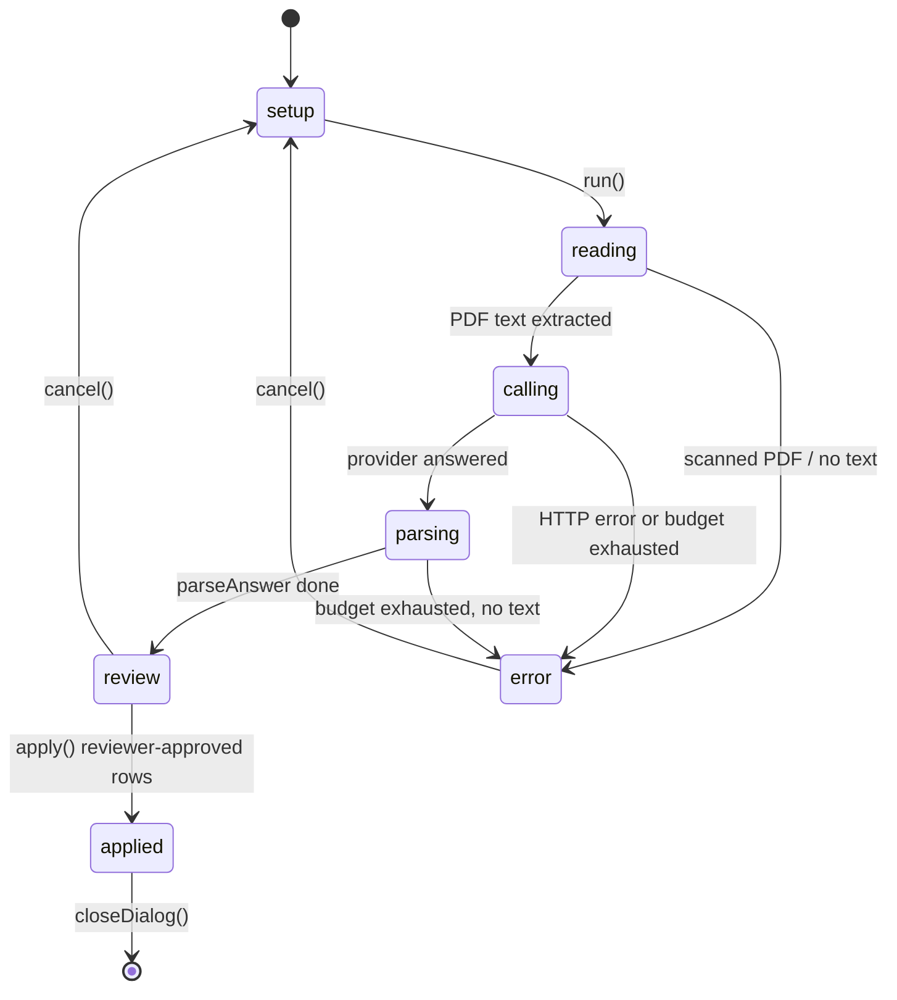
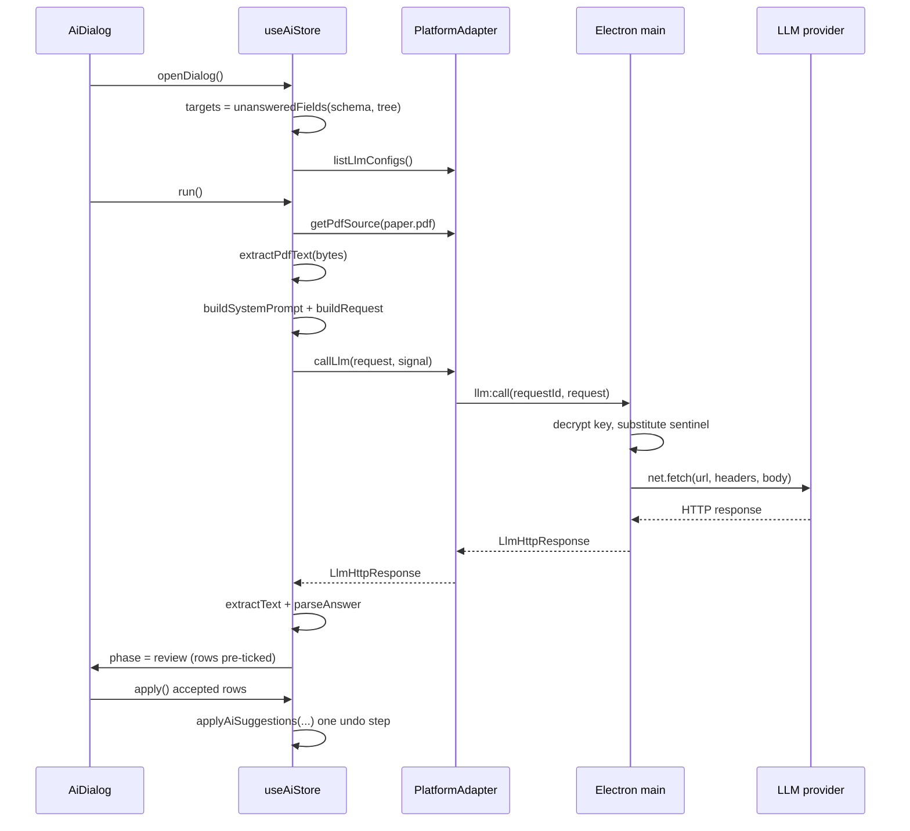

# AI-Assisted Annotation

The AI feature lets a reviewer point an LLM at one paper and have it propose values for the paper's
*still-empty* annotation fields. The reviewer then ticks the proposals they accept and applies them in a
single undo step. Two invariants shape the whole subsystem and are worth holding in mind before the pieces:

- **An API key never lives in the renderer.** `LlmConfig` (in `src/llm/types.ts`) has no `apiKey` field. The
  desktop app holds the key in the Electron main process, encrypted with `safeStorage`, and splices it into
  the outgoing request there; the renderer only ever learns *whether* a key exists (`hasKey`). The renderer
  builds the entire request but can only place the literal sentinel `{{apiKey}}` where the key goes.
- **Nothing the model returns reaches the project data unless it typechecks.** `parseAnswer`
  (`src/llm/parse.ts`) is the trust boundary: every proposed value is coerced against its `ResolvedDef`, and
  anything that does not fit (bad path, wrong type, value not in the enum, duplicate) is *rejected and shown*,
  never silently dropped and never guessed into shape.

The feature is off by default for every project and unlocked only by a hidden per-session gesture
(`aiUnlocked` in `src/state/store.ts`, wired in `Toolbar.tsx`). A project can forbid it outright
(`config.ai: false` always wins), but can no longer turn it on by itself. See [Architecture](../architecture.md)
for where this sits in the app, and [Annotation Schema](../concepts/annotation-schema.md) for the schema
format the prompt teaches the model to read.

## End-to-end flow

`useAiStore` (`src/state/aiStore.ts`) owns the flow as a small state machine, surfaced by `AiDialog`
(`src/components/AiDialog.tsx`). The invariant the UI enforces is: **nothing is sent until Start, nothing is
written until Apply.**



The phases (`AiPhase`) are `setup → reading → calling → parsing → review → applied`, with `error` reachable
from the network/extraction stages. `reading` extracts the PDF's text; `calling` waits on the provider;
`parsing` extracts the answer text and runs `parseAnswer`.



The Cancel button aborts the in-flight call. Because an `AbortSignal` cannot cross IPC, the call is given a
`requestId`; `cancel()` aborts the renderer-side controller, and the Electron adapter forwards an
`llm:abort` *send* (not `invoke`) that the main process matches against the in-flight request.

## The provider abstraction

`src/llm/providers.ts` is where everything that differs between the nine vendors lives: where to POST, how to
authenticate, how to shape the body, and how to read the answer back out. `ProviderInfo` describes each one,
and `PROVIDERS` is the `Record<Provider, ProviderInfo>` keyed by the `Provider` union (`anthropic`, `openai`,
`google`, `openrouter`, `groq`, `mistral`, `deepseek`, `xai`, `openai-compatible`).

Each provider carries:

- `defaultBaseUrl` — fixed per provider, except `openai-compatible`, the only one with `editableBaseUrl: true`
  (a self-hosted server: llama.cpp, LM Studio, vLLM).
- `supportsPdf` — whether a single inline-attachment request can carry a PDF. `groq`, `mistral`, `deepseek`,
  `xai`, and `openai-compatible` are `false` (no inline file input, or a separate upload-then-reference
  flow this app does not do), so a target set to "send the PDF" against them silently falls back to
  extracted text at `run()` time.
- `supportsModelListing` — `false` only for `openai-compatible`: there is no single endpoint/auth/response
  shape safe to assume for an arbitrary server, so the app never tries and the reviewer types the model name.
- `tokenParam` — `'max_tokens'` or `'max_completion_tokens'`. This exists to prevent the
  OpenAI-specific rename trap: OpenAI (and Groq, xAI) now reject `max_tokens` on newer models and require
  `max_completion_tokens`, while OpenRouter, Mistral, DeepSeek, and self-hosted servers still document
  `max_tokens`. Sending the wrong one fails the whole call.

`buildRequest(cfg, system, user, opts?)` produces an `LlmHttpRequest` — built entirely in shared (renderer)
code, with `API_KEY_SENTINEL` standing in for the key in the headers. There are three genuinely different
request shapes:

- **Anthropic** — POST `/v1/messages`, `x-api-key` header, `anthropic-version`, body with `max_tokens`,
  `system`, and `messages`. Reasoning effort maps to `thinking: { type: 'adaptive' }` +
  `output_config.effort`.
- **Google (Gemini)** — the model lives in the URL path
  (`/v1beta/models/{model}:generateContent`), not the body; auth is `x-goog-api-key`. Reasoning effort
  switches between `thinkingLevel` (named, Gemini 3.x) and `thinkingBudget` (a token count derived from the
  chosen level via `GOOGLE_BUDGET_BY_LEVEL`, Gemini 2.5.x) — the two are mutually exclusive, and sending both
  is an error.
- **OpenAI-shaped** (everyone else) — POST `/v1/chat/completions`, `Authorization: Bearer` header, body
  with `model`, the provider's `tokenParam`, `messages` (system + user), and reasoning effort either as
  `reasoning_effort` (flat) or, for OpenRouter, `{ reasoning: { effort } }` (nested).

`DEFAULT_MAX_TOKENS = 8192` is deliberately generous. On a reasoning-capable model the output budget is shared
between hidden reasoning tokens and the visible answer; reasoning that runs long can exhaust the whole budget
before a single visible token is written, surfacing as a "finish_reason: length" / "stop_reason: max_tokens"
response with *no usable text* — not an error. Generous headroom costs nothing on ordinary models and only
matters for the ones that need it.

Reading a response back out is provider-specific and deliberately tolerant: `extractText` degrades to `''`
and `extractError` always yields something a reviewer can read. `wasTruncated(provider, json)` distinguishes
"a 2xx response was cut off by the token budget" from "the model had nothing to say" — both look like empty
text, but the fix is different, and the store uses it to give a targeted message ("used its whole reply budget
on internal reasoning") rather than "the provider answered, but the reply was empty."

`join(base, path)` appends a path to a base URL without duplicating what the user already typed — only
`openai-compatible` has a user-supplied base, and people reasonably enter `http://host:1234`, `…/v1`, or the
full `…/v1/chat/completions`, all of which it treats as the endpoint.

## Model discovery

`src/llm/models.ts` turns each provider's list-models endpoint into the flat `{ id, label, reasoning }` shape
the model picker needs. The endpoint is public-shaped (no PDF, no streaming), but the response envelope,
pagination, and reasoning-effort detection all differ, and that heterogeneity lives here.

`ModelInfo` carries the model `id` (exactly what the provider expects back in the `model` field), a `label`
(falls back to `id`), and a `ReasoningProfile | null` — a flat set of named effort levels low-to-high plus a
`defaultLevel` ("medium" when offered, else the middle level). Reasoning detection is a mix of:

- **Read from the response** where the provider says so: Anthropic's `capabilities.effort`, Google's `thinking`
  flag, OpenRouter's per-model `supported_efforts`.
- **A model-ID pattern** where the list endpoint says nothing: OpenAI (`o[0-9]`/`gpt-5`, excluding `-chat`
  variants that reject the field), Groq (`openai/gpt-oss`), xAI (`grok-4.5`), Mistral (`mistral-small|medium`).

DeepSeek and `openai-compatible` are deliberately left with *no* reasoning control: DeepSeek's
`reasoning_effort` contract could not be confirmed, and self-hosted servers have no single agreed-upon shape.
Offering a control that silently does nothing on some servers would be worse than not offering one.

`buildModelsRequest(cfg, cursor?)` builds the GET (the only GETs in this layer); `parseModelsResponse`
decodes the provider-specific envelope (`data` array for most, `models` array for Google with
`supportedGenerationMethods: generateContent` filtering, a bare array for Mistral, Anthropic's
`display_name` + `capabilities`, OpenRouter's `links.next` pagination). Two providers paginate:
Anthropic (`has_more`/`last_id`) and Google (`nextPageToken`). `fetchModels` walks up to `MAX_MODEL_PAGES`
(10) pages.

The same-origin cursor check (`resolveSameOrigin`) is a security guard: a pagination cursor is whatever the
provider said, and the follow-up request carries the API key. A cursor like `@evil.com/v1/models` read against
an `openrouter.ai` base used to parse as userinfo, handing the key to `evil.com`. The cursor is resolved as a
URL against the base and rejected (returns `null`) if it leaves the origin.

`fetchModels` in the store is cached per config id for `MODELS_TTL_MS` (1 hour) — a provider's catalog
changes on the order of weeks, so this only makes reopening the settings dialog instant; an explicit refresh
(`force: true`) always bypasses it. Like `verifyConfig`, it must save the target first, because the key has to
be stored before the platform will use it for anything.

## Prompt construction

`src/llm/prompt.ts` assembles the system and user prompts. The central idea is that the model is taught *how
an annotation schema is written* before it is shown one, so it can read an unfamiliar schema rather than
pattern-match a familiar one. `SCHEMA_FORMAT_DOC` describes the schema format (mirroring
`docs/annotation-schema.md` §3 — if the format changes, both must move), `PATHS_DOC` explains the path syntax,
and `OUTPUT_DOC` specifies the exact JSON object to return (`{ fields: [...], skipped: [...] }`).

Every rule pushes the model toward saying nothing rather than something plausible: ground every value in the
paper (no outside knowledge), omit a field if the paper does not answer it, quote a verbatim snippet of
evidence for every value (or omit it), respect the field type, and match enum options verbatim.

`buildSystemPrompt(schema, targets, delivery)` is delivery-aware: when the paper arrives as extracted text
(`delivery === 'text'`), an extra rule warns the model that the extraction is lossy — tables, figures, and
column layout may be garbled, and it must not reconstruct or guess at illegible content. The schema is shown
exactly as it appears on disk via `dehydrateSchema`. `fieldLines(targets)` lists each empty field with its
type, required flag, enum options, and description, all flattened to one line via `oneLine` so a
reviewer-authored description containing a line break cannot forge prompt structure.

`buildUserText(paper, paperText)` wraps the extracted text between `--- BEGIN PAPER TEXT ---` markers;
`buildUserPdfCaption(paper)` is the text part that accompanies a PDF delivery (the PDF itself is a separate
part in `buildRequest`).

### PDF text extraction

`src/model/pdfText.ts`'s `extractPdfText(bytes)` produces the plain text used on the text delivery path.
`linesFromItems` reconstructs reading-order lines by bucketing pdf.js text items by baseline y (within
`Y_TOLERANCE`) and sorting each bucket by x — a naive item-order join of a two-column paper is soup. It
normalizes to NFC after the join (some `ToUnicode` maps split an accented letter across two items) and
collapses whitespace (the text is token-billed). `empty` is true below `EMPTY_CHAR_THRESHOLD` (200
non-whitespace chars) — a scanned, image-only PDF yields nothing, and `run()` refuses to send it (it would
invite the model to invent a paper from its title) and points the reviewer at the PDF path instead. Extraction
is capped at `DEFAULT_MAX_PAGES` (2000); the page count is file-controlled, and an uncapped walk is an
indefinite freeze with no cancellation.

## Response parsing

`src/llm/parse.ts` is the trust boundary. `parseAnswer(schema, raw)` never throws — it sits on a network
response, and unparseable garbage is a normal outcome, not an exceptional one. It returns an `LlmAnswer` of
`fields` (accepted `Suggestion[]`), `skipped` (fields the model left empty, with reasons), and `rejected`
(suggestions refused with a reason — kept and shown, because a silently dropped answer looks like the model
said nothing).

Extracting the JSON object is itself tolerant: `extractObject` tries a direct parse, then a ```json fence
(with either tag often missing/misspelled), then `scanForObject` — a balanced-brace scanner that knows about
string literals and escapes (a regex cannot do this: a non-greedy match stops at the first `}`, which usually
sits inside a quoted evidence string).

Each field entry is resolved against the schema with `resolvePath`, deduped by canonical path (two answers
for one field = contradiction; keep the first, reject the rest), and coerced to its type. Coercion bends only
where models reliably misbehave with exactly one honest reading:

- `"2021"` → number `2021`; `"true"`/`"True"` → boolean.
- A case- or whitespace-off enum answer is snapped to its canonical option; a value matching no option is
  *rejected*, never fuzzily matched to the nearest one.
- `toYear` additionally range-checks via `isPlausibleYear` — `55` or `20221` is a misread, not an unusual year.
- `toString` rejects an empty value, and rejects a number/boolean (the model answered a different question).
- Confidence outside 0..1 is dropped to `null` (not clamped) — `95` may mean percent, a 1..100 scale, or
  nothing; folding it to `1` invents a near-certainty. An empty string is *not* confidence 0.

Evidence and skip-reason strings are capped (`MAX_EVIDENCE_CHARS`/`MAX_REASON_CHARS`) — a quote is for the
reviewer to eyeball, not a document.

## Paths and field selection

`src/llm/paths.ts` is the path format used in the LLM contract: node names joined with `/`, each optionally
followed by `[i]` to pick one entry of a repeated node (`[0]` when omitted). The model may name an index that
does not exist yet — that is how it records a further entry of a repeatable node — so `resolvePath` checks
against the *schema*, not the current data; missing instances are created at apply time.

`resolvePath(schema, raw, opts?)` rejects unknown names, a non-final segment with no children, a final segment
that is not a field (a group holds no value), and any index at/`max`. The `maxUnboundedIndex` option (only the
LLM entry points opt in, via `MAX_UNBOUNDED_INDEX = 10_000`) rejects an absurd index on a `max: null` node —
those callers *materialize* every instance up to the index, so `Findings[9007199254740990]` is an
out-of-memory kill. The ceiling is opt-in precisely because applying it everywhere silently dropped real data
in `git/merge.ts`.

Names may contain `/`, `[`, `]`, or `\` (ordinary SLR codebook names like "Population / Setting"); these are
escaped with a backslash. The escaping is load-bearing for byte-compatibility: canonical path strings are
*persisted* (they key `paper.equal` marks and AI-mark keys), so a name with none of these characters must
escape to itself — every path that worked before escaping still round-trips identically.

`src/llm/fields.ts` decides what to ask about. `isUnanswered(def, value)` matches `validate.ts`'s notion of
empty for strings/numbers, but booleans have their own rule: the data model cannot represent an *unanswered*
boolean, so an unticked box and a deliberate "false" are the same `false`. A boolean is therefore offered
unless already `true` — the AI can propose flipping it to true, never to false, and never silently clear a
ticked box. `unansweredFields(schema, tree)` walks *existing instances only* (a repeatable node contributes
the entries it has); the model records further entries by naming the next free index.

## The aiStore

`src/state/aiStore.ts` is a Zustand store kept separate from the main store for the same reason the project
editor is: a self-contained mode with its own lifecycle. The one place the two meet is `apply()`, which hands
reviewer-approved values to the main store's `applyAiSuggestions`.

Key state and behavior:

- `runFor: { paperId, reviewer, provider, model } | null` — recorded when a run *starts*, because the dialog
  stays open and the paper list, seat picker, and target picker all stay usable while a call is in flight.
  Applying reads `runFor`, not "whatever is selected now", so a reply about paper A can never be written onto
  paper B. A superseded run (a newer run replaced it) must not publish its answer or narrate over the
  replacement — it compares its own controller against the module slot and returns silently.
- `run()` — fetches the PDF bytes from the same source the viewer renders (works in both runtimes), extracts
  text if `delivery === 'text'`, falls back to text if the provider can't take a PDF, builds the
  delivery-aware system prompt and the request, calls the provider, runs `extractText` + `parseAnswer`, and
  lands in `review` with every row *pre-ticked* (the reviewer's job is to *remove* what is wrong, the
  direction that makes a careless click safe-ish).
- `cancel()` — aborts only; it does not clear the controller slot (clearing it there made the run's own catch
  unable to tell an abort from a failure). The run clears the slot itself when it settles, if it is still
  current.
- `verifyConfig(config, apiKey?)` — sends the smallest request that reliably gets an answer ("Reply with the
  single word OK") so a wrong key/model/URL fails *here* rather than after a full paper. It saves first (the
  key must be stored before use), uses `VERIFY_MAX_TOKENS` (2048, below the real run's budget), and
  distinguishes "empty reply" from "budget exhausted on reasoning" via `wasTruncated`.
- `fetchModels(config, apiKey?, opts?)` — never attempts `openai-compatible`; saves first; walks pages;
  caches per config id.

## The apply step, marks, and usage disclosure

`apply()` passes the checked rows to `useStore.getState().applyAiSuggestions(chosen, usage, target)` where
`usage = { provider, model }` comes from `runFor` (not the current selection — switching the target between
reply and Apply used to record the wrong provider/model). `applyAiSuggestions` is the *only* place model
output reaches the project data, and it makes three guarantees:

1. It never overwrites the reviewer — a suggestion whose field has since been answered (or whose path no
   longer resolves) is skipped, never written.
2. The whole fill is one undo step (snapshot once, then mutate; reset the coalescing key so the next keystroke
   isn't folded in).
3. A run that writes nothing leaves no trace — no undo entry, no dirty flag.

It also defends against retargeting at apply time: it refuses if the project is multi-reviewer with no seat
selected, if the seat is Consolidation or a screening project (a model's include/exclude is the difference
between a systematic review and a generated one), or if the current paper/reviewer no longer matches `target`.

Two artifacts come out of a successful fill:

- **`aiMarks`** — a session-only record (`src/state/store.ts`) keyed by `aiMarkKey(paperId, canonical,
  reviewerScope)`, marking fields *the app* filled and the reviewer has not yet looked at. It lives beside the
  project, not inside it, so it can never reach the file on disk. `useAiMark` exposes the pair (is it marked?
  confirm it) that every marked control renders; `confirmAiMark` drops the mark.
- **`AiUsageRecord`** (`src/model/project.ts`) — a *disclosure* record appended to `paper.aiUsage` only when
  the pass actually changed something: `{ provider, model, appliedAt }` (ISO timestamp of the Apply click).
  Unlike the mark, it is persisted and survives the session — it is the paper's record of how it was
  annotated. A wrong value there is a research-integrity problem, not a cosmetic one. `AiApplyResult`
  (`{ filled, skipped }`) is the session-only summary shown in the dialog.

## The UI

**`AiDialog`** (`src/components/AiDialog.tsx`) is a pure view over `useAiStore`. It renders by `phase`: the
setup screen (target picker + a consent line stating what leaves the machine and that nothing is written until
Apply, plus a collapsible prompt preview), the running screen (spinner + elapsed seconds + cancel), the
review table (one row per accepted-able suggestion with field, proposed value, evidence quote, confidence,
all pre-ticked), and the applied/error screens. `deliveryOf(cfg)` mirrors `run()`: a target set to "send the
PDF" against a provider that cannot take one silently falls back to text, and the consent line must not
promise otherwise.

**`LlmSettingsDialog`** (`src/components/LlmSettingsDialog.tsx`) manages the targets. It enforces the
key-invariant in the UI: `LlmConfig` has no `apiKey` field, so an existing key is only ever `hasKey` — never
shown, never pre-filled; leaving the key box blank on an edit *keeps* the stored key (the only way to edit a
target without retyping it). It shows an honest, runtime-specific notice about where the key ends up
(encrypted in the OS keychain on desktop; unencrypted in browser local storage, which is why the desktop app
is the supported path). Provider switching resets the base URL, clears the model and reasoning effort (they
belong to the old catalog), and clears the fetched list. The reasoning-effort selector appears only when the
selected model has a `ReasoningProfile`, and a `useEffect` keeps `reasoningEffort` in step: default it in the
moment a reasoning model is picked, drop it the moment a non-reasoning one is.

**`ModelPicker`** (`src/components/ModelPicker.tsx`) is deliberately *not* `ComboBox`: the model field is a
free-text input the reviewer can always type into, dressed up with a searchable dropdown of what `fetchModels`
found, and a red "not a model {provider} listed" flag once the field is left with text that does not match.
A provider's catalog can be incomplete (a new model, a private fine-tune) or not fetched yet (no key), so the
reviewer must still be able to type a name straight from the provider's docs and have it stick. The invalid
flag is only ever judged against a list actually fetched — an empty list means "unknown", never "invalid".

## The IPC surface

The preload bridge (`electron/preload.ts`) exposes five LLM calls on `window.slr`, and the main process
(`electron/main.ts`) handles them. Notably absent is any way to read an API key back out.

| Bridge method | IPC channel | Kind | Purpose |
|---|---|---|---|
| `llmConfigs()` | `llm:configs` | invoke | List targets as `publicConfigs` (key stripped, `hasKey` added) |
| `saveLlmConfig(config, apiKey?)` | `llm:saveConfig` | invoke | Create/update; blank key keeps the stored key; encrypts with `safeStorage` |
| `deleteLlmConfig(id)` | `llm:deleteConfig` | invoke | Remove a target |
| `callLlm(requestId, request)` | `llm:call` | invoke | Send a built request; main substitutes the key |
| `abortLlm(requestId)` | `llm:abort` | send | Abort an in-flight call (not invoke — fire-and-forget) |

Main-process storage: targets live in `userData/llm-config.json` (mode `0o600`), the key encrypted via
`safeStorage` (the OS keychain). `encryptKey` *refuses* rather than write the key in the clear when no secure
storage is available (e.g. Linux without a keyring). `publicConfigs` strips the `key` and adds `hasKey`.

The `llm:call` handler is the security-critical path. Before handing over the key it re-derives the
configured origin and checks the request URL against it:

- The scheme must be `http:` or `https:`, and match the configured base's protocol. Opaque-origin schemes
  (`file:`) compare equal to each other, so without a scheme check a `file:` base would authorize any `file:`
  target and turn this into a file reader.
- The origin must match exactly. A compromised renderer must not be able to post the key to a host of its
  choosing.

It then decrypts the key, splices it into every header value by replacing the sentinel, and sends with
`net.fetch` (which has no document origin and so bypasses CORS — a renderer fetch to an LLM API is a
preflighted cross-origin POST from a `file://` origin and would be blocked). `redirect: 'error'` refuses
redirects: following one would carry the substituted key — including provider-specific headers like
`x-api-key`/`x-goog-api-key` that the fetch stack does *not* strip the way it strips `Authorization` — to
whatever origin the endpoint names, so the origin check would guard only the first hop. An in-flight
`AbortController` map (`inFlight`) backs the Cancel button, and `LLM_TIMEOUT_MS` (10 minutes) aborts an
endpoint that accepts the connection and never answers.

## Extension points

- **Adding a provider**: add it to the `Provider` union, `PROVIDERS`, and `PROVIDER_LIST`; give it a
  `buildRequest` branch (or let it fall through the OpenAI-shaped path); add a `parseModelsResponse` branch
  and a reasoning detector in `models.ts`. The per-provider `tokenParam` and `supportsPdf` flags are the
  easy-to-get-wrong parts.
- **A new field type**: add it to `coerce` in `parse.ts` (and the prompt's type rules in `prompt.ts`). The
  rule is that nothing enters `fields` unless it typechecks; bending is allowed only where there is exactly
  one honest reading.
- **Schema format changes**: `SCHEMA_FORMAT_DOC` in `prompt.ts` is hand-kept in sync with
  `docs/annotation-schema.md` §3 — both must move together.