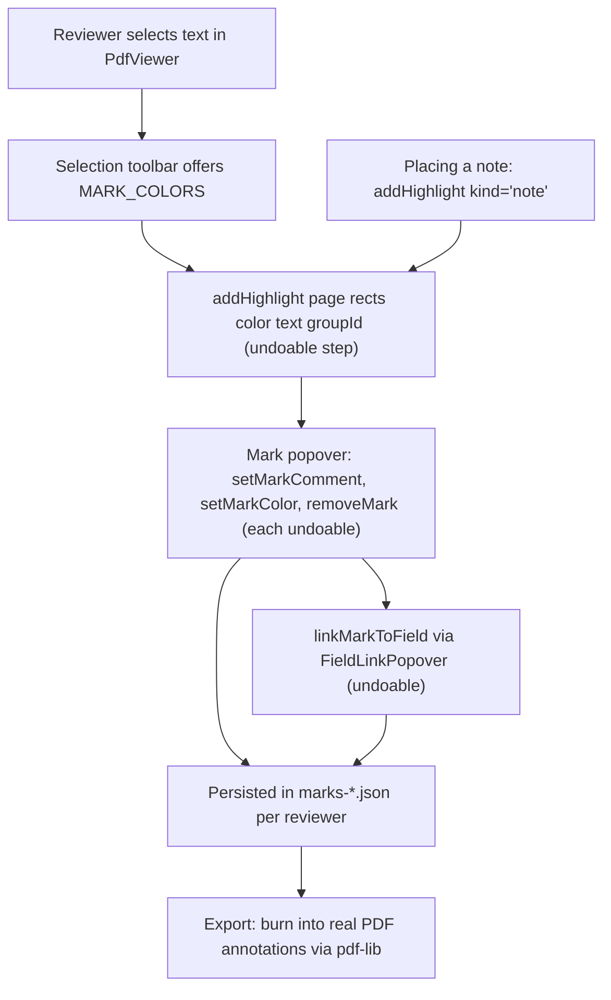

# PDF Viewer and Marks

The middle pane of SaiLoR is a PDF reader built on [react-pdf](https://github.com/wojtekmaj/react-pdf) (pdf.js underneath). It does three jobs at once: render and navigate the paper, let the reviewer highlight and annotate it, and feed the annotation panel — text the reviewer selects can be "grabbed" straight into a field, and highlights can be linked to fields as evidence. Crucially, the marks a reviewer makes are **SaiLoR's own overlay data, never written into the PDF binary**; they live in the project's `marks-*.json` files alongside the annotations and are burned into real PDF annotations only on explicit export. Keeping the PDF untouched is what lets it stay a plain relative-path reference, shared and diffed by git like everything else in a project — writing real PDF annotation objects into the file would make every reviewer's mark a binary edit to a file every reviewer references, with no way to tell whose is whose.

This page covers the viewer component itself, the marks model and its undoable mutations, field-linking, mark export, reading-position persistence, and the PDF metadata/text extraction that pre-fills project fields and feeds LLM prompts.

## Mark lifecycle

A mark begins as a text selection (or a pinned sticky note), becomes an undoable highlight, may be linked to annotation fields as evidence, and is finally either persisted in `marks-*.json` or burned into a real PDF file on export.

*The mark lifecycle: selection → undoable `addHighlight` → optional comment/color/link mutations (each its own undo step) → persist in `marks-*.json` or burn into the PDF on export.*

## The PdfViewer component

`src/components/PdfViewer.tsx` is the renderer. It mounts a react-pdf `Document` and one `Page` element per page — there is **no virtualization**: every page is a React element with its own canvas, text layer, and annotation layer, plus an entry in `pageRefs`. Real documents never reach five figures, but a hostile PDF (a 2.4 KB file whose page tree is a DAG) can claim 16 million pages, so `onLoadSuccess` caps the mounted count at `MAX_PDF_PAGES` (5000) and records any overflow in `truncatedPages` for a notice.

### Rendering and zoom

PDF zoom lives in the Zustand store (`pdfZoom`) rather than local component state so keyboard shortcuts (`Ctrl`/`Cmd` `+`/`-`) can drive it too. The page renders at the fit-to-width base size scaled by the zoom factor (`renderWidth = width * zoom`), clamped to `PDF_ZOOM_MIN`/`PDF_ZOOM_MAX` (0.4–3). `Ctrl`/`Cmd` + wheel zooms instead of scrolling — implemented as a native non-passive `wheel` listener because React's synthetic handler is passive by default and `preventDefault` would warn. The page elements are memoized (`pages = useMemo(...)`), and the `onRenderTextLayerSuccess` callback is a stable `useCallback` so unrelated re-renders (typing in the search box) reuse the same element identities and keep pdf.js's text layers intact.

### Navigation and current-page tracking

`updateCurrentPage` runs on every scroll: the current page is the last page whose top has scrolled into the upper 30% of the viewport. It also dismisses the fixed-position popovers (selection toolbar, mark popover, link preview), since scrolling invalidates their captured anchor points. Page jumps come from the page input (`commitPageInput`, clamped to `[1, numPages]`), `scrollToPage`, internal-link clicks (pdf.js's `LinkService` scrolls to the destination), and the search active-match centering.

**Jump history** (back/forward) mirrors a browser: before an internal-link jump moves the view, `recordJumpIfMoved` pushes the prior scroll position onto a `backStackRef` and clears the forward stack. `jumpBack`/`jumpForward` move between the two stacks with instant (non-smooth) scrolls that respect reduced-motion.

### In-PDF search

`Ctrl`/`Cmd` `F` opens the search bar (`openSearch`) and focuses it, overriding the browser's native find. `findMatches` walks every rendered page's text layer with a `TreeWalker`, concatenating text nodes so matches can span pdf.js's per-run spans, and builds a `Range` per match. The query is **debounced** (150 ms) so a fast typist doesn't trigger a full re-scan per keystroke; the input still reflects `query` immediately, only the re-search is delayed. Matches are tinted via the **CSS Custom Highlight API** (`CSS.highlights` + `Highlight`), which tints text ranges without mutating react-pdf's text-layer DOM — reached for dynamically and degraded gracefully when unavailable. The active match is centered in the scroll container on every `activeMatch` change, the same centering `scrollToMark` uses.

### Text-selection capture for field-grabbing

`captureSelection` reads `window.getSelection()`, NFC-normalizes the text (pdf.js's text layer can split an accented letter's base character and combining mark into adjacent DOM spans), and stores it in the store's `pdfSelection`. When the selection is non-collapsed, `updateSelectionToolbar` positions the highlight color toolbar near where the selection ends. `Field.tsx`'s "grab from PDF" button (⧉) reads `pdfSelection` and writes it into the field — parsing it as a number for `number` fields, a four-digit year via `parseYear` for `year` fields, or raw text otherwise. Enum dropdowns offer no grab button, only free-text/number/year fields do.

A selection that spans a page boundary is split into one highlight fragment per page (`splitRangeByPage`), each clamped to that page's text layer, with auto-extended boundaries on intermediate pages trimmed before a likely running header/footer (`AUTO_EXTEND_MARGIN`). All fragments of one cross-page highlight share a `groupId`. `dedupeOverlappingRects` folds near-duplicate rects (a cross-browser `getClientRects` quirk that can report the same line twice) into their union, while leaving genuinely side-by-side rects on the same line alone.

Because mark overlays sit on top of pdf.js's text layer, a mousedown on a mark could never anchor a native selection. `handleMarkMouseDown` turns `pointer-events` off for the whole gesture (via the `.pdf-marks-dragging` class), uses `document.caretRangeFromPoint` to find the real text under the cursor, anchors a selection, and extends it on mousemove — so dragging across a highlighted region selects the text instead of grabbing the empty overlay div. A bare click (no drag) still opens the mark's popover.

### Internal-link hover previews

Hovering an internal PDF link (a citation, figure/table reference, or TOC entry) previews its destination — a strip of the destination page copied from that page's **already-rendered canvas**, so no extra pdf.js render is needed. `resolveLinkPreview` resolves the link's explicit destination, gets the destination page, converts the destination point to scale-1 viewport coordinates, and fits a crop box to the destination's own entry using `detectEntryBox` (see below). The crop is copied out of the canvas at full backing-store resolution and scaled down only at display time so a shrunk preview stays sharp. The preview flips above the link when there's no room below. `linkHoverTokenRef` invalidates any in-flight resolution when the hover ends, so a slow destination resolution never overwrites a newer hover. External links open in a new browser tab (`externalLinkTarget="_blank"`); internal links are handled by pdf.js's `LinkService`, which scrolls without navigating.

`destinationPoint` decodes a pdf.js explicit destination array into an `x`/`y` in PDF user space (with `null` for an axis a `FitH`/`FitV`/`Fit` destination leaves unspecified), and is the only piece of the preview flow that's pure and unit-testable without a live document.

`src/model/refPreview.ts`'s `detectEntryBox` is a compact port of SumatraPDF's `DetectEntryBox`: it clusters the destination page's text items into lines by y, anchors on the line nearest the destination, expands it into a gap-bounded run that never crosses a column gutter, then walks following lines until the next entry starts (a line back at the entry's left margin) or a paragraph gap. It returns `null` when the page is too sparse/image-only to fit an entry, in which case `resolveLinkPreview` falls back to a page-wide window below the destination.

## PDF marks

`src/model/pdfMarks.ts` defines the in-app overlay model. A `PdfMark` is one highlighted region or one sticky note, stored as a **fraction of the page's own rendered size** (`MarkRect`, 0..1 from the top-left) rather than pixels or PDF points — a page's aspect ratio is fixed regardless of zoom, so a fraction stays correct at any zoom level without pdf.js viewport math. A text highlight's `rects` trace the selection (one per wrapped line); a sticky note has exactly one rect whose `x`/`y` is the pinned point.

Key fields:

- `kind`: `'highlight'` (traces selected text) or `'note'` (pins a sticky note at a point).
- `text`: the raw text selected at creation time, captured once and never edited — a fallback display label when `comment` is empty.
- `linkedFields`: the annotation fields linked to this mark as supporting evidence, each carrying a canonical `path` and a denormalized human-readable `label` (so the popover still shows something if the field is later renamed or removed).
- `groupId`: present only on a mark that's one page-fragment of a highlight spanning a page boundary — every fragment sharing a `groupId` is one logical highlight rendered as disjoint regions on different pages.

`MARK_COLORS` is the palette offered when creating or recoloring: `['#ffe066', '#a5f3a5', '#a5d8ff', '#ffb3c1', '#d0bfff']`.

### Defensive parsing and merge

`parseMarks` parses a `PdfMark[]` defensively — a malformed entry is dropped, never thrown over (the same rule every hand-editable array in the file format follows). `parseReviewMarks` parses the per-reviewer mark map, keeping only keys that look like a reviewer number. `mergeMarksList` unions two sides' marks by id for a pull merge or a branch switch: every mark survives, and a mark both sides edited differently keeps whichever was touched more recently (`updatedAt`, "ours" on a tie). This is deliberately not a field-level conflict the reviewer is asked about, because a highlight is a personal reading note, not the record a review reports.

### Reading order: `sortMarksForCycling`

`sortMarksForCycling` produces stable reading order for the "next/previous annotation" toolbar and the field-link popover's page-ordered tail: by page, then by **column** (`columnOf` — left half before right half at `COLUMN_SPLIT_X = 0.5`), then by the first rect's `y` within that column. Neither plain `y` (which interleaves a two-column paper's columns) nor plain `x` (which can reorder two same-column highlights by indentation jitter) is real reading order; bucketing into a column first and comparing `y` only inside it gets both right. Cross-page highlight fragments are deduped down to one (their earliest-page fragment) via `dedupeMarkGroups`, so cycling lands on a logical highlight once, not once per page it touches. `dedupeMarkGroups` is the single place every "list/count marks" consumer routes through, so they can never disagree about what counts as "one mark".

`orderMarksForLinking` orders marks for the field-link popover: up to `RECENT_LINK_CANDIDATES` (3) of *this session's own* marks (tracked by `sessionCreatedMarkIds`, not every mark's `createdAt`, so reopening a paper with old highlights doesn't pin three of them at random), most recently made first, then everything else in `sortMarksForCycling` order — each mark appearing exactly once.

### Undoable mark mutations

Every mark mutation is its own undo step in the Zustand store (see `src/state/store.ts`). Marks ride along inside the project snapshots undo/redo restore, but a mark edit is a separate, lower-stakes concern from an annotation answer — the store's doc comments call this out explicitly.

- `addHighlight(page, rects, color?, kind?, text?, groupId?)` creates a mark, returns its id (so the caller can open its comment popover right away), pushes a `HistoryEntry`, records the id in `sessionCreatedMarkIds`, and sets `dirty`. It no-ops when there's no project, no rects, or (on a multi-reviewer project) no selected reviewer seat.
- `setMarkComment(id, comment)` replaces a mark's comment (`''` clears it). Consecutive keystrokes coalesce into one undo step via the shared `lastFieldKey` mechanism (keyed `mark-comment:<id>`), the same coalescing `setFieldValue` uses. Comment changes propagate to every fragment sharing a `groupId`.
- `setMarkColor(id, color)` recolors a mark and all its `groupId` siblings, always its own (non-coalesced) undo step.
- `removeMark(id)` removes a mark and all its `groupId` siblings.
- `linkMarkToField(markId, path, name, index)` adds a `LinkedField` (no-op if already linked) and propagates to `groupId` siblings.
- `unlinkMarkFromField(markId, canonicalPath)` removes one link by canonical path, deleting `linkedFields` entirely once the last link is gone (rewritten to `undefined`, never `[]`, so a never-linked mark round-trips byte-identical).

## Field-linking

The 🔗 button in `src/components/Field.tsx` opens a `FieldLinkPopover` — the **only** entry point for creating a link; a mark's own popover in `PdfViewer` only shows/unlinks, never adds. The popover has two sections: a top list of marks already linked to this field (fixed to those linked *before* the popover opened, so a freshly-linked mark stays in the picker below), and a fold-out picker of every other mark in `orderMarksForLinking` order, with a search box. Clicking a mark's snippet jumps to it in the PDF (`setPendingMarkJump` → `PdfViewer` scrolls to and flashes it) without linking or closing the popover, so the reviewer can see which mark is which before committing.

A mark just created (`lastCreatedMarkId`) is offered once to the next field-link popover to open, auto-linking it instead of making the reviewer find it in the list — the common "highlight, then link it" flow. It's narrowed by `lastCreatedMarkAllowedField`: any field may claim it right after creation, but once a specific field is edited, only that field may claim it; anything else in between (editing a different field, undo, touching another mark) drops the offer back to `null`. The popover consumes the offer exactly once.

`useLinkedMarkCount(path, name, index)` drives the 🔗 button's badge count (routed through `dedupeMarkGroups`, so a cross-page highlight counts as one).

## Mark export

`src/model/pdfExport.ts` is the pure coordinate math for burning marks into real PDF annotations, kept separate from pdf-lib on purpose so it's trivially unit-testable without a real PDF:

- `rectToPdfPoints(rect, pageWidth, pageHeight)` converts a fraction-based `MarkRect` (top-left origin, y-down) into PDF user-space points (bottom-left origin, y-up). The result's `y` is the rect's **bottom** edge (a `/Rect`'s `lly`), which is why the flip subtracts the already-scaled height.
- `rectToQuadPoints(rect, pageWidth, pageHeight)` produces the 8-number `/QuadPoints` array per the PDF spec (§8.4.5): top-left, top-right, bottom-left, bottom-right — that specific pairing, not a clockwise walk, is what viewers expect; getting it wrong renders the highlight mirrored or skewed.
- `annotatedFileName(name)` derives the export name (`paper.pdf` → `paper-annotated.pdf`), and leaves an already-`-annotated` name alone rather than double-suffixing.

`src/components/ExportPdfDialog.tsx` is the one-way export dialog. It resolves the current paper's PDF to an absolute path, then offers two targets: save as a **new** PDF (a native save picker, `pickPdfExportPath`, defaults to the annotated name) or **overwrite the original** (with a warning that this affects every reviewer sharing the file and likely causes a git conflict). Both call `embedPdfAnnotations`, which goes through the platform adapter to the Electron main process — the only place in the app that touches both `pdf-lib` and Node `fs`. There, `embedMarksIntoPdf` (`electron/main.ts`) builds one annotation dictionary per mark by hand via pdf-lib's low-level `PDFContext` API (pdf-lib has no high-level "add Highlight" helper): a `Highlight` annotation (with `/QuadPoints` per line, `/CA 0.4` translucency, the union `/Rect`) for highlights, and a `Text` ("sticky note") annotation for notes, each with the comment as a `PDFHexString` (so non-ASCII survives), color as a `/C` array, and `T: 'SaiLoR'` as the author. Annotations are appended to each page's existing `/Annots`, so annotations already in the PDF survive. A mark whose page is beyond the PDF's actual page count is skipped rather than failing the whole export, since the marks and PDF bytes are two files a reviewer might have edited independently.

## Reading-position persistence

Reopening a project lands the reviewer back on the same paper, PDF page, and scroll offset — a local convenience stored in `localStorage`, keyed by the project's file path (`slr.readingPosition.<path>`), never in the shared project JSON (where it would be diff noise).

- `noteReadingPosition(paperId, page, offsetFraction)` is the write side, called debounced (500 ms) from `PdfViewer` as the reviewer scrolls. It takes `paperId` explicitly rather than reading `currentPaperId` off the store at fire time, because by the time a debounced call fires the reviewer may have switched papers — writing the now-current paper's id against a position captured for the previous one would attribute it to the wrong paper. It's a no-op with no stable save location.
- `readOffsetFraction(pageNumber)` computes how far scrolled into a page as a fraction of its current rendered height — the same resolution/zoom-independent "fraction of the page" convention `MarkRect` uses, so it still lands roughly right if the page renders at a different size next time.
- On project load, `loadReadingPosition(handle)` reads the stored position; `loadFromText` only uses it if the paper it names still exists, otherwise it falls back to the first unfinished paper. The loaded position populates `initialPdfPosition` (session-only).
- `PdfViewer` consumes `initialPdfPosition` once it has mounted pages: it scrolls to the remembered page and offset via a single combined `scrollTop` delta computed from the same rects `scrollToMark` uses (not `scrollIntoView` plus a separate adjustment, which could disagree and land the page right but the offset wrong). Because pages are still at their loading-placeholder height when `numPages` first becomes known, the restore **re-snaps on every `textRenderTick`** (each page's text layer finishing) rather than scrolling once — earlier pages growing to their real height would otherwise push the target out from under the already-applied scroll. The request is dropped (and `initialPdfPosition` cleared) after a short idle window, and the reset effect drops it outright if the reviewer has navigated to a different paper before it runs, so it can never misapply to a paper opened later by hand.

## PDF metadata extraction

`src/model/pdfMeta.ts` is best-effort extraction of a paper's title, authors, and abstract, used to pre-fill the project editor and (for the abstract alone) a screening paper opened with none recorded yet. Title/authors come from two sources in order:

1. The PDF's embedded metadata (`Title`/`Author`) — cheap and exact when present, but validated by `isPlausibleTitle` (rejects filenames, junk like "Microsoft Word - paper_final_v3.doc", and single-word strings) since plenty of publisher toolchains leave it blank or fill it with junk.
2. A layout heuristic over page 1 (`titleAndAuthorsFromLines`): the largest text near the top is the title, the lines just under it are the authors, parsed per-column (`namesFromAuthorBlock` joins a wrapped list per column before splitting, so a name broken across a line break can be repaired).

The abstract has no metadata source (PDFs carry no standard "Abstract" field), so it is always the layout heuristic (`abstractFromLines`): find a line starting with "Abstract" below the title/author block, take its `Segment`'s `x` as the column, and walk down taking only each line's segment at that same `x` until the next section heading — this is why `Segment` carries an `x`, because on a two-column paper the left column's "Abstract" and the right column's "1 Introduction" arrive on the same baseline as one `Line`. Hyphenated line breaks are healed (`joinWrappedLines`). Extracted abstracts are length-bounded and flagged (`Paper.abstractFromPdf`) for a durable "unverified" warning wherever shown, because they're what a screening decision gets made on. `extractPdfMeta` never throws — it returns `{}` when it can't tell.

## PDF text extraction

`src/model/pdfText.ts`'s `extractPdfText(data, opts?)` produces the full plain text of a PDF, one `[page N]` block per page, so it can be pasted into an LLM prompt instead of uploading the PDF itself (cheaper, and works with models that don't accept file attachments). `linesFromItems` mirrors pdfMeta's layout heuristic (bucket by baseline y, sort by x) rather than naively joining `item.str` in item order — pdf.js does not promise items in reading order, and a two-column paper joined naively is soup. It's duplicated here rather than imported to keep the module independent. A single bad page inside an otherwise-readable document is skipped, not allowed to sink the rest; only a document that can't be opened at all throws (a genuine corrupt/encrypted pdf.js error). Extraction is capped at `DEFAULT_MAX_PAGES` (2000) — both production callers pass no limit, and the page count comes from the file, so an uncapped walk would be an indefinite freeze. The result's `empty` flag (`bodyChars < EMPTY_CHAR_THRESHOLD`, 200, counting only the body text and not the `[page N]` markers) marks a scanned/image-only PDF so the AI flow can fall back to uploading the file. This is the text delivery path described in [LLM annotation](llm-annotation.md).

## Supporting modules

- `src/platform/pdfjs.ts` is the single place that points pdf.js at its worker (loaded from the bundled dependency, so it works offline and inside Electron); setting it twice from two modules would be a silent footgun. Both `PdfViewer` and the metadata extractor import it.
- `src/model/linkify.ts` splits free text into plain-text and URL segments (`http(s)://` only, matching what the feature it exists for was asked to recognize) so a schema field's `description` can render URLs as clickable links without building HTML from the input. It is not a general-purpose URL library.