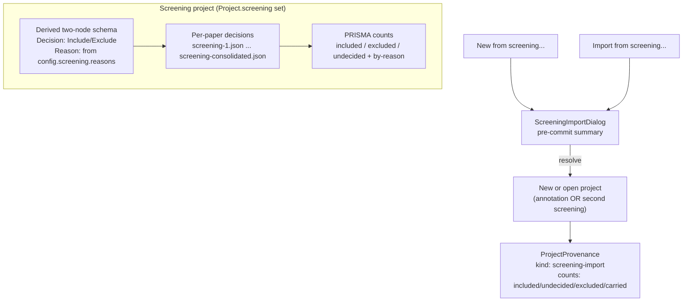
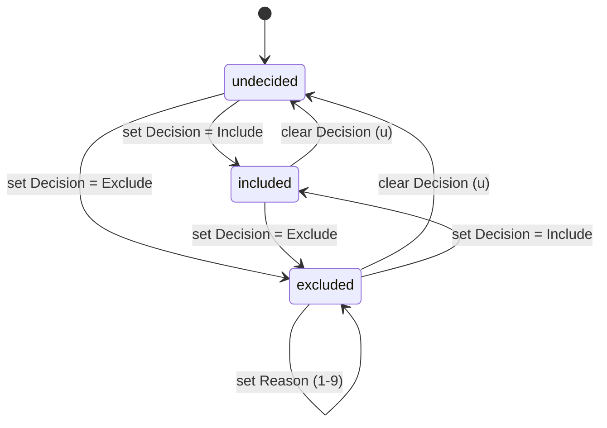

# Screening Mode

Screening is an alternative project mode for the title-and-abstract (or full-text) triage step of a
systematic review: reviewers make a fast **Include / Exclude** decision per paper, recording an
exclusion *reason* when they exclude, before any structured annotation begins. It is *not* the
annotation workflow with a boolean field bolted on — it is a distinct mode that reuses the same
multi-reviewer, consolidation, and validation machinery as annotation but replaces the authored
schema with a fixed two-node one derived from a pre-registered list of exclusion reasons.

The switch is one field: `Project.screening` (`ScreeningConfig | null`). When it is non-null the
project is a screening project, `isScreening(project)` returns true, and the whole UI swaps from the
annotation surface to the screening surface.

## What makes it a distinct mode

A screening project differs from an annotation project in five coupled ways:

1. **The schema is derived, not authored.** `config.screening.reasons` (the exclusion reasons) is the
   only authorable part of the schema; the rest is fixed (see [Derived schema](#derived-schema)).
2. **`Project.screening` is set.** This single presence flag is the predicate every caller uses
   (`isScreening`).
3. **On-disk files use the `screening-*` prefix** instead of `reviewer-<n>.json` /
   `consolidated.json` (see [On-disk layout](#on-disk-layout)).
4. **The UI swaps panels.** `App.tsx` renders `ScreeningRecord` + `ScreeningPanel` instead of
   `PdfViewer` + `AnnotationPanel`, and `ScreeningReasonsEditor` replaces `SchemaTreeEditor` in the
   project editor.
5. **Decisions are imported into a new project.** A "New from screening…" / "Import from screening…"
   flow partitions the source screening project and carries the included (and, by default, the
   undecided) papers into a fresh annotation or second-screening project, recording provenance for a
   PRISMA flow diagram.

A screening project carrying the included papers forward into the next phase of the review, with the
excluded papers dropped and the undecided papers carried by default.

## Derived schema

The schema for a screening project is *never read from the file*. `loadProject` derives it fresh on
every load from `config.screening.reasons`, so a hand-edited reason list can never disagree with the
dropdown the reviewer sees. `serializeProject` writes the derived schema back out so the file stays
self-describing for anything reading it without SaiLoR.

`src/screening/schema.ts` defines the fixed shape:

- `SCREENING_DECISION = 'Decision'` — a two-option string enum (`Include` / `Exclude`), **not** a
  boolean checkbox. This is a hard constraint of the codebase, not a stylistic choice: the
  `isEmptyValue` / `isUnanswered` / `hasAnnotations` machinery treats a boolean as "empty" until it
  is `true`, so an "Exclude" checkbox could not distinguish "I decided to include this" from "I have
  not looked at this yet" — both would read as `false`. Screening is exactly the phase where that
  distinction *is* the output (the progress count, the PRISMA numbers, and which papers survive an
  import all depend on it). A two-option enum gets the tri-state for free and keeps every reused
  module correct with no change.
- `SCREENING_REASON = 'Reason'` — a string whose options are a copy of `config.screening.reasons`.
- `DEFAULT_SCREENING_REASONS` — the seeded reasons for a new screening project (`Not peer-reviewed`,
  `Wrong topic`, …, `Other`). "Other" is included on purpose: a closed enum needs an authored escape
  hatch, not a magic one.
- `screeningSchemaDefs(config)` returns the two `AnnotationDef`s; `loadProject` runs them through
  `resolveSchema` exactly as an authored schema would be.
- `isScreening(project)` — the one predicate every caller uses: `!!project?.screening`.

`ScreeningConfig` (in `model/schema.ts`) is `{ reasons: string[] }` and is the *only* authorable
setting. On load, `parseScreening` trims, dedupes, and drops blank entries, requiring at least one
reason or throwing a `ProjectLoadError` — a broken reasons list cannot be degraded past, because the
reasons *are* the schema. The zod `superRefine` on the project schema accordingly lets a screening
project omit `config.schema` entirely (everyone else must supply a non-empty one).

## The tri-state status read

`src/screening/status.ts` is the read every count, validation rule, and the import flow depend on:

- `screeningStatus(tree)` → `'included' | 'excluded' | 'undecided'`. A null/missing tree, a missing
  node, or anything that is not exactly `Include`/`Exclude` reads as **`undecided`** — the
  conservative direction. A status the function cannot make sense of is "not screened", never
  "excluded", which is what `importFromScreening` relies on to never silently drop a paper it merely
  couldn't parse.
- `screeningReason(tree)` → `string | null`. Only meaningful when the status is `excluded`; callers
  must check. A stray `Reason` on an included/undecided paper (a hand-edited file, or a decision
  walked back without clearing the reason) is not this function's business to interpret.

The decision can move freely between the three states; the reason is only meaningful and editable
while excluded.

## Counts and PRISMA totals

`src/screening/counts.ts` produces the numbers a screening review must report. It is deliberately
store-free: `seatTree` reimplements the store's `currentTree` seat routing (single-reviewer reads
`paper.annotations`; Consolidation reads `paper.annotations`; a numbered reviewer reads
`paper.reviews[n]`; `null` reads nothing) so the module stays independently testable and never creates
a reviewer's tree.

`screeningCounts(project, currentReviewer)` returns `ScreeningCounts`:

- `total`, `included`, `excluded`, `undecided` — the include/exclude/pending headline a PRISMA flow
  diagram needs.
- `byReason` — every configured reason is a key, **including the ones nobody used**: PRISMA reports
  the pre-registered list in full, and a reason that eliminated nothing is a finding, not an absence.
  Built with `Object.create(null)` so a hand-edited reason of `"constructor"` or `"__proto__"` cannot
  collide with `Object.prototype` and book a paper against an inherited member.
- `excludedWithoutReason` — excluded papers whose reason is blank or not one of the configured ones.
  Its own bucket rather than folded into a reason nobody picked: the number is only honest if it says
  what it does not know.

### Two pending-unanimous counts

Multi-reviewer screening has two *deliberately separate* "pending unanimous" counts, because they
answer different questions:

- `pendingUnanimous(project)` — papers holding *anything* every numbered reviewer recorded
  identically that Consolidation has not adopted yet (a decision, a reason, or both). Drives the
  notice next to the **Adopt all** button in `ScreeningPanel`, and that button adopts everything
  unanimous — so the count must reflect any pending fill, not just decisions. (Counting only
  decisions made two reviewers who both excluded for the same reason, where the consolidator set the
  decision by hand but left the reason blank, produce a reason fill and no decision fill — no notice,
  nothing offering to adopt the reason, and the paper booked as excluded-without-a-reason
  permanently.)
- `pendingUnanimousDecisions(project)` — papers that are still undecided *and* whose reviewers all
  chose the same decision. The screening-import dialog speaks specifically about papers "not yet
  screened" with no final decision, so a paper that already has a decision and merely lacks a
  unanimous *reason* must not be counted there — the sentence would be false, promising that adopting
  changes an inclusion count that is already settled.

Both are zero for a single-reviewer project and delegate to `unanimousFills`
(`consolidate/unanimous.ts`), the same "what did every reviewer agree on" routine the annotation
consolidation path uses.

## Reason usage tracking

`src/screening/reasonUsage.ts` answers the two questions the reasons editor needs to guard a rename:
how many papers use a reason, and rewrite it across all of them. Renaming or removing an exclusion
reason in the editor orphans every paper that recorded the old label — the PRISMA counts then can't
attribute it (it lands in `excludedWithoutReason`) — so the editor warns rather than letting that
happen silently.

A multi-reviewer paper carries a reason in more than one place: its consolidated `annotations` tree
and each reviewer's own tree. The module is generic over a `ReasonBearingPaper` shape (the editor
keeps reviewer trees under `extra.reviews` rather than the typed `Paper`), so both are checked from
the raw shape.

- `countPapersUsingReason(papers, reason)` — how many papers record `reason` in any of their
  screening trees. `''` never matches (an unset reason is not "using" anything).
- `renameReasonInPapers(papers, from, to)` — rewrites `from` → `to` in every screening tree of every
  paper, immutably. Papers and trees that don't reference `from` keep their identity (both the array
  and unchanged element objects), so a caller's dirty-tracking only marks what actually changed and
  `=== papers` reliably means "no-op".

## Validation

`src/screening/validate.ts` enforces the two cross-field rules the schema language cannot express.
The screening UI makes both unreachable (the Reason control disables itself unless the decision is
Exclude, and `setScreeningDecision` clears the reason on any non-Exclude decision), but a
hand-edited file can still hold either, and both corrupt the PRISMA counts silently if nobody says
so.

`screeningIssues(project, currentReviewer)` produces `ValidationIssue[]` with `kind: 'screening'`:

1. **Exclude requires a reason** — `status === 'excluded' && !reason` →
   *"Excluded, but no exclusion reason is recorded."*
2. **Include must not have a reason** — `status !== 'excluded' && reason` →
   *"An exclusion reason is recorded, but this paper is not excluded."*

It uses the same `seatTree` routing as the counts module. A malformed tree is reported as no issues
rather than throwing (it reads as `undecided`, which is never a violation). Issues carry
`canonicalPath: ''` because screening has no annotation-panel field to jump to (its schema is
derived, not authored) — `ValidationDialog` falls back to a paper-only jump. The store's `validate`
action appends these to the ordinary schema validation issues over the *original* project, since
`screeningIssues` reads decision and reason together rather than a single remapped tree.

## The screening UI

`App.tsx` swaps the middle and right panes based on `project.screening`: when it is set, the middle
pane is `ScreeningRecord` (unless `screeningShowPdf` is on) and the right pane is `ScreeningPanel`.

### ScreeningRecord (middle pane)

`src/components/ScreeningRecord.tsx` is the default surface shown *instead of* `PdfViewer`.
Screening is normally a title + abstract decision by protocol, and the PDF is often entirely absent
(a fresh reference-manager export), so this is the default rather than `PdfViewer` nested inside it.
It shows the paper's title, authors, venue/year, DOI, and abstract, plus a "Read the PDF" button
(only when `paper.pdf` is non-empty) that flips `screeningShowPdf` to reveal the untouched
`PdfViewer`. `PdfViewer` itself is not modified and is reachable with one click.

It also surfaces an **abstract-extracted** notice: if `paper.abstractFromPdf` is set, the abstract
was extracted automatically from the PDF text and may be incomplete or wrong. The store's
`extractScreeningAbstract` reads the PDF (outside `PdfViewer`'s own rendering) to populate a missing
abstract, keyed by a generation counter so a late result is written rather than wasted even after the
reviewer moves on.

### ScreeningPanel (right pane)

`src/components/ScreeningPanel.tsx` is the decision control, rendered by `App.tsx` instead of
`AnnotationPanel` whenever `project.screening` is set. It reuses the same withheld-form /
reviewer-badge / Consolidation-tools shapes `AnnotationPanel` established, but the body is the
two-button decision control rather than a rendered schema tree.

- Two buttons: **✓ Include** (shortcut `I`) and **✕ Exclude** (shortcut `E`). Pressing the active
  decision again clears it (toggles back to undecided via `setScreeningDecision(null)`). When
  undecided, a hint reads *"Not screened yet. Press I to include, E to exclude."*
- A **Reason** `ComboBox`, disabled unless the status is `excluded`. When disabled, a hint explains
  the `1`–`9` shortcuts exclude with that reason in one press. When excluded, the reason list is the
  project's `screening.reasons`.
- A **Summary** button opens the PRISMA-style counts modal. In the Consolidation seat, two more
  buttons appear: **Agreement** (inter-rater agreement on the include/exclude decision) and
  **Disagreements** (list every paper where reviewers disagree).
- A **pending-unanimous notice** appears only in the Consolidation seat when `pendingUnanimous > 0`,
  with an **Adopt all** button that calls `adoptAllUnanimousScreening`.
- A **progress line**: *"{included + excluded} of {total} screened — {included} included,
  {excluded} excluded, {undecided} left."*

The same withheld-form rule as `AnnotationPanel` applies: an edit made with no reviewer picked (in a
multi-reviewer project) would be unattributed, so the panel shows a "pick a reviewer" message
instead.

### ScreeningSummary (PRISMA counts modal)

`src/components/ScreeningSummary.tsx` is a modal following the `ValidationDialog` pattern
(`.modal-overlay` → `.modal` → `.modal-head` + `.modal-body`, Escape-to-close, backdrop click). It
shows the headline `total`/`included`/`excluded`/`undecided` numbers and a per-reason table (every
configured reason, plus an "unknown" row for `excludedWithoutReason` when non-zero). It labels which
seat it is counting — "this project's decisions" (single-reviewer), "Reviewer N's own decisions",
"the consolidated result", or "no reviewer (pick one above)".

### ScreeningImportDialog (pre-commit summary)

`src/components/ScreeningImportDialog.tsx` is shown after picking a screening project via "New from
screening…" or "Import from screening…", *before anything is written*. It renders a
`ScreeningImportDraft` held in the editor store:

- how many papers are included (always carried over), excluded (never carried over, with a per-reason
  breakdown), and not-screened-yet (carried over **by default** — dropping them would silently remove
  papers from a systematic review, which this dialog is what makes explicit rather than silent, with a
  "leave them out" escape hatch).
- when `reviewers > 1` and `pendingUnanimousCount > 0`, a notice that those not-yet-screened papers
  were decided the same way by every reviewer but Consolidation has not adopted them yet, advising
  the reviewer to open as Consolidation and use **Adopt all** first if they want them counted as
  included.
- for `target: 'start'`, a radio choosing whether the new project is an **annotation** project
  (extract data) or a **screening** project (screen again, e.g. on full text — gets its own
  exclusion-reason list seeded from the source's reasons and editable before save).

Three actions: **Cancel**, **Leave out the N not-screened-yet papers**, and **Import M papers** (the
included plus the undecided). `resolveScreeningImport('include-undecided' | 'skip-undecided' |
'cancel')` commits or aborts.

### ScreeningReasonsEditor

`src/components/ScreeningReasonsEditor.tsx` replaces `SchemaTreeEditor` in the project editor
whenever screening is on — there is no schema to build, only this short, ordered list of exclusion
reasons. The order matters: the reviewer's `1`–`9` keys exclude with the corresponding reason in one
press, so common reasons should be near the top.

- **Rename on blur**: if a committed rename moves away from a reason papers still record, the editor
  offers (via `window.confirm`) to carry those decisions to the new label by calling
  `migrateScreeningReason` (which uses `renameReasonInPapers`). An empty new label has nothing to
  migrate *to*, so it only warns.
- **Remove**: removing a reason papers still record orphans those decisions the same way an empty
  rename does, so it warns the same way (no new label to migrate to — only remove-anyway vs keep).
- Add / move-up / move-down reorder the list.

## Decision writes and auto-advance

The store (`src/state/store.ts`) owns the decision writes, so the panel's buttons and the
keybindings cannot drift apart:

- `setScreeningDecision(decision, reason?)` — writes `Decision` and, in the same mutation, the
  `Reason`: clears it on any non-Exclude decision; writes the supplied reason when excluding with a
  reason (the `1`–`9` shortcuts pass it here so the exclusion and its reason are one undo step). A
  second call would land on whatever paper auto-advance just moved to, not this one, so both are
  written here. Reading whether the seat was undecided *before* mutating decides auto-advance.
- **Auto-advance**: when the decision was undecided and the new decision is non-null, selection
  advances to the next undecided paper after the current one. This is the store's responsibility, so
  buttons and keystrokes agree.
- `setScreeningReason(reason)` — only meaningful once the seat's own decision is Exclude; otherwise
  it is a no-op. Delegates to `setFieldValue` for the routing, coalescing, undo, and dirty-flagging
  it already does.
- `adoptAllUnanimousScreening()` — iterates every paper and calls `adoptUnanimousValues`, coalescing
  into one undo step, returning the count of papers filled. Synchronous (screening has no repeatable
  node, unlike the annotation path's `adoptAllUnanimousAnnotations`).

Keybindings (`src/hooks/useKeybindings.ts`) are bare letters/numbers only (a modifier means
something else) and never while typing in a field or while a modal is open (a DOM check for
`.modal-overlay` covers every dialog, so pressing `3` inside the Help dialog can't silently exclude
the hidden paper). `I`/`E`/`U` set Include/Exclude/undecided; `1`–`9` exclude with the Nth reason.

## On-disk layout

A screening project uses the same split storage as an annotation project (`project.json` meta plus a
per-paper `annotations/<paperId>/` folder, one file per reviewer plus a consolidated file), but with
a different prefix so the two kinds of per-paper decision are distinguishable at a glance:

- reviewer files: `screening-<n>.json` (not `reviewer-<n>.json`)
- consolidated file: `screening-consolidated.json` (not `consolidated.json`)

`splitProjectFiles` picks the prefix from `project.screening`; `ownAnnotationPathMatcher`
(`src/git/ownAnnotationPath.ts`) builds its regex from the same flag, so a screening project only
claims `screening-*` files and vice versa. This is what lets a legitimate screening-to-full-text
sibling relationship keep working without the two projects' annotation files colliding.

## Import flow and provenance

"New from screening…" (`startFromScreening`) and "Import from screening…" (`importFromScreening`)
both pick and parse a screening project via `pickScreeningProject` (which refuses a project whose
`screening` is null), partition it, and set a `screeningImport` draft in the editor store.

`partitionScreeningPapers` reads each paper's *consolidated* `annotations` tree (the one that ships,
in both single- and multi-reviewer cases — reading `reviews` here would import an individual
reviewer's opinion, not the project's result) and splits into:

- `included` — `Decision === 'Include'`, always carried.
- `undecided` — no decision (or an unrecognized one), carried unless the reviewer explicitly leaves
  them out.
- `excludedCount` / `excludedByReason` — never carried; the per-reason tally is shown for context.

`resolveScreeningImport` then writes the carried papers into either a new project (`target: 'start'`,
default save location a sibling of the screening JSON so relative `pdf` paths still resolve, named
`<source>-fulltext.json` for a second screening pass or `<source>-annotation.json` otherwise) or the
already-open session (`target: 'import'`, blocked when the open project is itself a screening
project). Each carried row gets an absolute PDF source so "Change…" can re-derive paths later.

The resulting project records a `ProjectProvenance` with `kind: 'screening-import'`, the source file
name (never its path — these files are committed to git and shared, and an absolute path would leak
the author's filesystem into every clone), the import time, and a `counts` snapshot
(`included`/`undecided`/`excluded`/`carried`) — a snapshot, not a cache: screening continues in the
source after the import, so nothing there is derivable from either file later, which is exactly why
it is stored. `carried` is the number PRISMA's flow diagram wants.