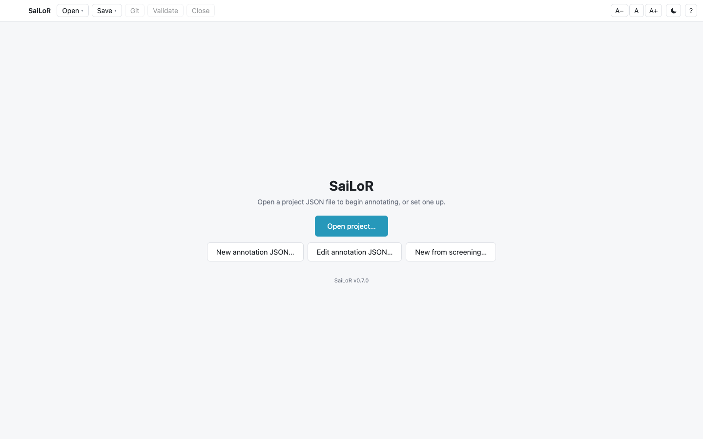
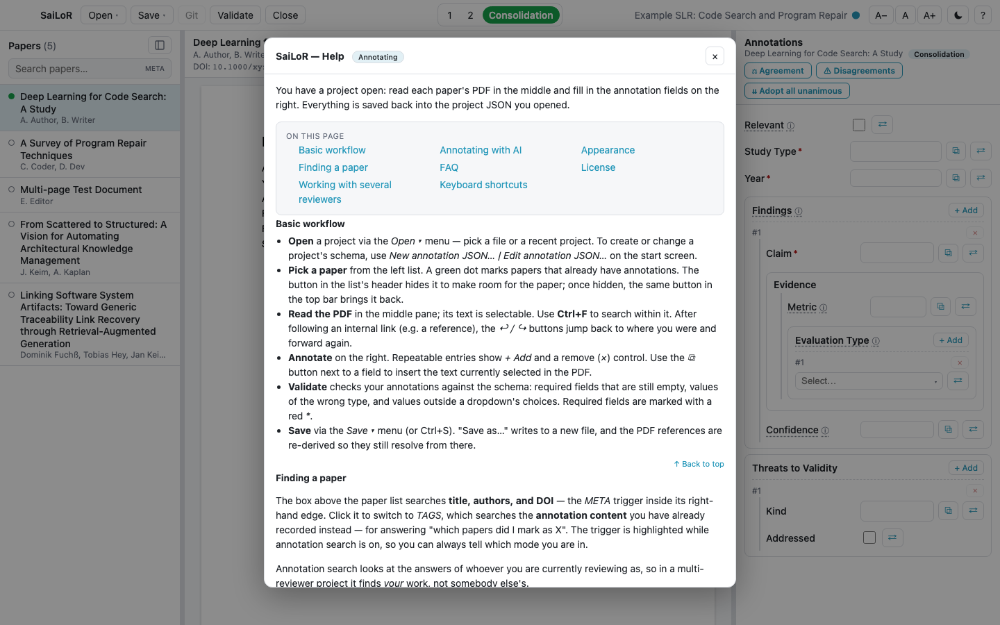

# SaiLoR User Guide

SaiLoR helps you run a **Systematic Literature Review (SLR)**: screen candidate papers, extract data
from the ones that survive, and — if you're a team — reconcile independent reviewers into one final
result. Everything for a review lives in a single **project JSON file** on your own disk, next to its
PDFs. There is no account, no server, and no sync.

  

## Before you start

**Read [Things to know](things-to-know.md) first.** It's short, and it covers the handful of
mistakes that are easy to make once and expensive to make twice — including one about hand-editing
the project JSON that will silently eat your changes if you don't know about it.

## Guide contents

| Page | What's in it |
| --- | --- |
| [Things to know](things-to-know.md) | Warnings worth reading before you rely on this for real review data |
| [Getting started](getting-started.md) | Opening a project, the three-pane layout, annotating, search, grabbing text from the PDF, validating |
| [Screening](screening.md) | The fast include/exclude pass that usually comes before annotation, and starting the next phase from it |
| [Working with several reviewers](multi-reviewer.md) | Independent reviewers, Consolidation, agreement statistics, disagreements, reviewer-seat identity |
| [Setting up a project](project-editor.md) | Building the annotation schema, adding papers, importing references, duplicate detection, the review protocol |
| [Git support](git.md) | Cloning, committing field by field, pulling, and resolving merge conflicts (desktop app only) |

## Quick start

Download the installer for your system from the [releases page](https://github.com/Gram21/SaiLoR/releases)
and run it. See the main README's [Installing a release](../README.md#installing-a-release) for the
exact steps per system, including the one-time Gatekeeper/SmartScreen click-through an unsigned build
needs on macOS and Windows.

(Building and running from source instead — for development — is covered in the main README's own
[Quick start](../README.md#quick-start).)

From the start screen:

  

- **Open project…** — somebody handed you a project JSON file. Open it and start.
- **New annotation JSON…** — you're setting up a new review from scratch. See
  [Setting up a project](project-editor.md).
- **Edit annotation JSON…** — change an existing project's schema or paper list. Existing answers are
  preserved.
- **New from screening…** — build the next phase (annotation, or a second screening pass) from a
  finished screening project. See [Screening](screening.md).

## Desktop vs. browser

SaiLoR runs two ways, from the same code: a desktop app (Electron) and a static web app. Almost
everything in this guide works identically in both. The two exceptions:

- **Git support** needs your own local `git` installation, which only the desktop app can reach — see
  [Git support](git.md).
- **Picking a folder of PDFs, or a reference file**, uses your OS's native file picker in the desktop
  app; the browser build uses the File System Access API (Chromium-based browsers) or a plain upload,
  depending on what your browser supports.

## Getting help inside the app

Press **F1**, or the **?** button in the top-right corner, at any time. The help dialog describes the
screen you're actually looking at (the start screen, annotating, screening, or the project editor)
and lists that screen's keyboard shortcuts.

  

## License

SaiLoR is free software, released under the **GNU General Public License v3.0**. See the
[LICENSE](../LICENSE) file, or [gnu.org/licenses/gpl-3.0](https://www.gnu.org/licenses/gpl-3.0.html).
