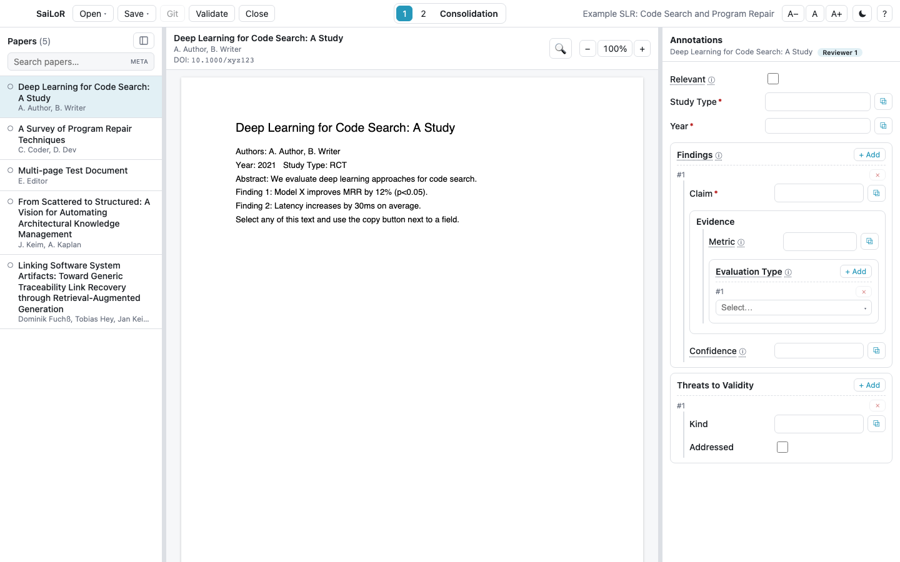
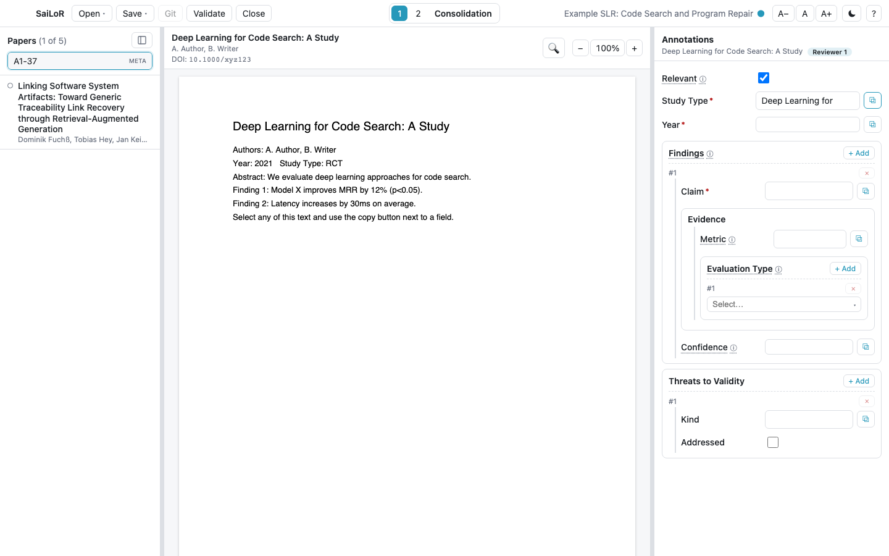
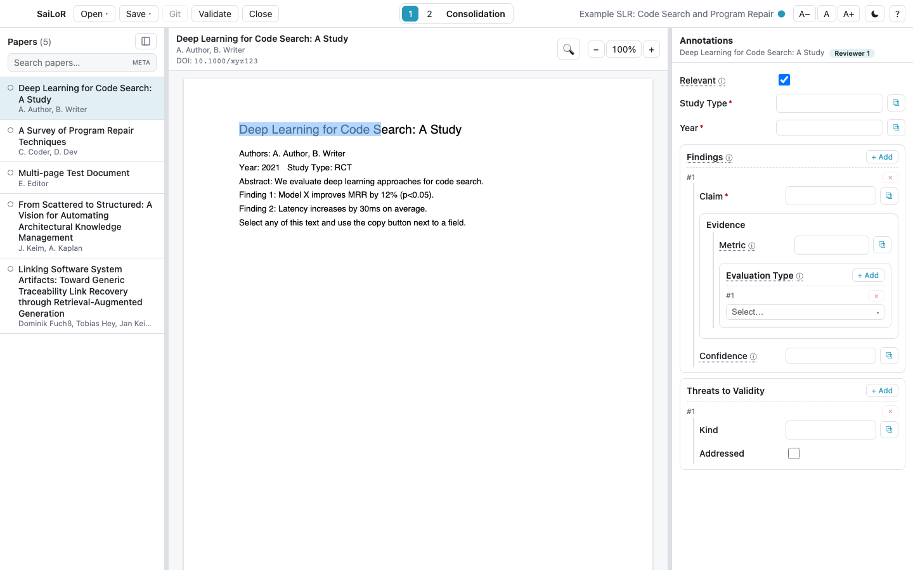
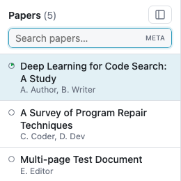
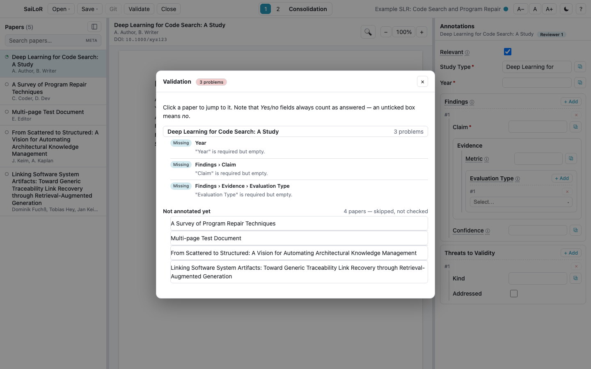

# Getting started

## The three-pane layout

Once a project is open, the screen is three panes: your **papers** on the left, the **PDF** in the
middle, and the **annotation form** on the right, built from the project's schema.

  

- **Pick a paper** from the left list to load its PDF and its form.
- **Read the PDF** in the middle; its text is selectable, and **Ctrl/Cmd+F** searches within it.
- **Fill in the form** on the right. Repeatable fields (like *Findings* above) show **+ Add** and a
  remove (**×**) control for each entry.
- **Save** via the *Save* menu, or **Ctrl/Cmd+S**. *Save as…* writes to a new location and
  re-derives every PDF reference so they keep resolving from there.

If the project is set up for **screening** instead of full annotation, this pane shows a title/abstract
record and an Include/Exclude choice instead — see [Screening](screening.md). If it's set up for
**multiple reviewers**, you'll be asked which seat you are before you can annotate anything — see
[Working with several reviewers](multi-reviewer.md).

## Finding a paper

The box above the paper list searches **title, authors, DOI, abstract, the PDF's file name, and the
paper's own id** by default (the **META** trigger on the right edge of the box). Click that trigger to
switch to **TAGS**, which searches the **annotation content** you've already recorded instead — useful
for "which papers did I mark as X".

  

The search above matches `A1-37` — part of a PDF's *file name*, not its title or authors — and still
finds the right paper. Searching by the paper's own id works the same way; both are useful once a
project has more papers than you can recognize by title alone.

Annotation-content search looks at *your own* current seat's answers, so in a multi-reviewer project
it finds your work, not somebody else's.

## Grabbing text straight from the PDF

Select any text in the PDF, then click the **⧉** button next to a field to insert exactly that
selection into it. Numeric fields pull out the first number in the selection.

  

This is the fastest way to fill in most fields without retyping anything from the paper — select the
sentence that supports a claim, click ⧉ next to *Claim*, done.

## Highlighting and commenting in the PDF

Select text in the PDF and a small color toolbar appears — pick a color to highlight the selection
and open a note box for it right away. Click any existing highlight later to reopen that box: change
its color, edit or clear the note, or delete it. Press **Escape**, click elsewhere, or scroll the page
to close the box without deleting anything.

These highlights and notes are your own — in a multi-reviewer project, each reviewer (and
Consolidation) sees only their own marks, just like annotation answers. They're saved with the
project like everything else, but on their own file per paper per reviewer, so two people marking up
the same PDF never conflict in git.

**More annotation tools.** The 📝 button in the PDF header opens a row of annotation tools below it:

- A post-it button for dropping a sticky note anywhere on the page — click the button, then click
  the spot in the PDF, and the note's comment box opens right away.
- ‹ › buttons to step through every highlight and note on the paper, in reading order, jumping
  straight to each one's exact spot on the page (not just the top of the page it's on).
- A 📤 button (enabled once you have at least one highlight or note) that exports the PDF with your
  marks burned in as real PDF annotation objects any PDF reader can show — for sharing outside
  SaiLoR. Choose to save it as a new file (the default) or overwrite the paper's own PDF in place;
  the app warns before the second option, since that file is shared with every other reviewer and
  overwriting it is likely to cause a git conflict.

## The completeness dot

Each paper in the list carries a status dot on its left. In an ordinary (non-screening) project, it
fills in proportionally as fields are completed:

  

- If the schema marks any fields **required**, the dot's denominator is those required fields only.
- If nothing is marked required, it's a fraction of *all* fields instead — better than nothing rather
  than staying permanently empty.
- Hover a dot (or check its accessible label) for the actual numbers: "3 of 12 fields filled".

This dot means something different depending on your seat: for a numbered reviewer it's your own
progress; for **Consolidation** it's a simple done/not-done marker instead (whether every reviewer has
recorded something for that paper yet); in a **screening** project it becomes the tri-state
include/exclude/undecided marker described in [Screening](screening.md).

## Validating

**Validate** (in the toolbar) checks every annotated paper against the schema: required fields that
are still empty, values of the wrong type, and enum values outside a dropdown's allowed choices.

  

Click a problem to jump straight to that field. Papers with **no annotations at all** are listed
separately under *Not annotated yet* rather than reported field by field — an untouched paper would
otherwise fail every required field at once and bury the problems that are actually worth looking at.

Note the reminder at the top of the dialog: a *Yes/No* field is never reported as missing, even if
it's marked required — see [Things to know](things-to-know.md#a-smaller-one-a-yesno-field-can-never-be-reported-as-missing).

## Keyboard shortcuts

Press **F1** at any time for the full, current list for whichever screen you're on — it differs
between the start screen, annotating, screening, and the project editor. The most common ones while
annotating:

| Shortcut | Action |
| --- | --- |
| Ctrl/Cmd+O | Open a project file |
| Ctrl/Cmd+S | Save |
| Ctrl/Cmd+Shift+S | Save as… |
| Ctrl/Cmd+Z / Shift+Z | Undo / redo an annotation change |
| Ctrl/Cmd+F | Search within the PDF |
| Alt+↓ / `]` | Next paper |
| Alt+↑ / `[` | Previous paper |
| F1 | Open help |
