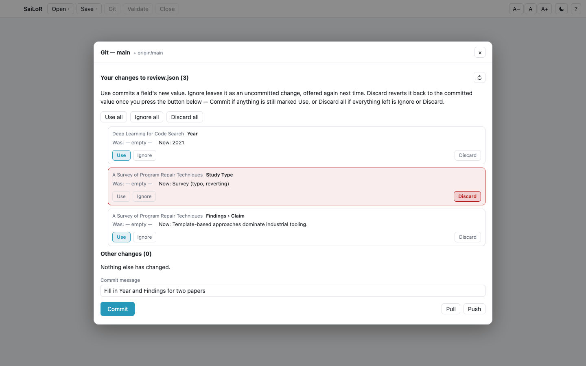
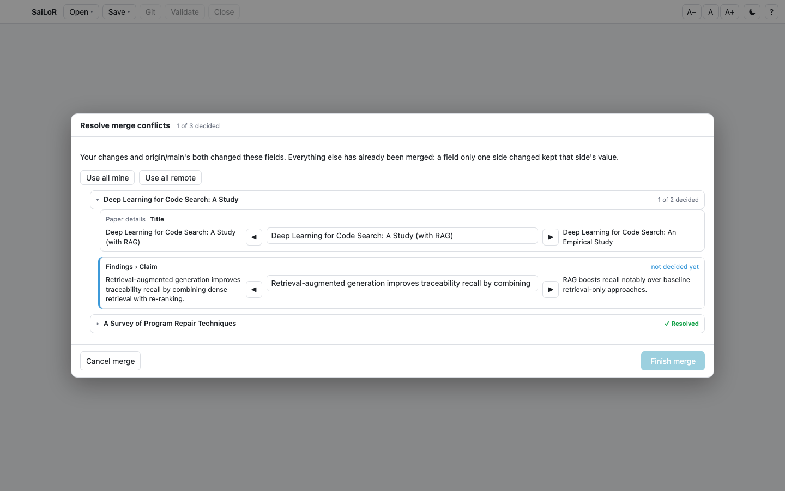

# Git support

**Desktop app only.** Git support runs your own `git` binary, so it can use your real
`~/.gitconfig`, your credential helper, and your SSH agent — exactly as a terminal `git` command
would. (SaiLoR's discontinued web build could never have offered this either — a web page can't spawn
a process or read your git config — but that's moot now: the web build no longer opens projects at
all, see the main [README](README.md).)

If `git` isn't on your `PATH` in the desktop app, the same controls appear greyed out with git's own
error explaining why.

## Cloning a repository

**Import from git…**, on the start screen and in the toolbar's *Open ▾* menu: paste a repository URL,
pick a destination folder, confirm. A clone of a repository full of PDFs can take a while, so you get
a spinner and an elapsed-seconds line rather than a frozen-looking window. On success you pick which
project JSON to open, and the picker already starts inside the folder that was just cloned.

## The Git panel

The toolbar's **Git** button appears whenever the open project's JSON sits inside a git repository —
disabled, with a reason on hover, when it doesn't (no project open, or the project isn't in a
repository).

### Field-level commit review

When your changes are to the open project's own file, SaiLoR breaks them down **field by field**
instead of offering only a whole-file checkbox — "Field: was *this*, now *that*":

  

Each row gets three choices:

- **Use** — commit this field's new value.
- **Ignore** — leave it as an uncommitted local change, offered again next time. Nothing about it is
  touched.
- **Discard** — revert it back to the committed value. This only actually happens once you press
  **Commit** or **Discard all**, never the moment you click it — see
  [Things to know](things-to-know.md#discard-in-the-git-commit-review-is-real-the-moment-you-press-the-button).

**Use all / Ignore all / Discard all**, above the field list, apply one disposition to everything at
once. If, after your choices, nothing is left marked *Use* — either because you ignored everything or
discarded everything — the **Commit** button relabels itself to **Discard all** and turns red,
because committing at that point would write nothing new; pressing it just performs the discards
directly, with no message needed.

Any change to a file *other* than the open project's own — a PDF you added, say — still shows as a
plain whole-file checkbox underneath, exactly as before field-level review existed.

## Pull

**Pull** fetches, and either fast-forwards, reports "already up to date", or — on a genuine
divergence — merges the three revisions of the project JSON **field by field**, not as text. A field
only *you* changed keeps your value; a field only the *remote* changed takes theirs. Only a field
**both sides changed, to different things**, is a real conflict, and those are the only ones you're
ever asked about.

  

Conflicts are **grouped by paper**, one collapsible section per paper — a section collapses
automatically the instant every conflict inside it is decided, so a long list of conflicts across many
papers doesn't stay one undifferentiated wall of rows. Reopening a collapsed section to change a
decision never gets forced shut again on its own. Both sides of every conflict are shown in full,
wrapped rather than truncated, alongside an editable middle value you can type your own reconciled
answer into, or take one side wholesale with the ◀ / ▶ buttons.

**Use all mine / Use all remote** resolve every remaining conflict at once toward one side. Nothing is
committed until every conflict has been decided — the **Finish merge** button stays disabled until
then.

### What Pull refuses to guess at

A few kinds of disagreement can't be expressed as a field-level conflict, so instead of guessing,
SaiLoR aborts the merge cleanly and tells you what to reconcile first:

- The **annotation schema** was changed on both sides, differently — it decides the shape of every
  tree in the file, so there's no per-field answer to offer.
- The **review protocol**, or **where the project was imported from**, was edited on both sides,
  differently — each is a single nested record, not something a conflict row can represent piece by
  piece.
- **A conflict outside the project JSON** (a PDF, a `.gitignore`, anything else git couldn't merge on
  its own) — resolve it with git directly, then pull again.
- **Two different people claiming the same reviewer seat**, with different git identities — see
  [Reviewer-seat identity](multi-reviewer.md#reviewer-seat-identity).

None of these leave anything half-done: the git merge itself is aborted, so the repository ends up
exactly where it started.

## What it won't do

- Merge a conflict outside the project JSON (see above) — that's on you and plain git.
- Delete a paper the remote deleted, if you've annotated it since — it's kept, and you're told, rather
  than losing your work silently.
- Show live clone progress with a cancel button, or offer branch switching / history browsing — out of
  scope for this feature.

## Credentials

SaiLoR never asks for your password and never stores one. Every git operation runs through your own
credential helper and SSH agent, exactly as a terminal `git` command would.
