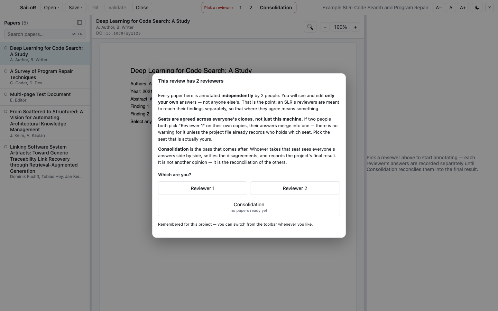
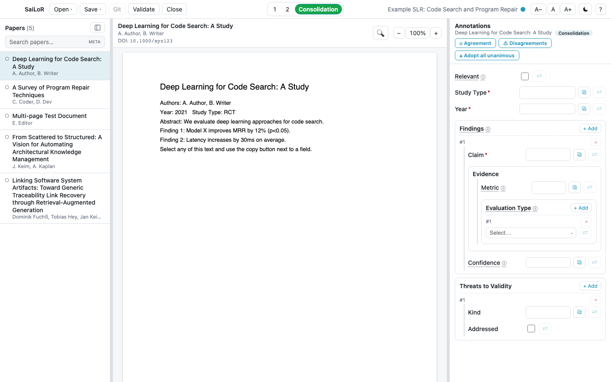
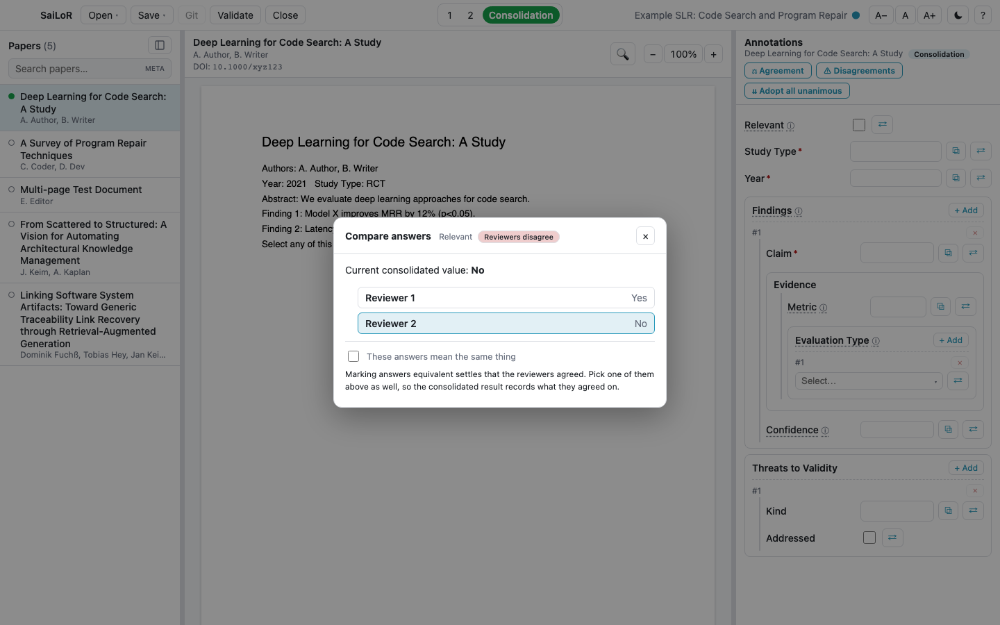
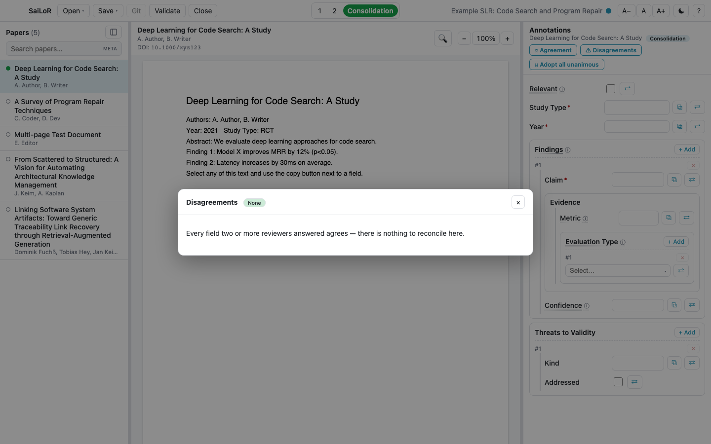
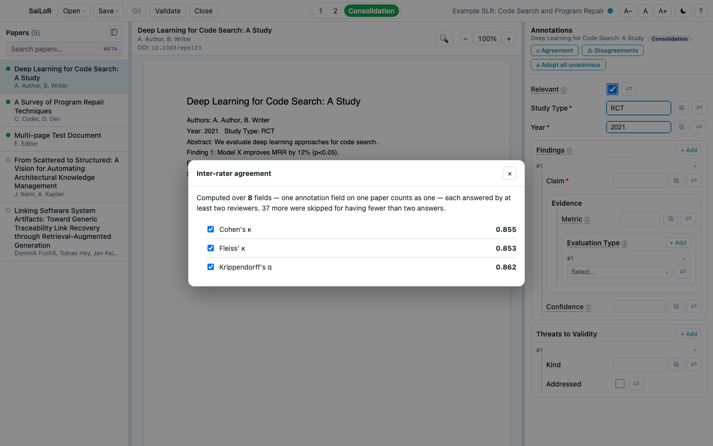

# Working with several reviewers

An SLR is normally annotated by two or more people **independently**, then reconciled — that's what
makes agreement between them mean something. Set up a project for multiple reviewers (see
[Setting up a project](project-editor.md#setting-up-several-reviewers)) and SaiLoR handles the rest.

## Picking a seat

Opening a multi-reviewer project asks who you are before showing you anything — an answer that isn't
attributable to a specific reviewer is worse than no answer at all.

  

It's asked once and remembered for that project; switch seats any time from the toolbar's reviewer
switcher at the top.

Each numbered reviewer sees and edits **only their own answers** — nobody is influenced by what anyone
else already wrote. There's always one extra role beyond the numbered reviewers: **Consolidation**.

## Consolidation

Consolidation is not "one more opinion" — it's the pass where the disagreements actually get settled.
Every field gets a **⇄** compare button showing every reviewer's answer side by side.

  

What Consolidation records is `Paper.annotations` — the project's **final result**, the one an export
or analysis would actually read.

- **Where every reviewer agreed**, Consolidation fills the field in for you with a light-blue border
  until you click it — there's nothing to reconcile when everyone already agrees, and copying those
  across by hand is exactly the task during which a real disagreement further down gets missed. Only
  case and stray whitespace are forgiven automatically; a genuine difference in wording, or a field
  one reviewer left blank, is still your call.
- **Repeatable groups are lined up for you.** Opening a paper in Consolidation works out which of each
  reviewer's entries are the *same* entry — two people rarely list the same three findings in the same
  order — so the compare button lines up answers about the same thing instead of reporting a
  disagreement that was really just a difference of ordering. A group you've already answered is left
  alone, not re-matched underneath you.
- **Every entry gets a slot, even one only one reviewer recorded.** Consolidation lists the *union*, not
  just the busiest reviewer's count: if you recorded three findings and your co-reviewer recorded two,
  one of which you never wrote down, you get four groups — the shared one, filled in as agreement, and
  three that only one of you has, for you to confirm or delete. Two entries are only ever paired when
  they are genuinely more alike than not; entries with nothing in common each keep their own group
  rather than being forced together and reported as a disagreement they were never about.
- **Your own answers are never rearranged.** Lining the entries up is bookkeeping Consolidation keeps to
  itself: in your own reviewer seat your groups stay exactly as you typed them, in your order, with no
  blank entries inserted to match somebody else's count.

Clicking a compare button shows every reviewer's value, and whether they agree:

  

Two reviewers can write *RCT* and *randomized controlled trial* and mean the same thing, which no
amount of text comparison can know on its own. Tick **"These answers mean the same thing"** and the
app counts it as agreement from then on — in the badge, in the disagreement list, and in the
statistics. It's worth doing before you quote a κ anywhere, since until you do, the number understates
how much your reviewers actually agreed. Ticking it settles *that* they agreed, not *what* — you still
click one of the answers to record the value; trying to leave without doing so pauses you rather than
silently recording an empty "agreement".

## ⚠ Disagreements and ⚖ Agreement

Two buttons above the annotation fields, visible only in the Consolidation seat:

  

**⚠ Disagreements** lists every field the reviewers answered differently, across the whole project —
click one to jump straight to it instead of hunting paper by paper. **⚖ Agreement** reports the usual
inter-rater coefficients — Cohen's κ, Fleiss' κ, and Krippendorff's α — tick any combination you want.

  

A coefficient that can't honestly be computed for your project yet (nothing overlapping between
reviewers so far, or Cohen's needing exactly two raters) is greyed out and explains why on hover,
rather than silently reporting a number that wouldn't mean what it appears to.

**⇊ Adopt all unanimous** runs the same "everyone agreed, fill it in" logic across *every* paper at
once — aligning repeatable groups first, exactly as opening each paper individually would — instead of
you clicking through a hundred papers just to trigger the auto-fill on each one. A paper you've
already partly consolidated is left alone.

## Reviewer-seat identity

The seat you pick (see above) is remembered **on your own machine**, keyed to that project file. If
you're using [Git support](git.md), the first time you claim a seat SaiLoR also records your git
identity (name/email) *inside the project file itself* — this is what closes a real hazard: two
different people, on two different clones, both picking "Reviewer 1" would otherwise merge into one
chimeric answer tree with no warning at all the next time the file is pulled together.

Once a seat's identity is recorded, picking it from a *different* git identity warns you before you
can proceed:

- You'll see a mismatch dialog explaining whose seat it already is, with the option to take it anyway
  (if you're sure — a legitimate handover) or pick a different seat.
- The toolbar's reviewer switcher shows who holds each seat on hover, so you can check before you even
  try.

This protection only exists once git is available and a seat has actually been claimed with it on —
see [Things to know](things-to-know.md#two-people-must-not-pick-the-same-reviewer-seat)
for what to do otherwise.
