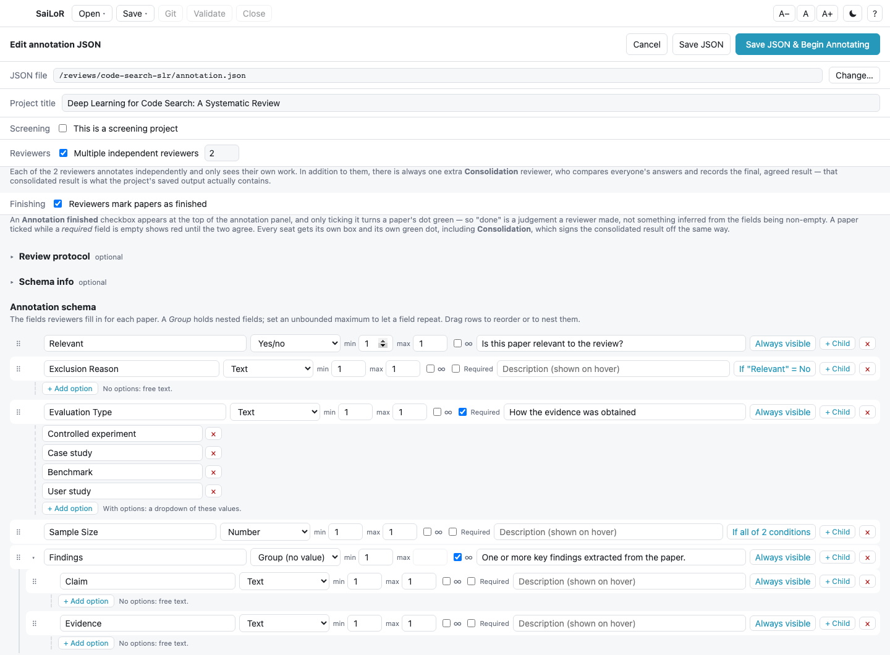
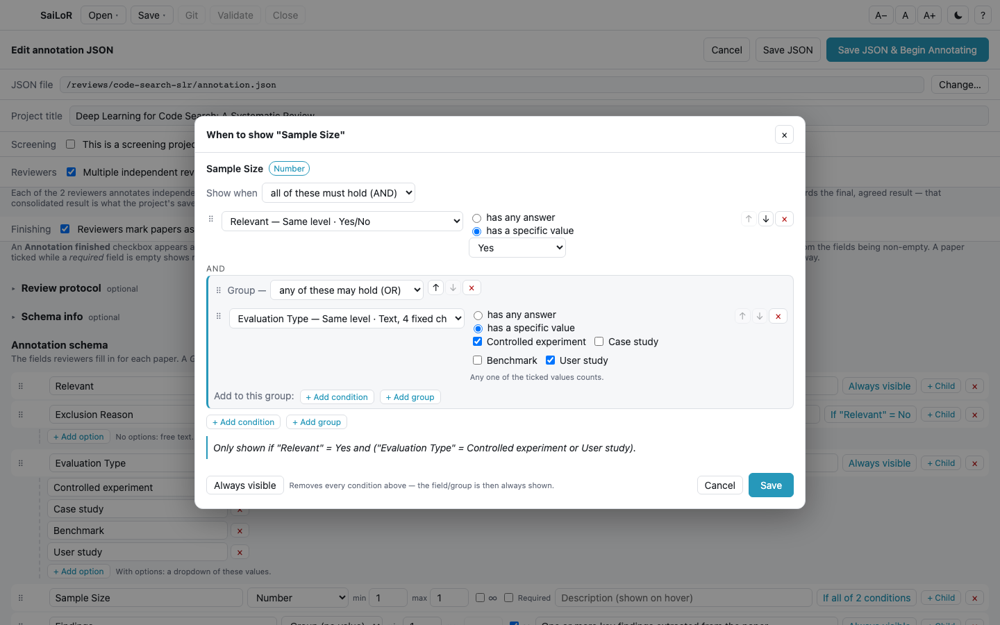
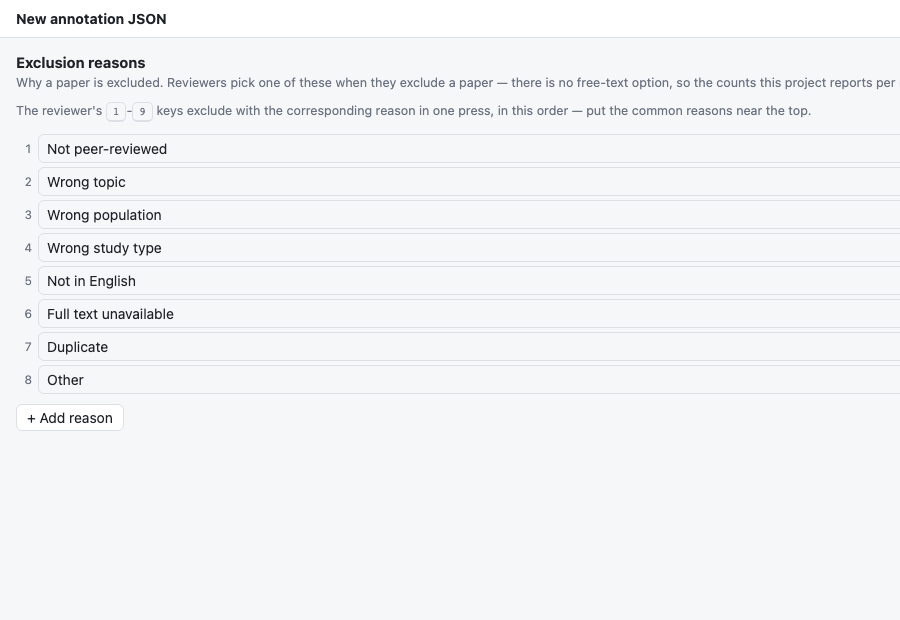
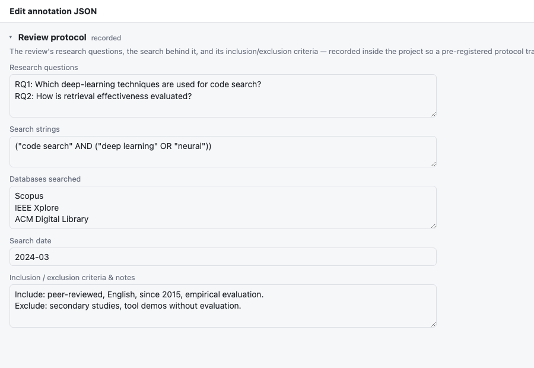
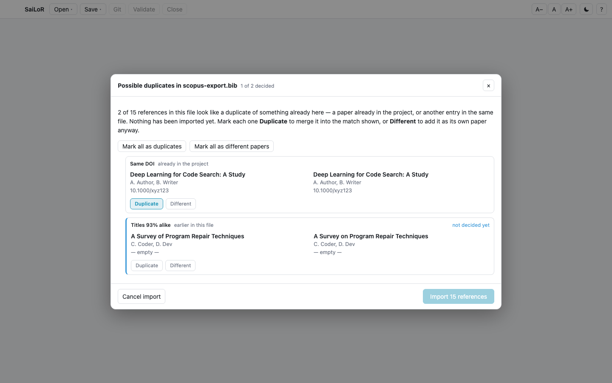

# Setting up a project

The project editor is where you define a review: its **annotation schema** (the fields reviewers fill
in for every paper), the **papers** to review, and — optionally — its **protocol**. It writes the
project JSON the rest of the app then opens.

Reach it from the start screen (**New annotation JSON…** / **Edit annotation JSON…**), or from
*Open ▾* while a project is already open.

  

## Where the JSON lives

The location is chosen up front and shown at the top; use **Change…** to move it later — this
re-derives every PDF reference for the new location automatically (see
[Things to know](things-to-know.md#pdf-paths-are-relative-to-the-json-file)).

**Annotations folder** names the folder next to the JSON file where the project's answers are kept —
`annotations` when left empty. It is always a plain folder name directly next to the JSON file: a
name that would lead anywhere else (`..`, `a/b`, a drive letter, an absolute path) is refused. Save
is refused while another project file of the same kind (screening or annotation) next to it uses
the same folder *and* lists one of the same papers, since the two would then write the same files. A
screening project and an annotation project may always share a folder: their files are named
differently. Renaming it for a project that already has answers moves the folder along when you
save.

## Building the schema

Each row is one field or group:

- **+ Add field**, or **+ Child** to nest one under another.
- **Type** — *Text*, *Number*, *Year* (a number bounded to a plausible publication year, roughly
  1000–2100, with its own control in the annotation form), *Yes/No*, or *Group* (holds no value of its
  own, just nested fields).
- **min / max** control how many times a field can occur; tick **∞** for unbounded — the annotator then
  gets **+ Add** to create as many entries as needed.
- **Fixed choices** — on a *Text* field, add options to turn it into a dropdown. With no options it
  stays free text.
- **Required** — the reviewer must fill it in before Validate is satisfied. Not offered on *Yes/No*
  fields; see [Things to know](things-to-know.md#a-smaller-one-a-yesno-field-can-never-be-reported-as-missing).
- **The visibility button** — every row carries a button spelling out when the row is shown:
  *Always visible*, `If "Relevant" has any answer`, `If "Relevant" = Yes`, or
  *If all of 2 conditions* (the full rule is in its tooltip). Click it to open the **When to show
  "…"** dialog, which names the field being gated and its type, and where you add one or more
  **conditions** and pick, per condition:
  - the **field to watch** — the picker lists, in this order, fields at the *same level* (same
    group, or the top level), then *ancestor* fields this row is nested under (nearest first: the
    group it's inside, that group's own group, and so on), then everything *elsewhere in the
    schema*, top to bottom, shown with its path. The only fields you cannot watch are the row
    itself and anything nested **under** it — a field inside a hidden node can never be answered,
    so such a rule could never open. A condition on a field from elsewhere reads the **first**
    entry of any repeatable group on the way to it (the dialog says so when you use one);
    same-level and ancestor conditions read the entry the row itself belongs to.
  - **what counts as satisfied** — *has any answer*, or *has a specific value*. The first is the
    plain "the reviewer filled this in" test: a ticked box on a *Yes/No* field, any non-empty value
    on every other kind — and it stays available for every field, whatever its type. The second
    offers *Yes* / *No* on a *Yes/No* field, and the option list on a *Text* field with fixed
    choices (tick several and any one of them counts). Free text, *Number* and *Year* have no fixed
    set of answers to pick from, so *has any answer* is the only test there, and the dialog says so.

  Every field in the picker is labelled with **where it lives** (same level, or how far up the tree
  it sits and in which group) and **what it holds** (Yes/No, Number, Year, free text, or text with
  N fixed choices), so you can tell two same-named fields in different branches apart.

  With two or more conditions you also choose how they combine: **all of these must hold (AND)** or
  **any of these may hold (OR)**. **+ Add group** nests a group with its own AND/OR inside the
  current one, which is how a mixed rule is built — *Relevant is Yes* **and** *(Evaluation Type is a
  controlled experiment* **or** *a user study)*. Groups nest as deeply as the rule needs, and one
  left empty is simply dropped.

  Every group keeps its own **+ Add condition** / **+ Add group** buttons, labelled *Add to this
  group*, so you can extend a group at any time — not only when you create it. Each condition and
  each nested group also carries **↑ / ↓** buttons that move it among its neighbours, and **×** to
  remove it; the arrows stop at the first and last entry of the group they are in.

  To move something *between* groups, **drag its ⠿ handle** — the same gesture the schema tree
  itself uses. Drop near an entry's top or bottom edge to land before or after it, or in the middle
  of a group to move inside that group; drop on the outer rule to lift an entry back out to the top
  level. A group can be dragged whole, carrying its conditions and its own AND/OR with it, and a
  drop into itself is refused. Nothing has to be deleted and rebuilt, so a condition you already
  filled in keeps its values. A sentence under the conditions always spells the whole rule out, so
  you can read back what you built:

  

  **Always visible**, bottom left, clears the gate again — it removes every condition, and says so
  next to the button. Nothing is written to the project until you press **Save**.

  Note that *No* on a *Yes/No* field needs the explicit value condition: an unticked box counts as
  "not answered", so *has any answer* never fires for it — which is exactly how you show an
  "Exclusion reason" field only once *Relevant* is unticked.

  Gating is available on *Group* rows too, not just fields — gating a group hides everything nested
  inside it at once, rather than each field individually.
- **Drag a row's ⠿ handle** to reorder or nest it: drop near a row's top or bottom edge to place it
  before or after; drop in the middle of a row to nest it inside.

A field that can hold *several* values at once (say, "which of these techniques does the paper use")
is modeled as a repeatable Text field with fixed options (**max: ∞**) rather than a single dropdown —
there's no built-in way to prevent the same option being picked twice in that list, so treat it as a
convention to watch for during review, not something the tool enforces for you.

**Renaming or moving a field takes its answers along; removing one hides them** — see
[Things to know](things-to-know.md#renaming-moving-or-removing-a-schema-field).

## Setting up several reviewers

Turn on **Multiple independent reviewers** and give it a count (2–10) to have the project annotated
independently by that many people — each sees only their own answers. On top of that number, the
project always gets one extra **Consolidation** role. "2 reviewers" means two independent passes plus
a consolidation pass. See [Working with several reviewers](multi-reviewer.md) for the full workflow.

## Screening instead of annotation

Tick **This is a screening project** to replace the schema-building section with a short, ordered list
of exclusion reasons instead:

  

Reviewers press `1`–`9` to exclude with the corresponding reason in one key press, in the order shown
here — put the common ones near the top. See [Screening](screening.md).

## The review protocol

  

An optional, collapsible section for recording the review's own protocol — the kind of thing a
pre-registered SLR needs to report:

- **Research questions**, one per line.
- **Search strings** — the query run against each database.
- **Databases searched** — Scopus, IEEE Xplore, ACM Digital Library, whatever you used.
- **Search date** — free text, since a search is usually a range ("2024-03", "March–April 2024"), not
  one instant.
- **Inclusion/exclusion criteria and notes** — anything else worth recording about the protocol.

Every field is optional, and it's saved as a real, dedicated `protocol` key in the project JSON — see
why that matters in
[Things to know](things-to-know.md#hand-editing-config-in-the-json-silently-deletes-your-changes).

### Schema info

Another optional, collapsible section, right below the protocol one: a single free-text note about
the schema as a whole — what the fields mean together, how to use them, anything a reviewer should
read before they start. Unlike a field's own description (hover its ⓘ marker while annotating), this
one is shown once per project: an ⓘ button in the annotation panel's header opens it, and it also
opens on its own the first time a reviewer loads a project that has one — closed via its × button, an
"Okay" button, or Escape.
The section starts collapsed unless the project already has a protocol recorded, so an existing one is
never hidden behind a disclosure you'd have to know to open.

## Provenance

When a project was built via **New from screening…**, the editor shows a read-only note recording
where it came from:

  

The source project's name, the date it was imported, and how many papers were carried over versus left
behind. It's a durable record, not a setting — there's nothing to edit here, only to read. See
[Screening](screening.md#starting-the-next-phase-from-a-screening-project).

## Adding papers

Three ways to get papers into a project, and they mix freely:

- **+ Add PDFs…** — pick one or more files.
- **+ Add folder…** — take every PDF in a folder at once, including sub-folders.
- **Import references…** — read a **BibTeX** (`.bib`), **RIS** (`.ris`), or **CSL-JSON** export from a
  reference manager (Zotero, Mendeley, JabRef, …). This brings in titles, authors, DOIs, years, and
  venues; you still attach the PDFs themselves.

A paper already in the project is never added twice — importing references matches against what's
already there (by DOI, then by title) and fills in the gaps of a matching paper instead of duplicating
it.

Newly added papers are marked with a blue border, since their title and authors are a best-effort
guess read out of the PDF or the reference file. Check them; the mark clears as soon as you click into
the row.

### Duplicate detection

Beyond exact DOI/title matches (handled silently, as above), importing also flags **probable**
duplicates — a fuzzy title match, or the same normalized main title with similar authors — against
papers already in the project *and* against other entries in the same import batch:

  

Nothing is silently merged or silently added twice. Mark each flagged row **Duplicate** (merges it
into the match shown, filling in any gaps) or **Different** (adds it as its own paper anyway) — every
row needs a decision before the import can proceed. **Mark all as…** handles a whole batch at once
when you can eyeball that they're all the same kind of call.

### Paper ids

Every paper has its own `id`, auto-generated from the PDF's file name or title and shown in each row
so you can hand-edit it — it's what git and any hand-editing keys off, so it must stay **unique**
within the project. Typing an id that collides with another paper's is flagged right there — a red
outline on the field and a "duplicate" note next to the label — before you ever get to Save; Save
itself refuses with the same complaint if a collision is still unresolved. Ids that differ only in
upper/lower case count as a collision too, since macOS and Windows treat them as the same folder.

An id also names a folder under `annotations/`, so it must work as a folder name on every reviewer's
machine: no characters Windows forbids in file names (such as `:` `?` `*` `/`), no trailing dot or
space, and not a reserved Windows name like `CON` or `NUL`. Renaming the id of a paper that already has
annotations asks first — this copy of its answers moves to the new folder, but a reviewer whose work
you haven't pulled yet keeps writing under the old id.

## Saving

**Save JSON** writes the file and keeps you in the editor. **Save JSON & Begin Annotating** writes it
and opens it for review. Both check the project first and tell you what to fix if something's off.
