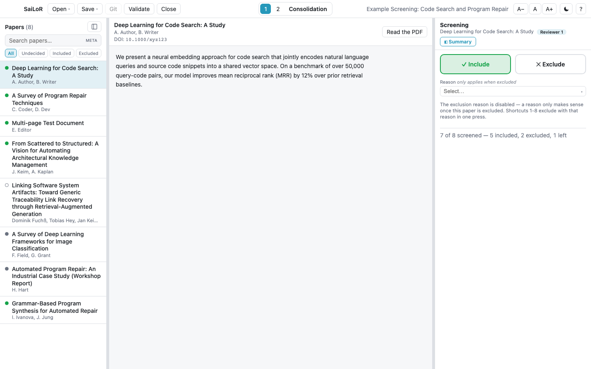
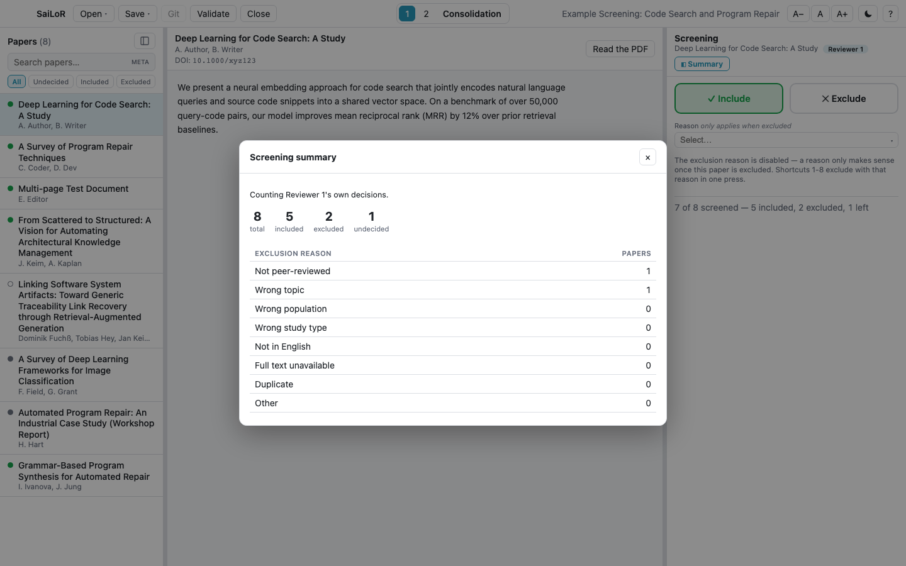

# Screening

Before an SLR extracts data from anything, it usually **screens** a large batch of candidate papers
down to the ones worth reading in full — a fast pass, usually decided from the title and abstract
alone. A project set up for screening replaces the annotation form with exactly one decision per
paper: **Include** or **Exclude**.

  

## Why Include/Exclude, not a checkbox

The decision is a **two-option choice**, not a single "Exclude" tickbox, because SaiLoR needs to say
*"not screened yet"* as its own state — a checkbox can't hold that. Every screening decision reads as
one of three states: included, excluded, or undecided, and the paper list's filter tabs (**All /
Undecided / Included / Excluded**, visible in the screenshot above) let you jump straight to any of
them.

## Excluding, with a reason

Exclusion reasons are **fixed up front**, set once by whoever built the project — the same way a
review protocol pre-registers its exclusion criteria. That's what makes the per-reason counts in the
summary (below) mean something: free text would let every reviewer phrase the same reason
differently, and the counts wouldn't add up to anything a PRISMA flow diagram could report.

## The fast keyboard flow

Screening a stack of papers is meant to be quick:

| Key | Action |
| --- | --- |
| `I` | Include the paper on screen |
| `E` | Exclude it |
| `U` | Un-decide (back to "not screened") |
| `1`–`9` | Exclude with the corresponding configured reason, in one press |
| Alt+↓ / `]` | Next paper |
| Alt+↑ / `[` | Previous paper |

Deciding a paper for the first time automatically moves to the next undecided one, so screening reads
as a rhythm of read → decide → read, not read → decide → click → read. Going back to fix an earlier
call never jumps you away again.

## The summary

**◧ Summary**, in the top-right of the screening view, shows progress and the include/exclude/undecided
totals, plus how many papers were excluded for each configured reason — exactly the numbers a PRISMA
flow diagram reports.

  

It states which seat's decisions it's counting (your own, or — for Consolidation — the consolidated
result), since the two can genuinely differ before everyone has finished.

## Several reviewers

Screening reuses the same reviewer/Consolidation machinery the rest of the app uses (see
[Working with several reviewers](multi-reviewer.md)): two or more reviewers screen independently, and
Consolidation reconciles them into the final decision. Where every reviewer decided the same way,
Consolidation's **Adopt all unanimous** takes all of those decisions at once, and **⚖ Agreement**
reports Cohen's/Fleiss' κ over the include/exclude decision specifically — the statistic a screening
phase actually reports.

## Renaming a reason

If you rename an exclusion reason that papers are already using, SaiLoR checks on blur and offers to
migrate: it tells you how many papers reference the old label and lets you choose whether to carry
those decisions to the new name, or leave them pointing at the label you just removed. Left alone,
those papers land in an "excluded without a recognized reason" bucket until you fix it — Validate will
tell you, but it's easy to miss until then.

## Starting the next phase from a screening project

Once screening is done, use **New from screening…** (on the start screen) to build what comes next.
You choose the target:

- **An annotation project** — the usual next step. Every paper not explicitly excluded is carried
  over: included papers always, and undecided ones by default (dropping a paper nobody actually
  excluded would silently shrink the review — you can choose to leave undecided ones out instead, in
  the confirmation dialog). Title, authors, DOI, abstract, year, venue, and the PDF reference all carry
  over.
- **A second screening project** — for a full-text screening pass after the title/abstract pass, using
  the *same* exclusion-reason vocabulary the first pass used (editable before you save, if the second
  pass needs different reasons). Two dual-screened passes report comparable per-reason counts this
  way, which a disjoint generic reason list wouldn't.

The new project's location defaults to right next to the screening JSON, so every paper's relative PDF
path keeps resolving unchanged. Its project editor also shows an **Imported from** note recording
which screening project it came from, when, and how many papers were carried over versus left behind
— see [Setting up a project](project-editor.md#provenance).
